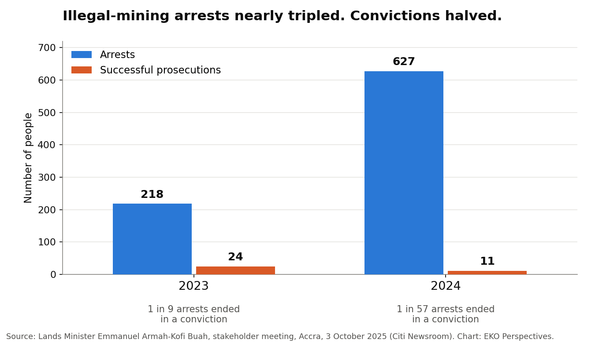
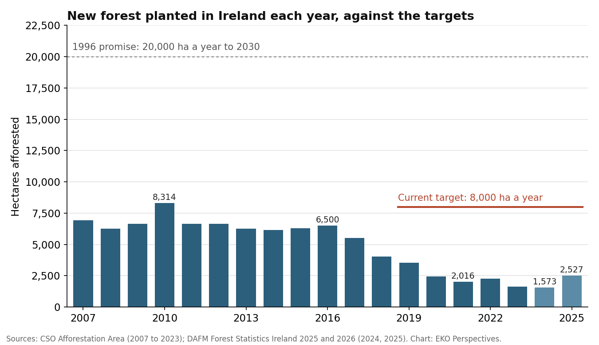
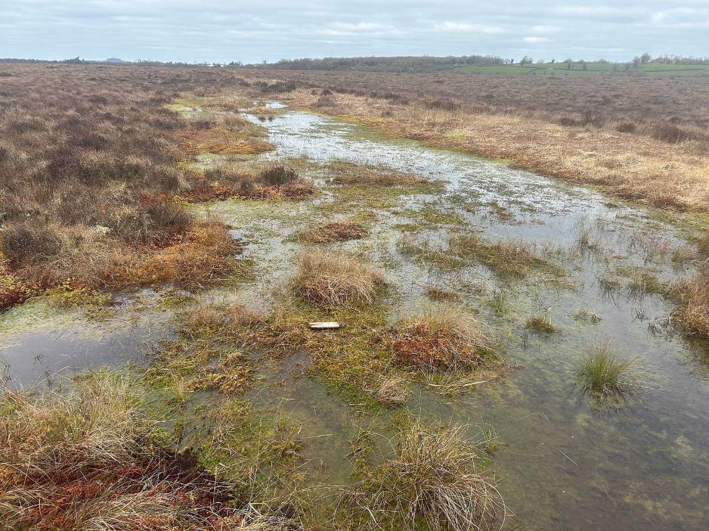

# EKO Perspectives

Policy, land and agriculture, economics and evidence, science and technology, places and development, and personal ideas.

### [How to start a research paper, and why you should](../blog/posts/2026-10-05-start-research-paper/index.llms.md)

A paper worth writing starts with a failure in the world, not a method or a gap in a literature review. Five questions get you from that failure to something you can answer.

Oct 5, 2026

Elvis Kwame Ofori

### [The carbon credit that wasn’t there](../blog/posts/2026-10-05-carbon-credit-counterfactual/index.llms.md)

Two major studies agree that forest carbon credits claimed several times what the projects achieved, even where forests were protected. The registries have since rewritten how baselines are set. The old credits are still being retired.

Oct 5, 2026

Elvis Kwame Ofori

### [Europe’s forest rule will trace the cocoa. Will it save the forest?](../blog/posts/2026-10-05-eudr-cocoa-ghana/index.llms.md)

From 30 December the EU will require every cocoa, coffee, palm oil, soy, rubber, timber and cattle shipment to be traced to a plot cleared of no forest since 2020. Ghana has built the systems to comply and Côte d’Ivoire is struggling. The harder question is what the rule cannot see.

Oct 5, 2026

Elvis Kwame Ofori

### [A climate credit that will not count the land](../blog/posts/2026-10-04-climate-credit-land/index.llms.md)

The United States now pays corn ethanol a clean-fuel credit calculated without the emissions from land converted to grow more crops. The science on that effect is contested. Writing it out of the law does not settle the dispute. It hides it.

Oct 4, 2026

Elvis Kwame Ofori

### [Nepal asked for \$20 million. The money has not arrived](../blog/posts/2026-10-04-loss-and-damage-money/index.llms.md)

The world has agreed that climate-vulnerable countries need money to adapt and to recover. It has created the funds and set the targets. What it has not done is pay.

Oct 4, 2026

Elvis Kwame Ofori

### [Africa’s food problem is not too many people](../blog/posts/2026-10-04-africa-feed-itself/index.llms.md)

Sub-Saharan Africa will add more than half the world’s population growth to 2050. The evidence says it can feed far more people than it does today, but only if yields rise faster than they ever have, and honest numbers show whether they are.

Oct 4, 2026

Elvis Kwame Ofori

### [We cannot drink gold](../blog/posts/2026-10-04-we-cannot-drink-gold/index.llms.md)

Ghana arrests hundreds of illegal miners a year and convicts a handful. The problem is not a shortage of soldiers. It is who profits from the gold and who pays for the water.

Oct 4, 2026

Elvis Kwame Ofori

### [Feeding the world or destroying it](../blog/posts/2026-10-04-feeding-the-world/index.llms.md)

Farming already uses almost half the world’s habitable land, and new studies show where the damage is concentrated. The argument over intensive versus ecological farming misses the condition both sides depend on: land that is protected because someone decided it would be.

Oct 4, 2026

Elvis Kwame Ofori

### [One hectare, many promises](../blog/posts/2026-10-02-one-hectare-many-promises/index.llms.md)

Climate, biodiversity, energy, housing and food are all asking more of the same land. Governments are answering with plans and targets, and scientists disagree about what land should do next. The farmer who lives from it is rarely at the table.

Oct 2, 2026

Elvis Kwame Ofori

### [Thirty years of Irish tree-planting promises, checked against the record](../blog/posts/2026-10-01-ireland-tree-planting-promise/index.llms.md)

Ireland has planted a fraction of the forest it promised since 1996. Licensing explains one bad stretch. Farmers walking away from planting explains more of the gap.

Oct 1, 2026

Elvis Kwame Ofori

### [A map can clarify the world and still leave something out](../blog/posts/2026-09-24-seeing-like-a-state-models/index.llms.md)

Reading James C. Scott’s Seeing Like a State as a warning about simplification, and as a useful question for anyone who builds models for policy.

Sep 24, 2026

Elvis Kwame Ofori

### [Wildfire policy begins before the fire](../blog/posts/2026-09-24-wildfire-policy-before-fire/index.llms.md)

Europe is treating wildfire less as an emergency event and more as a land-management problem. Ireland has reasons to pay attention.

Sep 24, 2026

Elvis Kwame Ofori

### [When the future is outside the data](../blog/posts/2026-09-22-econometrics-to-scenario-thinking/index.llms.md)

Climate and land-use targets can push economics beyond what historical data can tell us. Scenario models offer a way to explore futures that have not yet been observed.

Sep 22, 2026

Elvis Kwame Ofori

### [AI is becoming ordinary. The evidence about its effects is still catching up](../blog/posts/2026-09-22-ai-needs-evidence-not-anecdotes/index.llms.md)

Generative AI is becoming ordinary in classrooms and everyday life. The scientific question is shifting from what the tools can do to what happens when people actually use them.

Sep 22, 2026

Elvis Kwame Ofori

### [When environmental policy needs a landscape, not just a farm](../blog/posts/2026-09-22-acres-landscape-actions/index.llms.md)

Some environmental problems do not stop at the farm gate. Ireland’s ACRES landscape actions show why coordination can matter across holdings.

Sep 22, 2026

Elvis Kwame Ofori
