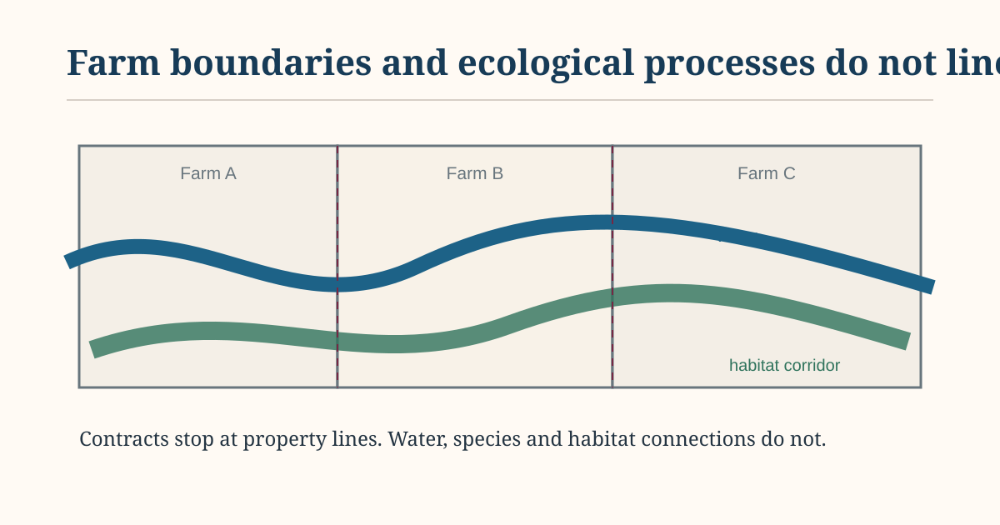

I keep coming back to a fairly simple problem in agri-environment policy. The contract is usually with a farmer, but the thing the policy is trying to improve often does not stop at the farm gate. Water runs downhill. Habitats connect across holdings. Invasive species spread. A bird or pollinator has no reason to care where one parcel ends and the next begins.

{fig-alt="Three adjoining farm parcels are crossed by a river and a habitat corridor, showing how ecological processes extend across individual holdings." width="92%" fig-align="center"}

*Original schematic for EKO Perspectives.*

Ireland's [Agri-Climate Rural Environment Scheme, ACRES](https://www.gov.ie/en/department-of-agriculture-food-and-the-marine/services/agri-climate-rural-environment-scheme-acres/), is interesting partly because it has begun to deal with that mismatch directly. The scheme still works through individual participants, as any payment scheme has to, but its Co-operation approach allows some problems to be treated at a larger spatial scale. In February 2026 the Department opened a second application window for [Landscape Actions](https://www.gov.ie/en/department-of-agriculture-food-and-the-marine/press-releases/minister-heydon-announces-opening-of-second-application-window-for-acres-landscape-actions/), with examples including invasive species, scrub encroachment in species-rich grassland, threatened species and water-quality protection.

The scheme is large enough that the administrative experiment matters. The Department describes ACRES as a €1.5 billion programme intended to support up to 50,000 farm families, and [Budget 2026](https://www.gov.ie/en/department-of-agriculture-food-and-the-marine/press-releases/minister-heydon-secures-additional-170-million-in-budget-2026-9-increase-brings-departmental-vote-to-over-23-billion/) reported almost 54,000 participating farmers with €280 million allocated for that year. But the number of participants is not really the part I find most interesting. It is the question of scale.

Take water quality. A farmer can change nutrient management on one holding, but the river receives whatever happens across the catchment. Habitat connectivity is similar. Protecting one good patch may do relatively little if every neighbouring patch disappears, while several modest actions can become much more useful when they connect. The environmental outcome depends on the combination of decisions, even though each decision is made and paid for separately.

There is a familiar economic problem hiding inside this. Some of the benefit produced on one farm spills over to other farms or to the wider public, which means the private incentive to provide it can be weaker than the social value. Agri-environment payments already try to close part of that gap. Landscape coordination adds another difficulty because the value of one participant's action may depend on whether several other people act as well.

I do not think "landscape scale" solves this by itself. Coordination costs money and time. Someone still has to decide what the relevant landscape is, which actions make sense there, and how to judge an outcome that may also be affected by weather, soils and processes outside the farmer's control. Results-based payments make this especially awkward because the thing being rewarded is often partly the product of management and partly the product of place.

There is another reason to be cautious. A larger planning unit can easily become an excuse for assuming that the same intervention belongs everywhere inside it. Irish agricultural landscapes are too heterogeneous for that. The costs, production effects and environmental returns from the same action can change with soil, farm system and what is happening next door.

So the question I am left with is not whether environmental policy should be farm-based or landscape-based. It is more specific than that: which environmental problems can sensibly be handled one holding at a time, and which ones become badly specified if we insist on doing so?


