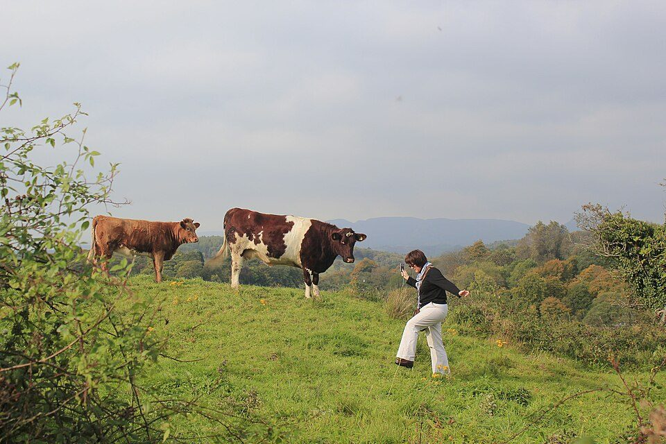

# When the future is outside the data

Economics & Evidence

Why climate and land-use targets can push economics beyond what historical data can tell us, and what scenario models add.

Published

September 22, 2026

For a long time, most of the questions I worked on began with data that had already been observed. I would estimate a relationship, test a hypothesis, worry about identification, and then ask what the result might tell us about policy. Econometrics is perfectly capable of saying something about situations that have not yet happened, of course. Much of applied economics is built around counterfactuals. But during my PhD I started running into a slightly different problem: some of the futures I was being asked to think about were much farther from the data than I was used to.

That distance matters. An estimated relationship is usually most convincing around the range of variation from which it was learned. Move far enough beyond that range and the regression will still give you a number, but more of the answer is now coming from the model and less from anything we have actually observed. This is not a criticism of econometrics. It is simply a boundary that becomes easier to see when the policy question is large enough.

[The Irish Land Use Review](https://www.epa.ie/publications/research/evidence-synthesis-reports/evidence-synthesis-report-3-land-use-review-fluxes-scenarios-and-capacity.php) is a good example of the kind of problem I mean. Its scenarios include substantial additional forestry and large-scale rewetting of grassland on organic soils by 2050. Those are not ordinary year-to-year movements in the land system. They ask what happens when the structure itself changes.

Irish farm field. Photograph by Daniel Hanrahan.

*Source: [Daniel Hanrahan / Wikimedia Commons](https://commons.wikimedia.org/wiki/File:Irish_Farm_Field_(38665262).jpeg), used under [CC BY 3.0](https://creativecommons.org/licenses/by/3.0/).*

This is where I began to understand scenario modelling differently. A scenario is not a forecast wearing a different name. It can begin with a target, a policy assumption or a possible future condition and ask what else would have to change if that condition were true. Backcasting pushes the idea further by starting from the future objective and working backwards toward the present. The [European Commission has a useful short explanation of scenario building in foresight](https://policy-lab.ec.europa.eu/stories/how-do-we-build-scenarios-foresight-exercise-2019-07-02_en), and the [OECD’s strategic foresight work](https://www.oecd.org/en/about/programmes/strategic-foresight.html) makes much the same distinction between exploring plausible futures and trying to predict one.

I still find econometric evidence indispensable here. If a scenario assumes that farms will respond to a price, payment or constraint in a particular way, observed behaviour is one of the best places to discipline that assumption. The trouble starts when we pretend the historical estimate can carry the whole exercise after the system has moved well outside the conditions under which the estimate was obtained. At that point it is better to say openly which parts come from evidence and which parts come from scenario assumptions.

There is an older distinction in climate policy between top-down economic models and bottom-up technology or sector models. An [OECD paper on emissions baselines](https://www.oecd.org/content/dam/oecd/en/publications/reports/2012/11/projecting-emissions-baselines-for-national-climate-policy_g17a244b/5k3tpsz58wvc-en.pdf) puts the difference fairly plainly: the first gives you economy-wide coherence, while the second can give you much more detail about technologies and sectors. I increasingly think the same way about the mix of methods I use. Econometrics tells me what observed variation can teach me. Scenario models let me ask what a different future would require. Spatial models force the question of where the change lands. Microsimulation makes it harder to forget that thousands of farms facing the same policy may not respond in the same way.

I have not found a single method that does all of this particularly well. I am no longer sure I would want one to.

**Elvis Kwame Ofori**\
Researcher and writer behind *EKO Perspectives*.

[More from EKO Perspectives](../../../blog/) · [Follow via RSS](../../../blog/index.xml) · [About the author](../../../about.llms.md)
