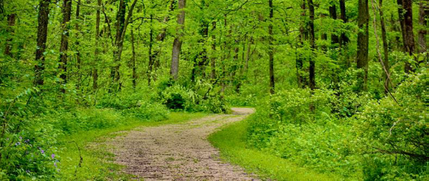

<figure>
  
  <figcaption><em>FORESIGHT project illustration</em>, <a href="https://fusion-research.eu/foresight.html">FUSION, University of Galway</a>, used under <a href="https://creativecommons.org/licenses/by-sa/4.0/">CC BY-SA 4.0</a>.</figcaption>
</figure>

A forecast asks what is likely to happen. Foresight asks something different: which futures are possible, what would it take to reach them, and what do we learn by working backwards from the outcome?

The distinction sounds academic. In agricultural climate policy, it is practical, and it shapes much of the work I now do.

I do my PhD within **FUSION**, a modelling group at the University of Galway that works across life-cycle assessment, integrated assessment, land-use analysis and environmental software. Much of my work connects to **FORESIGHT**, a project funded by Ireland’s Department of the Environment, Climate and Communications under a services contract to provide agriculture and land-use modelling to the Climate Action Modelling Group. The project is led by FUSION with the University of Limerick and FERS Ltd.

I mention the funding at the start because I will write about Irish climate and agricultural policy on this site, and readers should know where I sit. The views expressed here are my own.

Within FORESIGHT, **GOBLIN** is used as a national land-balance modelling framework for exploring agriculture, forestry and other land-use pathways through backcasting. Rather than predicting what Ireland will do, the approach can begin with a future objective such as climate neutrality and examine combinations of livestock, forestry, wetlands and cropland that could be consistent with it.

That is foresight in practice.

My own question begins where a nationally coherent pathway can become much less simple.

A national reduction in cattle numbers, for example, could fall very differently across a dairy-intensive area and a region dominated by suckler farming. The aggregate change may be identical while the consequences for production systems, land use and local economies are not. That is an illustration of the question, not a result.

I am interested in resolving national pathways down to places and farms: where adjustment falls, what released land can realistically support, and how economic and behavioural differences change the picture.

What I value most about working this way is a lesson I keep relearning: **the model is not the product**.

The useful product is better evidence for a difficult decision, produced transparently enough that assumptions can be examined and alternatives tested.

Future posts here will range much more widely than my PhD. I will write about climate and agricultural policy, land use, energy, economics, Ghana and Ireland, useful models and code, books, technology and research life.

The aim is simple: to think in public, and to make technical arguments readable without flattening them.

### Further reading

- [FORESIGHT project](https://fusion-research.eu/foresight.html)
- [FUSION research group](https://fusion-research.eu/)
- [GOBLIN package documentation](https://fusion-research.eu/goblin-package-documentation.html)
