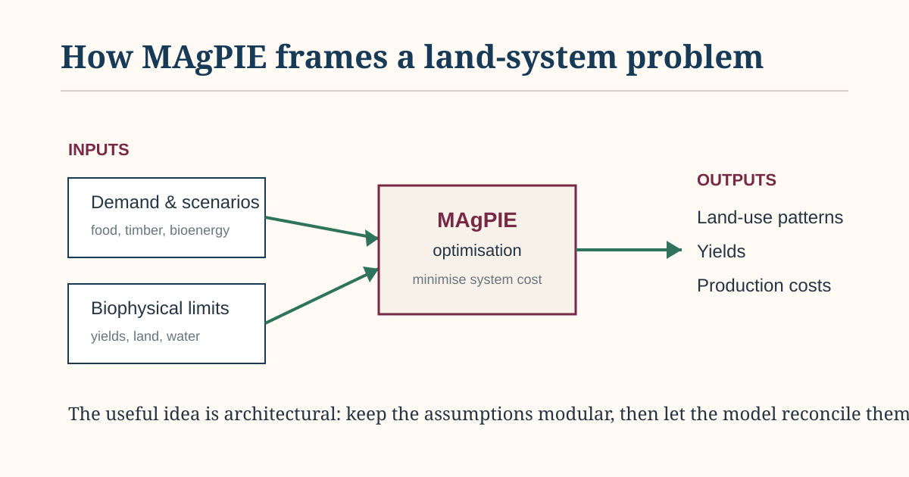

# Useful GitHub: MAgPIE and the discipline of open land-system modelling

Science & Technology

Land & Agriculture

What the MAgPIE repository can teach researchers about modelling agriculture, forestry and land-use futures reproducibly.

Published

September 22, 2026

I was looking through the [MAgPIE repository](https://github.com/magpiemodel/magpie) because I wanted to see how a large land-system model is actually organised once it has grown beyond the scale of one paper. That turned out to be more useful than looking for a particular function. The repository is interesting because the code, configuration, documentation and scenario machinery make visible a lot of decisions that are normally hidden behind the finished results.

MAgPIE stands for the Model of Agricultural Production and its Impact on the Environment. It is an optimisation model used to study global agriculture, forestry and land-use change, with economic demand on one side and spatially explicit biophysical constraints on the other. The broad question is easy to state and difficult to solve: given demand for food, timber and bioenergy, along with yields, costs, land, water and other constraints, what pattern of production and land use can satisfy those demands at minimum cost?

A simplified view of how MAgPIE turns demand and biophysical constraints into a land-system optimisation problem.

*Simplified schematic for EKO Perspectives, based on the public MAgPIE model documentation.*

What interested me first was the modularity. Large models become difficult to reason about when every assumption is buried in one script. MAgPIE separates components and lets scenario choices live in configuration rather than forcing the modeller to rewrite the model every time the question changes. That sounds like a software-engineering point, and it is, but it is also a modelling point. A model that can only be understood by the person who wrote the original script is difficult to interrogate, however sophisticated the equations are.

The same is true of reproducibility. The repository does not treat publishing source code as the end of the job. It documents software requirements, installation, configuration, execution and outputs, and the project maintains [tutorials](https://magpiemodel.github.io/tutorials.html) and versioned documentation around the model. There is also a clear attempt to make dependencies and data preparation part of the reproducible workflow rather than an invisible stage that happens before the “real” model starts. The underlying framework is described in [this paper in *Geoscientific Model Development*](https://doi.org/10.5194/gmd-12-1299-2019).

There are practical barriers. MAgPIE is not a lightweight Python package. The core model is written in GAMS, with R used around the workflow, and running it requires software and computing resources that will put off some potential users. That is worth remembering when open-source models are discussed as though publishing the repository automatically makes the model easy to reproduce. Openness and accessibility are related, but they are not the same thing.

Its scale creates another useful boundary. MAgPIE can say a great deal about globally consistent land transitions and competition among food, forestry and bioenergy. It is not trying to tell us which individual farmer changes enterprise or which exact parcel converts next year. A farm microsimulation model and a global optimisation model are not competing versions of the same thing. They answer different questions.

That is probably what I took from the repository more than anything else. I would not try to copy MAgPIE into a smaller national model. I would copy the discipline around it: keep assumptions visible, separate components cleanly, make scenario settings explicit, trace outputs back through the data pipeline, and be clear about the level at which the model can actually speak. Those habits travel rather well.

**Elvis Kwame Ofori**\
Researcher and writer behind *EKO Perspectives*.

[More from EKO Perspectives](../../../blog/) · [Follow via RSS](../../../blog/index.xml) · [About the author](../../../about.llms.md)
