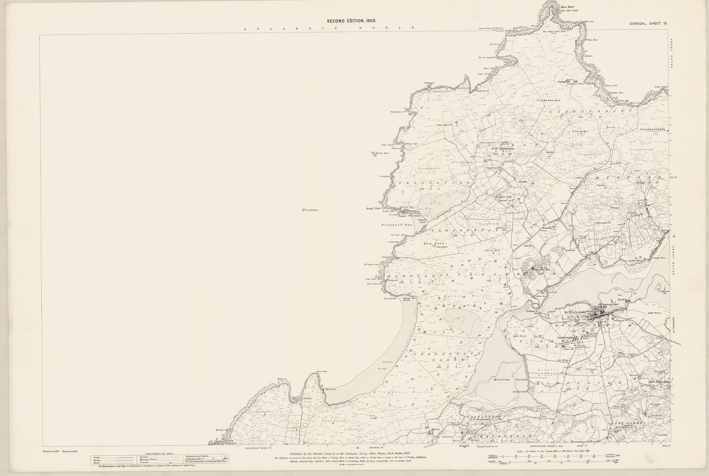
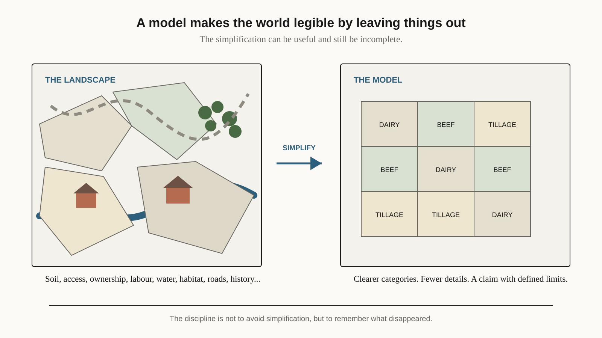

{fig-alt="A detailed black-and-white 1905 Ordnance Survey map showing roads, settlements, field boundaries and terrain around Dunfanaghy in County Donegal." width="100%" fig-align="center"}

*Ordnance Survey Ireland, six-inch Donegal Sheet 15, published 1905. Director General of the Ordnance Survey Office, Dublin; digital image via the National Library of Scotland and [Wikimedia Commons](https://commons.wikimedia.org/wiki/File:Ordnance_Survey_Ireland_Six-inch_Donegal_Sheet_15_Dunfanaghy,_Published_1905.jpg). Underlying map public domain; digital image [CC BY 4.0](https://creativecommons.org/licenses/by/4.0/).*

The map above is the 1905 edition of Ordnance Survey sheet 15 for County Donegal, covering Horn Head and the town of Dunfanaghy. Nearly half the sheet is open Atlantic. Around the town, field boundaries are packed tightly together; on the higher ground behind it they thin out into scattered symbols for rough land. It is a careful and accurate piece of work, and it records exactly what the survey was built to record: boundaries, roads, buildings and heights. Who worked which field, on what terms, and how the hill ground was used are not on it, because the map was never designed to carry them.

James C. Scott's [*Seeing Like a State*](https://yalebooks.yale.edu/book/9780300078152/seeing-like-a-state/) is about the gap between a map like this and the world it describes. The book is usually read as a critique of large schemes of social improvement, and it moves through scientific forestry, cadastral maps, urban planning, collectivisation, villagisation and agricultural modernisation. The thread running through them is what Scott calls legibility: complicated social and ecological worlds translated into categories that institutions can count, compare and administer.

{fig-alt="A split-panel schematic showing an irregular agricultural landscape with fields, a stream, woodland, roads and farm buildings on the left, and a regular grid of dairy, beef and tillage categories on the right." width="100%" fig-align="center"}

*Original schematic for EKO Perspectives.*

Legibility is not foolish. A forest can be represented as timber volume, land divided into mapped parcels, people counted in a census, farms classified as dairy, cattle, sheep, tillage or mixed. A government that cannot identify property, measure resources or count people will struggle to tax, plan services or run a policy at all. Scott's warning is narrower than a rejection of measurement, and more useful. Trouble begins when the representation starts to stand in for the thing it represents.

His forestry example shows how. A forest managed around a narrow measure of timber production can look admirably ordered while losing ecological relationships the accounts never valued. A planned settlement can make sense on paper and work badly for people whose movements, trades and ties were never visible in the plan. The simplification makes intervention possible, and it can hide some of the knowledge the intervention needs.

Modelling lives on the same ground, which is why I keep returning to the book. Models depend on legibility too. We choose variables, harmonise categories, build representative units, aggregate activities and draw boundaries around systems. A spatial model divides a continuous landscape into units. A microsimulation assigns people or farms to types. [Scenario thinking](/blog/posts/2026-09-22-econometrics-to-scenario-thinking/) turns an uncertain future into a manageable set of assumptions. None of this is a defect. It is what makes modelling possible in the first place.

The tempting answer is more detail, and it is usually the wrong one. Complexity is not realism. A model with a thousand weakly identified parameters can hide more than a transparent model with twenty, and policy needs shared categories anyway, since a programme cannot be administered if every case has its own private definition. The better habit is to ask, every time, what the simplification cannot see.

Take a land-use model that finds the least-cost spatial arrangement for meeting an emissions target. The optimisation can be internally correct and still leave important questions outside it. Who owns the land selected for change? Are there tenure constraints? Does the model see labour at all? Are two hectares that look interchangeable in the data actually different because of soil, fragmentation, access or local markets? Does the transition rely on behaviour that was assumed rather than observed? Asking these does not make the model useless. It defines the claim the model can support.

Scott gives real weight to practical knowledge, which he discusses through the Greek term *mētis*: knowledge built up through experience and adaptation to local conditions, and often hard to formalise. Agricultural analysis has an obvious version of it. Administrative data may say two farms have the same area and enterprise type, while a farmer or adviser sees at once that they differ in soil, family labour, machinery, succession, fragmentation or access to markets. The task is not to choose local knowledge over formal evidence. It is to notice when one is quietly being asked to substitute for the other.

That is what stays with me from the book. Standardising the world makes some things visible by pushing others out of view, and a model is useful precisely because it does this on purpose. The discipline lies in being just as deliberate about what has disappeared.


