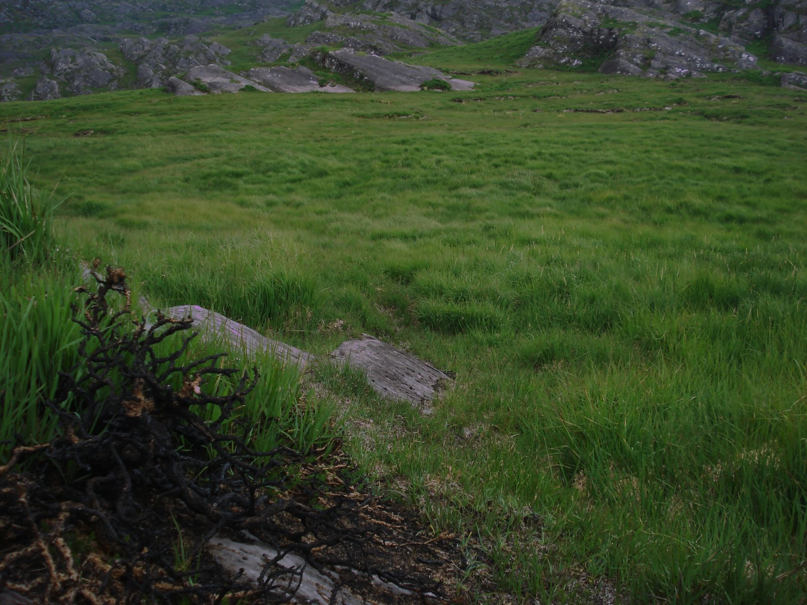
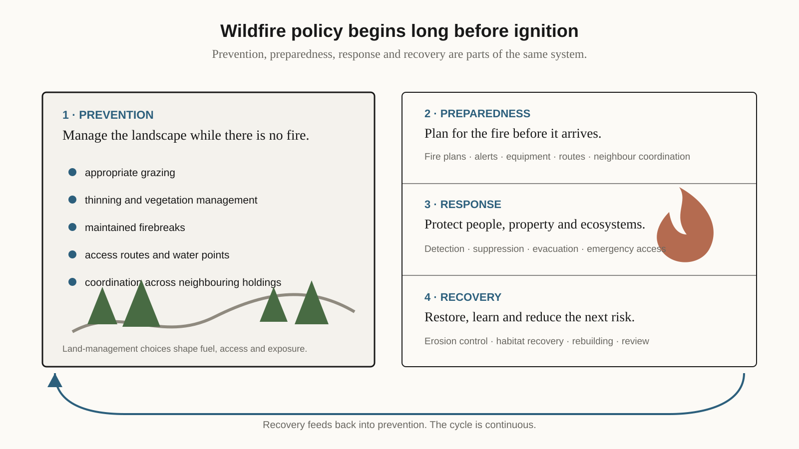

{fig-alt="Smoke rises from burning gorse and heather on a mountain slope in County Cork, with grassland visible around the burned area." width="100%" fig-align="center"}

*Photograph: [Keith Cunneen / Geograph Britain and Ireland via Wikimedia Commons](https://commons.wikimedia.org/wiki/File:I_love_the_smell_of_burning_gorse_in_the_morning._-_geograph.org.uk_-_1930711.jpg), [CC BY-SA 2.0](https://creativecommons.org/licenses/by-sa/2.0/).*

Ireland's fire season comes in spring. The Department of Agriculture, Food and the Marine's [fire-management page](https://www.gov.ie/en/department-of-agriculture-food-and-the-marine/publications/fire-management/) identifies a spring fire-risk season, and when I checked it in late September 2026 it listed three Fire Danger Notices for the year. The photograph above, of gorse and heather burning on a Cork hillside, is an Irish version of the problem. It looks nothing like a Mediterranean forest fire, and much of what shapes the risk on a hillside like that is settled before an emergency begins.

That is also the argument running through the European Commission's [Communication on Integrated Wildfire Risk Management](https://ec.europa.eu/echo/files/civil_protection/communication_on_integrated_wildfire_risk_management.pdf), adopted on 25 March 2026. The strategy treats prevention, preparedness, response and recovery as parts of one system, and its guidance for [agriculture and forests](https://agriculture.ec.europa.eu/cap-my-country/sustainability/environmental-sustainability/wildfire-prevention-and-restoration-agriculture-and-forests_en) gives farmers and foresters a role throughout. Grazing, agroforestry, thinning, firebreaks and other land management shape fuel loads and landscape structure well before an ignition.

{fig-alt="A four-stage schematic of wildfire risk management. Prevention is emphasized with grazing, vegetation management, firebreaks, access routes, water points and neighbour coordination, followed by preparedness, response and recovery." width="100%" fig-align="center"}

*Original schematic for EKO Perspectives.*

Ireland is not southern Europe, and importing the Mediterranean fire story wholesale would mislead. Irish guidance already treats wildfire as more than a firefighting problem, though. The [Office of Emergency Planning](https://www.gov.ie/en/office-of-emergency-planning/guidance/wildfires/) names peatlands, turf-cutting bogs, uplands and immature forest among the land most prone to wildfire, and notes that active farming, appropriate grazing and other fuel reduction can lower the risk. [Teagasc's guidance for forest owners](https://teagasc.ie/crops/forestry/advice/forest-protection/dealing-with-wildfires/) stresses fire plans, maintained firebreaks, access routes, water sources and cooperation with neighbouring landowners. None of it looks dramatic beside aircraft, fire engines or an evacuation, and all of it has to be done before the emergency to count for anything.

Neighbours appear in that guidance for a reason. The benefits and risks of managing land for fire do not stop at a property boundary. A well-managed parcel can reduce fuel across a wider area, while a blocked access route or an unmanaged strip creates problems next door. Fire prevention therefore shares the [coordination problem that runs through water quality, biodiversity and invasive-species policy](/blog/posts/2026-09-22-acres-landscape-actions/): the ecological unit is often larger than the holding through which policy is paid.

My view is that, on uplands and the margins of peatland, wildfire prevention belongs partly inside ordinary land-management policy, alongside emergency planning rather than in opposition to it. Grazing, access, vegetation management and agri-environment measures can shape risk before ignition; emergency services remain essential once a fire starts. That does not mean managing every landscape the same way. Peatlands and habitats have their own ecological objectives, and badly designed fuel reduction can damage the things a policy is meant to protect. Prescribed burning, where it is used at all, needs expertise, legal compliance and careful timing.

Nor is a plausible mechanism the same as demonstrated effect. Grazing reduces some fuels, but the result depends on stocking, vegetation, season, terrain and the ecosystem in question. Bringing fire prevention into land-management policy only works if those schemes ask where an intervention works, at what intensity and cost, and with what consequences for biodiversity, carbon and farming.

By the time a hillside is burning, many of those choices have already been made, but that makes prevention and emergency response parts of the same system rather than substitutes for one another.


