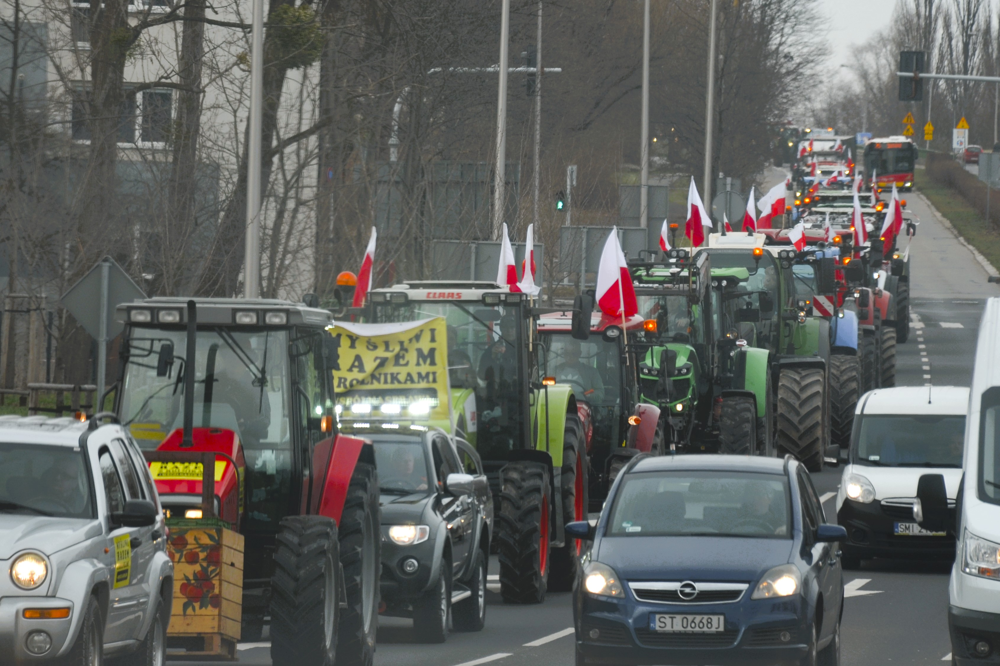

{fig-alt="A group of researchers, most wearing face masks, standing in a row on bare ground at a UC Davis agrivoltaics field site, with low solar panels and green crops behind them under a hazy sky." width="100%" fig-align="center"}

*Photograph: [UC Davis College of Engineering / Wikimedia Commons](https://commons.wikimedia.org/wiki/File:Agrivoltaics.jpg), [CC BY 2.0](https://creativecommons.org/licenses/by/2.0/).*

A great deal is being asked of land. We want it to keep producing food, and often more food, for a population that is growing and eating differently. We want it to store carbon, restore lost biodiversity, hold back floodwater, carry new forests and make room for wind turbines, solar farms and the power lines that connect them. We need somewhere to put houses, roads, warehouses and data centres. Some countries are asking their land to reduce dependence on imported food or fuel; others are asking it to repair ecosystems damaged over generations. Each of these ambitions makes sense on its own, and each has its advocates, its experts and its targets. The difficulty begins when several of them arrive on the same hectare.

Ask a climate scientist what a particular field is for, and the answer will usually involve carbon. Ask a conservation biologist and it will involve habitat. An energy planner sees a possible site for solar panels or a transmission route; a food economist sees calories; a housing ministry sees homes that have not yet been built. Each of them is describing something real, and each is speaking from a discipline with its own priorities and its own blind spots. What is striking is how often they are describing the same field, and how rarely the person who farms it is in the room when they compare notes.

Governments have noticed the pressure, and they are answering it with an unusual burst of plans. The European Union has set an aspiration of [no net land take by 2050](https://www.nature.com/articles/s41467-026-71931-w) alongside new laws on soil and nature restoration. On 18 March this year, England published its [first Land Use Framework](https://www.gov.uk/government/publications/land-use-framework/the-land-use-framework-for-england-accessible) and Scotland its [fourth Land Use Strategy](https://www.gov.scot/publications/scotlands-fourth-land-use-strategy-2026-2031/), on the same day. African governments have pledged [100 million hectares](https://www.rbge.org.uk/news/media-centre/press-releases/current/the-trouble-with-trees-what-is-the-benefit-of-afforestation/) for restoration, and Caribbean leaders have promised to grow far more of their own food. None of these governments suddenly discovered land this decade. What has changed is the number of national objectives now trying to occupy it, and the realisation that decisions once made inside separate ministries are colliding on the ground. Each document is, in its own way, an attempt to protect and to shape a future that nobody can see clearly.

England's framework reaches a reassuring conclusion. After what Defra describes as the most sophisticated land-use analysis the country has undertaken, it argues that England has enough land for new homes, continued food production, nature recovery and clean power, provided land is used more efficiently and, where possible, for several purposes at once. That may well be true in the aggregate, and it is a useful corrective to the idea that every gain for nature must be a loss for food. But land is one of those subjects on which national arithmetic can be right and still incomplete. A hectare of deep peat is not interchangeable with a hectare of prime cropland. A windy ridge beside a transmission line is not the same as a distant field with no grid connection, and a field on the edge of a growing town faces pressures that one fifty kilometres away does not. Totals add up hectares; the land itself is made of particular places.

Those places are also changing faster than the plans assume. A study published in *Nature Communications* this year by Zander Venter and colleagues combined satellite data with nearly 10,000 checked sample points and found that Europe converted [about 1,548 square kilometres a year](https://www.nature.com/articles/s41467-026-71931-w) of farmland and natural land to built surfaces between 2018 and 2023, nearly twice previous estimates. Housing accounted for 41 percent of that land and transport and logistics for another 22 percent. In the United States, which has no national land-use framework of the English kind and relies instead on local zoning, public-land agencies and voluntary conservation programmes, the American Farmland Trust estimates that the country is on course to convert [more than 18 million acres of farmland by 2040](https://farmland.org/?p=20341), an area the size of South Carolina. Governments, in other words, are getting better at writing integrated plans at exactly the moment when land is being consumed faster than their own statistics showed.

It would be tempting to turn such numbers into a league table of good and bad planning. Switzerland used land far more sparingly per person than Norway, for example. The researchers resisted that reading, pointing out that density, land prices and geography shape outcomes as much as rules do; in their words, ["attributing land-use efficiency solely to policy is likely premature."](https://www.nature.com/articles/s41467-026-71931-w) That caution is worth carrying into the wider debate, because the scientists advising governments on land do not agree on what land should do next, and each of them sees the hectare through a particular objective.

Start with food. Tim Searchinger, the lead author of the World Resources Institute's *Creating a Sustainable Food Future*, calculated that if crop and pasture yields continued to grow only at past rates, the world would need [593 million more hectares of farmland by 2050](https://research.wri.org/wrr-food/executive-summary-synthesis), an area nearly twice the size of India. His conclusion was blunt: ["There is no realistic potential to create a sustainable food future without major innovations."](https://www.world-grain.com/articles/12359-challenges-ahead-to-meet-2050-world-food-sustainability) The same report warned that when [bioenergy competes with food production for land](https://www.weforum.org/stories/2018/12/how-to-sustainably-feed-10-billion-people-by-2050-in-21-charts/), it widens the very gaps it was meant to help close. Seen from the food side, every hectare given to fuel, trees or solar panels is a hectare that has to be made up somewhere else, by higher yields or by clearing new land.

Biodiversity scientists see a different emergency. A global analysis by an international team including researchers from Conservation International, also published in *Nature Communications* this year, estimated that if future agriculture and renewable energy are planned without regard for nature, they could affect [nearly a million square kilometres of high-priority conservation land](https://www.nature.com/articles/s41467-026-69952-6). The authors called for protecting the most important places, reducing demand for food and energy land, and learning to ["intentionally coordinate land use across sectors."](https://www.nature.com/articles/s41467-026-69952-6) From this angle the danger is not too little farmland but too little room left for everything that is not farmed. And some ecologists warn that even well-meant climate solutions can misread the land entirely. William Bond of the University of Cape Town and colleagues argued that much of the African land targeted for tree planting was savanna and grassland that had never been forest, ancient ecosystems in their own right rather than failed forests waiting for trees. ["The tree-planting plans ignore the fate of the savanna's current inhabitants,"](https://eco-business.com/opinion/current-proposals-to-plant-trees-are-misguided) Bond wrote. Those grasslands are [home to more than 300 million people](https://science.uct.ac.za/node/3733).

Each of these perspectives is honest, and each has a blind spot. Food analysts can treat ecosystems mainly as a constraint on output. Conservation models can treat farms as pixels that might be moved elsewhere. Climate targets can treat grassland as an empty space waiting for trees. Planners can treat national totals as if hectares were interchangeable, when soils, water, grid connections and ownership make them anything but. None of these questions is frivolous, but none of them, on its own, owns the hectare. And none of them naturally includes the person who already lives from it.

That person is not rare. According to the Food and Agriculture Organization, there are [more than 608 million farms in the world](https://www.fao.org/agrifood-economics/publications/detail/en/c/1252236/), more than nine in ten of them family farms, together occupying around 70 to 80 percent of farmland and producing about 80 percent of the world's food by value. Most are very small: farms under two hectares make up 84 percent of the total. For these households land is not first a carbon store, a habitat or a site. It is the cattle whose sale pays this year's bills, the food on the table, the reserve against a bad season, the security for a loan and, very often, the inheritance a parent intends to pass on. A national model may place two hectares in the same land class; the family working one of them knows they are nothing of the sort.

{fig-alt="A smallholder farmer bent over a plot of dry beans, weeding the rows by hand with a hoe, in Hlokozi, KwaZulu-Natal, South Africa." width="100%" fig-align="center"}

*Photograph: [Alan Manson / Wikimedia Commons](https://commons.wikimedia.org/wiki/File:2005_0316_Dry_bean.jpg), released into the public domain under [CC0 1.0](https://creativecommons.org/publicdomain/zero/1.0/).*

Ownership widens the gap between the map and the household. In Sub-Saharan Africa, the World Bank reports that only [about 10 percent of rural land is formally registered](https://documents1.worldbank.org/curated/en/099062124174089530/pdf/P176052-f77d8e0e-8cd9-450e-bcdd-f07f73dc5619.pdf), that around 90 percent of the rural population reaches land through customary institutions, and that roughly a quarter of landholders fear losing their rights. A restoration map can therefore identify "available" land whose users are invisible to the very information system doing the identifying, land a family has worked for generations and cannot prove it owns. Wealthier countries have their own version of the problem. In England, tenant farmers manage [32 percent of agricultural land](https://www.gov.uk/government/publications/land-use-framework/the-land-use-framework-for-england-accessible), and the new framework itself concedes that policy has historically been designed for owner-occupiers. In Ireland, Teagasc's National Farm Survey found that even in a good year, 2025, only [42 percent of cattle-rearing farms were economically viable](https://www.agriland.ie/farming-news/farm-survey-sharp-increase-in-number-of-viable-farms-in-2025/), and these are precisely the farms whose land most often appears in national plans as available for forestry. When the Irish Farmers' Association argued against taxing farmland zoned for housing, it put the farmer's view in a phrase: land is ["the base input for their food production"](https://www.irishexaminer.com/farming/arid-41894734.html), not an asset held for speculation.

When farmers do reach the table, they often arrive as protesters rather than participants. In Victoria, Australia, the renewable energy zones were mapped to cover [around 7.9 percent of the state's land](https://www.stockandland.com.au/story/9043481/victorian-farmers-protest-against-energy-zone-expansion/), and farmers drove tractors into country towns over transmission lines planned across their paddocks. The state offered hosts [$8,000 a year per kilometre for 25 years](https://www.stockandland.com.au/story/8233027/countrys-power-line-anger-ignored-in-key-government-document/), yet many said the grievance was consultation rather than compensation. Emma Germano, then president of the Victorian Farmers Federation, called it unacceptable that ["farmers and our regional communities are set to pay the price"](https://www.sheepcentral.com/?p=147292). The disagreement was rarely between people who believe in clean energy and people who do not. A farmer can support decarbonisation and still object to a line across a particular paddock, just as a community can accept a national need while disputing who carries its local cost. In the Caribbean the land question is smaller in area but no less hard. A regional pledge to cut a [food import bill of about US$6 billion](https://barbadostoday.bb/?p=397090) by growing more food at home sounds simple at a summit, but the extra food has to be grown by smallholders on islands exposed to storms. After Hurricane Beryl, banana and plantain growers in St Vincent and the Grenadines lost up to 98 percent of their crop, and damage in Jamaica reached [more than 45,000 farmers](https://www.caribank.org/node/10941). A regional target, in the end, becomes a household's risk.

{fig-alt="Farmers taking part in a protest in Bielsko-Biała, Poland, on 22 February 2024, during the wave of European farmers' protests against farm incomes, imports and EU green rules." width="100%" fig-align="center"}

*Photograph: [Silar / Wikimedia Commons](https://commons.wikimedia.org/wiki/File:02024_1024_Europe_Farmers%27_Protest,_Bielsko-Bia%C5%82a.jpg), own work, used under [CC BY-SA 4.0](https://creativecommons.org/licenses/by-sa/4.0/).*

None of this is an argument against planning, and it would be unfair to tell the story as one of distant governments and wronged farmers. Farming landscapes are not museums; land uses have always changed and will change again, and some farmers can benefit from renewable-energy leases, woodland payments or restoration contracts. Leaving every decision to individual landowners would not protect the vulnerable either. Housing sprawls across good soils when nobody plans, habitats and rivers cross property boundaries, and electricity networks cannot be designed one farm at a time. The absence of strategy, not its presence, is usually what lets the collisions happen unseen until a farmer discovers them field by field. The harder question is what kind of planning, and here England's framework contains a sentence that deserves to sit above every land-use model: ["spatial data can augment on the ground knowledge, it should never replace it."](https://www.gov.uk/government/publications/land-use-framework/the-land-use-framework-for-england-accessible)

Good planning would make two things visible that are often hidden. The first is the collision itself. If forestry policy wants a hectare, energy policy wants it too, biodiversity policy values it for something else and agricultural policy assumes it will keep producing food, the contradiction should be seen at the centre rather than discovered by the household that receives four different signals. The second is distribution, including distribution across borders. Eric Lambin and Patrick Meyfroidt warned years ago in their work on [the looming land scarcity](https://doi.org/10.1073/pnas.1100480108) that land spared in one place can simply be spent in another; a country that takes farmland out of production and imports more food has not removed the land claim, only moved it. England's framework now commits to tracking these "imported hectares", which is welcome, but the farmers working them, often somewhere poorer and farther from the conversation, are in nobody's consultation. The hectare is local; the forces acting on it increasingly are not.

That is why I am uneasy with both extremes of this debate. One assumes that better maps, more detailed models and enough optimisation will reveal the correct allocation of land. The other treats almost any attempt at national coordination as an intrusion. I build land-use models in my own work, and I think the future will need more spatial intelligence, not less: we need to know where soils are productive, where biodiversity is irreplaceable, where flood risk is rising and where objectives overlap. But a map of land is not yet a map of people's ability to change. That requires asking who owns the land, who rents it, who grazes it without formal title, who earns from it, who would be paid if its use changed, who carries the risk if the new use fails, whether the decision can be reversed, and whether the person being asked to change was present when the objective was set. As the [slow progress of Irish tree planting](/blog/posts/2026-10-01-ireland-tree-planting-promise/) shows, a voluntary target that landholders do not believe in can stay on paper for decades. The future of land will be shaped less by any single national document than by millions of household decisions about whether to keep farming, sell, rent, plant or lease.

A great deal is being asked of land because a great deal is being asked of the future. Governments are right to try to see those demands together, and the new generation of land-use frameworks, restoration plans and spatial strategies may be an overdue admission that one landscape cannot be planned by half a dozen ministries pretending the others do not exist. But integration has to mean more than adding coloured layers to the same map. The scientist deserves to be heard, and so does the planner, and so does a public that wants climate action, wildlife and secure food. So, finally, does the farmer, tenant or pastoralist who may never use the phrase "land-use transition" but knows exactly what one piece of ground means to a household. Before it is a carbon store, a habitat, a solar site or a line in a national target, a farmed hectare is somebody's income and somebody's dinner. National targets count hectares, but people live on particular ones, and the next generation of land policy will have to hold both truths at once.

*Disclosure: I work within a government-funded agricultural and land-use modelling programme in Ireland. [This page explains that context](/research/context/). The views here are my own.*

