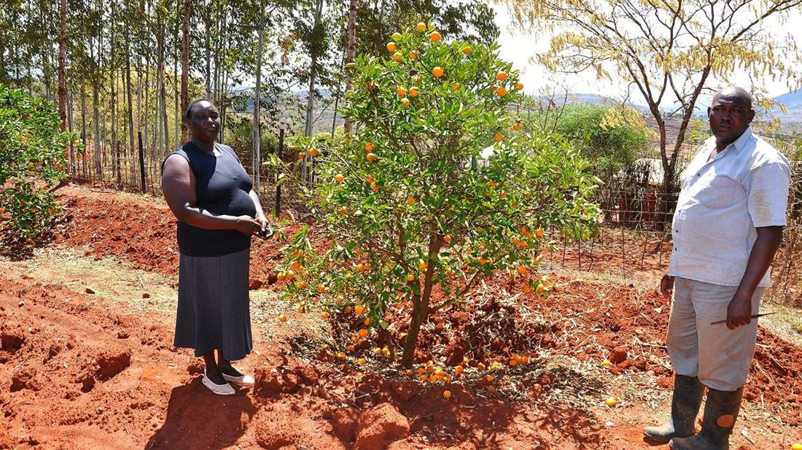
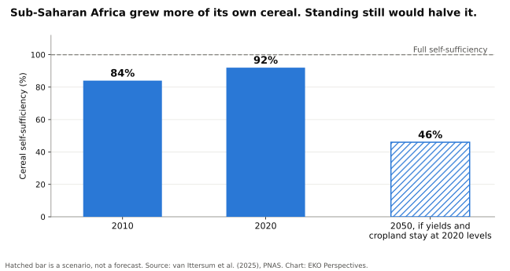

# Africa’s food problem is not too many people

Places & Development

Land & Agriculture

Sub-Saharan Africa will add more than half the world’s population growth to 2050. The evidence says it can feed far more people than it does today, but only if yields rise faster than they ever have, and honest numbers show whether they are.

Author

Elvis Kwame Ofori

Published

4 October 2026

Farmers in Machakos County, Kenya, beside an orange tree they planted, 2014.

*Photograph: [Timothy Mburu, CGIAR Climate Change, Agriculture and Food Security / Wikimedia Commons](https://commons.wikimedia.org/wiki/File:Climate_smart_agriculture_in_Machakos_county_(15453997230).jpg), [CC BY 2.0](https://creativecommons.org/licenses/by/2.0/).*

In the 1930s colonial officials looked at the hillsides of Machakos, east of Nairobi, and saw gullies, bare soil and too many people. Sixty years later Mary Tiffen, Michael Mortimore and Francis Gichuki went back. Between 1930 and 1990 the district’s population had grown almost sixfold, from about 240,000 to 1.4 million. Output per square kilometre, valued in constant maize prices, had risen about elevenfold, and output per person more than threefold. The gullied slopes of the 1937 photographs had become [terraces, woodlots and orchards](https://www.iied.org/sites/default/files/pdfs/migrate/6059IIED.pdf). They called the book *More People, Less Erosion*.

Machakos became the standard exhibit for Ester Boserup’s argument that population pressure can drive farmers to intensify rather than exhaust their land. It is worth stating what the exhibit actually shows. Machakos had a growing market on its doorstep in Nairobi, farmers secure enough on their land to invest in terraces, and decades in which to do it. The question now is whether sub-Saharan Africa as a whole can do the same, faster and under a warming climate.

## The case for pessimism

The demographic arithmetic is real. Sub-Saharan Africa will account for [about 54 per cent](https://www.pnas.org/doi/10.1073/pnas.2423669122) of the world’s population growth to 2050, and its food demand is projected to double between 2020 and 2050. The region already has the highest incidence of malnutrition in the world.

The climate arithmetic makes it harder. A 2026 review of Eastern Africa by Belay Simane and colleagues projects regional warming of 1.8 to 3.0°C by mid-century and, even with steady productivity gains of 1.5 per cent a year, [cereal deficits by 2050](https://pmc.ncbi.nlm.nih.gov/articles/PMC12923499/) of 71 per cent in Kenya and 60 per cent in Uganda. Ethiopia’s projected deficit is far smaller, at 21 per cent, which already hints that national paths diverge.

The strongest version of the pessimist case comes from agronomists, not demographers. In 2016 Martin van Ittersum and colleagues found that farmers in ten sub-Saharan countries were harvesting only [15 to 27 per cent](https://www.pnas.org/doi/10.1073/pnas.1610359113) of the yield their rainfall would allow. Merely keeping the region’s cereal self-sufficiency at its level then, about 80 per cent, would require closing almost all of that gap by 2050, a “large, abrupt acceleration” in yield growth that no country in the sample had shown.

## What happened instead

The same research group checked a decade later. Between 2010 and 2020, sub-Saharan Africa’s cereal self-sufficiency [rose from 84 to 92 per cent](https://www.pnas.org/doi/10.1073/pnas.2423669122) even as its population grew by 29 per cent. In the ten countries studied in detail, higher yields accounted for 44 per cent of the production increase, a shift from millet to higher-yielding maize for 22 per cent, and cropland expansion for 34 per cent.

Sub-Saharan Africa grew more of its own cereal between 2010 and 2020. If yields and cropland stopped rising, self-sufficiency would halve by 2050.

*Original chart for EKO Perspectives. Data: [van Ittersum et al. (2025)](https://www.pnas.org/doi/10.1073/pnas.2423669122).*

This is progress, and it is also a warning. A third of the gain came from ploughing more land, which the authors note is costly for biodiversity and emissions and cannot continue indefinitely. If yields and cropland simply stayed where they were in 2020, self-sufficiency would fall to 46 per cent by 2050. The region is not losing the race, but it is running to stand still, and too much of the running is still done by clearing land.

Individual countries show both the possibility and the problem of measuring it. FAO’s deputy regional representative for Africa, Meshack Malo, [says Tanzania now produces](https://africarenewal.un.org/en/magazine/africas-progress-towards-food-security) 235 per cent of its rice needs and exports the surplus. Ethiopia claims to have become self-sufficient in wheat by irrigating millions of hectares in the dry season. Its government put the 2023/24 harvest at 23 million tonnes; the African Development Bank and the US Department of Agriculture estimated [about 7.5 million](https://ethiopianbusinessreview.net/ethiopias-wheat-self-sufficiency-claims-questioned-amid-discrepancies/), and private traders imported 1.4 million tonnes in 2023. Irrigated wheat has clearly expanded. How far is impossible to judge when the official figure is three times the independent one.

## The strongest objection

The most serious challenge to the intensification story comes from the Alliance for Food Sovereignty in Africa, drawing on Timothy Wise’s analysis of FAO data for the 13 countries prioritised by the Alliance for a Green Revolution in Africa. Over eighteen years, fertiliser use in those countries more than doubled and cultivated land grew by 46 per cent, yet staple yields grew by 1.2 per cent a year, slightly slower than before AGRA began. The number of chronically undernourished people rose [from 94.6 million to 149.6 million](https://afsafrica.org/wp-content/uploads/2026/08/Green-Revolution-Has-Failed-Africa_compressed.pdf), and in Malawi, which had the strongest yield growth in the group, by 61 per cent. Senegal, outside the programme, halved its hunger while raising its staple-yield index by 73 per cent on about half the fertiliser per hectare.

The report is advocacy, and its own figures limit what it can show. The rise in hunger across the 13 countries was, it notes, almost the same as across sub-Saharan Africa as a whole, and Ethiopia and Ghana reduced hunger inside the programme. The evidence does not show that the Green Revolution model caused hunger to rise. It shows that two decades of input-led intensification did not deliver the transformation it promised, and that more fertiliser on more land is not the same as higher yields. The FAO’s [2026 report on soil health and fertiliser](https://www.fao.org/investment-centre/latest/news/detail/soil-health-and-fertilizer--policy-and-investment-prospects-in-sub-saharan-africa/en) reaches a similar verdict from a different starting point: “decades of subsidy programmes, research and investments have had only limited success,” and mineral fertiliser has to be combined with soil management adapted to each farming system rather than applied as a uniform package.

## What the evidence supports

Put together, the record does not support the Malthusian story. Sub-Saharan Africa fed 29 per cent more people with a larger share of its own cereal in a single decade, even though, on the last full measurement, its farmers were harvesting about a fifth of what their rainfall allowed. The constraint is not the number of people. It is how fast yields rise on land already farmed, and whether that rise comes from better soils, water, seed and agronomy rather than from clearing more land or from statistics that flatter a government.

That points to unglamorous priorities: soil fertility managed for local conditions, water harvesting and small-scale irrigation, extension services and seed systems that work, roads and markets that make investment worthwhile, and agricultural statistics that independent analysts can trust. Nothing on that list is new. Machakos had most of it, and it took sixty years.

The question for the continent is not whether more people can be fed. Machakos answered that in 1990. It is whether the conditions that made it possible there, a market worth producing for, land worth investing in, and time to do it, can be created across a continent in half the time.

**Elvis Kwame Ofori**\
Researcher and writer behind *EKO Perspectives*.

[More from EKO Perspectives](../../../blog/) · [Follow via RSS](../../../blog/index.xml) · [About the author](../../../about.llms.md)
