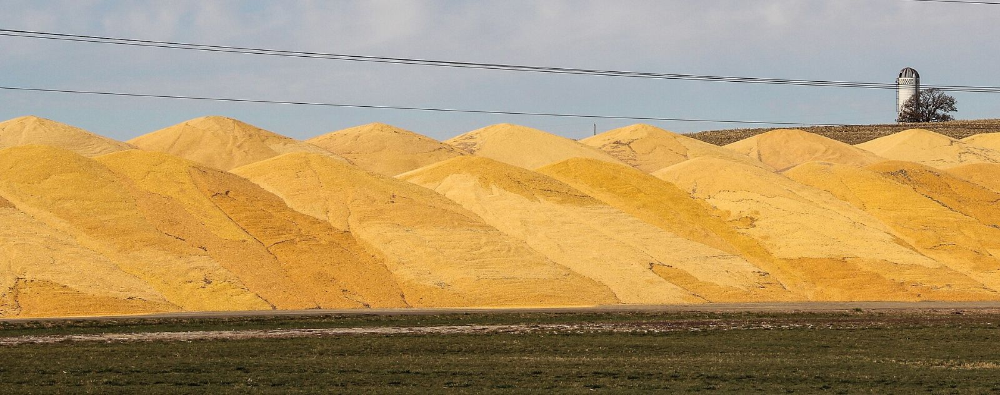

# A climate credit that will not count the land

Land & Agriculture

Policy

The United States now pays corn ethanol a clean-fuel credit calculated without the emissions from land converted to grow more crops. The science on that effect is contested. Writing it out of the law does not settle the dispute. It hides it.

Author

Elvis Kwame Ofori

Published

4 October 2026

Corn piled beside an ethanol plant in Atlantic, Iowa, November 2021.

*Photograph: [Cecilia Lynch, USDA / Wikimedia Commons](https://commons.wikimedia.org/wiki/File:Earth_Day_-_Rural_Development_(20211207-USDA-RD-IA-CRC-0001).jpg), public domain.*

Roughly a third of the American corn crop now goes into fuel. The Department of Agriculture projects that [5.6 billion bushels](https://www.usda.gov/oce/commodity/wasde/wasde0926.pdf) of a 15.8 billion bushel harvest will be used for ethanol in the 2026/27 marketing year, from a crop planted on 96.8 million acres. The ethanol share of that land comes to around 34 million acres, larger than Mississippi, although part of it returns to livestock as distillers’ grains. In March 2026 the Environmental Protection Agency finalised the [largest renewable fuel obligations](https://www.fb.org/market-intel/epa-sets-record-renewable-fuel-volumes-for-2026-2027) in the programme’s history, with [room for 15 billion gallons](https://www.federalregister.gov/documents/2026/04/01/2026-06275/renewable-fuel-standard-rfs-program-standards-for-2026-and-2027-partial-waiver-of-2025-cellulosic) of conventional, overwhelmingly corn, ethanol.

Whether that is good for the climate depends on where the calculation draws its boundary. A gallon of ethanol has direct emissions: fertiliser, field diesel, the energy used at the distillery. It also has indirect ones. When corn goes into fuel tanks, prices rise, and farmers somewhere else convert grassland or forest to grow the food and feed that the corn would have supplied. That carbon is real, but it is released far from the ethanol plant and can only be estimated with economic models. This is indirect land-use change, and its size is the most contested number in biofuel policy.

In July 2025 Congress settled the argument for tax purposes. The One Big Beautiful Bill Act rewrote the 45Z Clean Fuel Production Credit, which pays producers more the lower their fuel’s lifecycle emissions, so that emissions rates [“shall be adjusted as necessary to exclude any emissions attributed to indirect land use change”](https://farmdocdaily.illinois.edu/2026/05/the-clean-fuel-production-tax-credit-45z-introductory-discussion.html). The Department of Energy’s [updated 45ZCF-GREET model](https://www.biobased-diesel.com/post/us-doe-update-to-45zcf-greet-model-strengthens-path-for-american-biofuels) followed in June 2026, and the Iowa Renewable Fuels Association welcomed it for moving away from “flawed, unscientific assumptions about biofuels.” Nothing in the law stops anyone from estimating the effect. California’s Low Carbon Fuel Standard still charges corn ethanol [19.8 grams of CO₂-equivalent per megajoule](https://www.choicesmagazine.org/choices-magazine/submitted-articles/the-carbon-intensity-of-ethanol-in-california) for land-use change. What the federal law does is require a subsidy to be calculated as though the effect were zero.

Zero is the one value the evidence does not support. The studies disagree about size, not existence. The most cited recent estimate, by Tyler Lark and colleagues in the [*Proceedings of the National Academy of Sciences*](https://www.pnas.org/doi/10.1073/pnas.2101084119) in 2022, found that the Renewable Fuel Standard raised corn prices by about 30 per cent and expanded corn cultivation by 2.8 million hectares a year between 2008 and 2016. Counting only the resulting land conversion within the United States, the authors concluded that corn ethanol’s carbon intensity was “no less than gasoline and likely at least 24% higher,” and noted that any effects abroad would come on top.

That study has serious critics. The Department of Agriculture’s [Office of the Chief Economist](https://www.usda.gov/sites/default/files/documents/USDA-OCE-Review-of-Lark-2022-For-Submission.pdf) argued that it treated short-term conservation land as long-standing grassland and overstated the soil carbon lost when it was ploughed. Economists from Purdue, the University of Illinois and Argonne National Laboratory, which develops the GREET model, [argued](https://ag.purdue.edu/commercialag/home/wp-content/uploads/2022/05/Comments-on-Environmental-Outcomes-of-the-U.S.-Renewable-Fuel-Standard.pdf) that it also overstated the price effect and mistook idle land returning to production for new conversion. A 2021 review led by Melissa Scully in [*Environmental Research Letters*](https://doi.org/10.1088/1748-9326/abde08) put corn ethanol’s carbon intensity 46 per cent below gasoline’s.

All three estimates include land-use change. They differ in how large it is.

*Original chart for EKO Perspectives. Data: [Scully et al. (2021)](https://doi.org/10.1088/1748-9326/abde08); [USDA, Lewandrowski et al. (2019)](https://www.usda.gov/about-usda/news/press-releases/2019/04/02/usda-study-shows-significant-greenhouse-gas-benefits-ethanol-compared-gasoline); [Lark et al. (2022)](https://www.pnas.org/doi/10.1073/pnas.2101084119).*

Those objections narrow the range of estimates. They do not take it to zero. The USDA’s own estimate of a 39 per cent saving includes land-use emissions, and even the Scully review, the most favourable to ethanol, puts its central land-use term at 3.9 grams per megajoule rather than nothing. Models that let prices respond keep finding that diverting a third of a national crop changes land use somewhere. The disagreement is about how much.

A contested parameter is normally handled by choosing a central estimate, reporting the uncertainty around it, and revising it as evidence improves. The EPA did this in its [2010 lifecycle analysis](https://www.govinfo.gov/content/pkg/FR-2010-03-26/pdf/2010-3851.pdf) for the Renewable Fuel Standard, which included international land-use change and rejected calls to drop it because of uncertainty. California does it now. Fixing the parameter at zero by statute is a different act. It turns a scientific dispute into an accounting rule, and it sets the rule at the end of the range that suits the industry receiving the credit.

The choice matters most for aviation. The 45Z credit also covers sustainable aviation fuel, a market that is only beginning, with production expected to cover [0.8 per cent of jet fuel use](https://www.iata.org/en/pressroom/2026-releases/06-06-saf-production-volumes-still-disappointing/) in 2026. Crop-based fuel could take a large share of whatever growth comes. The European Union has gone the other way. Its [ReFuelEU Aviation regulation](https://transport.ec.europa.eu/transport-modes/air/environment/refueleu-aviation/faq-refueleu-aviation_en) does not count fuels made from food and feed crops towards its mandate. Whether crop-based jet fuel carries a land cost is the question the American credit now declines to ask.

Fuels that do not compete for cropland exist, from waste oils and residues to gas recovered from wastewater treatment. They are small and expensive, and a credit that scores crop fuels as though their land use were free makes those alternatives smaller and slower, because it removes the one accounting difference that favoured them.

The politics are familiar. The Renewable Fuel Standard has survived for two decades because its benefits are concentrated among corn growers, refiners and the politicians who represent them, while its costs are spread thinly. What is new is where the lobbying has landed. The industry has always fought over the size of the mandate. This time the outcome was written into the measurement itself.

The carbon released when grassland is ploughed reaches the atmosphere whether or not the tax code counts it. The forest cleared somewhere else to replace the crop that went into a fuel tank falls whether or not an emissions analyst is allowed to record it. A climate credit is only as good as what it is willing to count.

The fix is modest. Restore a central estimate of indirect land-use change with its uncertainty stated, update it as the evidence improves, and let corn ethanol claim whatever credit survives the full accounting. Until that happens, the numbers produced by this credit will describe a fuel that exists only on paper.

**Elvis Kwame Ofori**\
Researcher and writer behind *EKO Perspectives*.

[More from EKO Perspectives](../../../blog/) · [Follow via RSS](../../../blog/index.xml) · [About the author](../../../about.llms.md)
