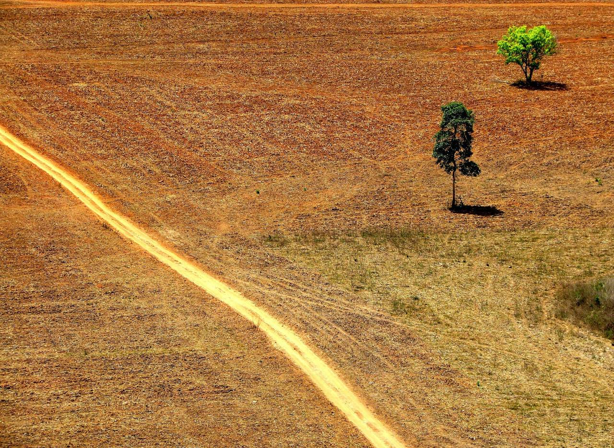
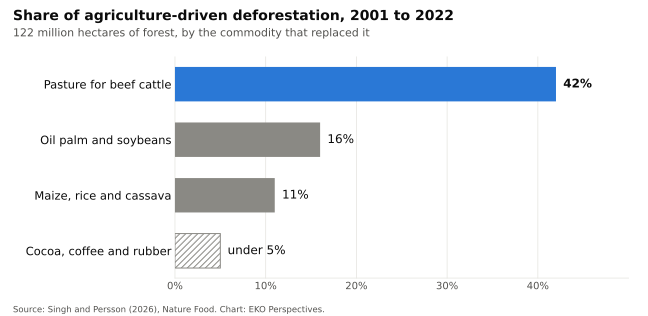

{fig-alt="Two small trees stand alone in a vast expanse of bare, reddish-brown cleared ground in the Brazilian Amazon. A pale dirt track cuts diagonally across the lower left of the frame." width="100%" fig-align="center"}

*Photograph: [Ana Cotta / Wikimedia Commons](https://commons.wikimedia.org/wiki/File:Amaz%C3%B4nia_em_2008.jpg), [CC BY 2.0](https://creativecommons.org/licenses/by/2.0/).*

Farms now cover about [44 per cent of the world's habitable land](https://ourworldindata.org/global-land-for-agriculture). Livestock accounts for roughly 80 per cent of that area once grazing land and feed crops are added together, yet meat, dairy and farmed fish supply 17 per cent of the world's calories and 38 per cent of its protein. The food system as a whole, from fertiliser to landfill, produced [about a third](https://doi.org/10.1038/s43016-021-00225-9) of global greenhouse gas emissions in 2015. A 2022 review led by Florence Pendrill found that between 90 and 99 per cent of tropical deforestation is driven [directly or indirectly by agriculture](https://www.chalmers.se/en/current/news/see-agriculture-drives-over-90-of-deforestation-in-the-tropics/).

Michael Grunwald's *We Are Eating the Earth* is built on those numbers. His case, which leans heavily on the work of Tim Searchinger at Princeton and the World Resources Institute, is that land is the neglected half of the climate problem: every hectare cleared for food releases carbon and removes habitat, and the world has to feed a population projected to reach [about 9.7 billion](https://population.un.org/wpp/) by 2050 without clearing much more. The diagnosis is hard to dispute. The prescription is where the argument starts.

## Where the damage is

Three studies published this year sharpen the picture. In February, Martin Persson and a colleague at Chalmers University of Technology traced 122 million hectares of forest lost between 2001 and 2022 to the commodities that replaced it. Pasture for beef cattle accounted for [42 per cent](https://trase.earth/insights/domestic-food-crops-overlooked-as-driver-of-deforestation), oil palm and soybeans together for 16 per cent. Maize, rice and cassava, crops grown mostly for domestic food markets, accounted for about 11 per cent, more than cocoa, coffee and rubber combined. The emissions estimate was lower than earlier work: about [2 billion tonnes of CO₂ a year](https://www.earth.com/news/everyday-foods-are-the-hidden-drivers-of-deforestation), around 5 per cent of global emissions, less than half of some previous figures.

{fig-alt="Horizontal bar chart of shares of agriculture-driven deforestation between 2001 and 2022. Pasture for beef cattle 42 per cent, oil palm and soybeans 16 per cent, maize, rice and cassava 11 per cent, and cocoa, coffee and rubber under 5 per cent, shown as a hatched bar because only an upper bound is reported." width="100%" fig-align="center"}

*Original chart for EKO Perspectives. Data: [Singh and Persson (2026), *Nature Food*](https://doi.org/10.1038/s43016-026-01305-4).*

Forests are only part of it. A [PNAS study](https://www.wri.org/insights/global-ecosystem-conversion-grassland-wetland-savanna-to-agriculture) led by Elise Mazur at the World Resources Institute found that between 2005 and 2020, 95 million hectares of grassland, savanna, wetland and other non-forest ecosystems were converted to annual crops and another 95 million to pasture. The combined area is roughly four times the forest lost to crops and pasture over the same period, in landscapes that most deforestation rules do not cover. Livestock, through pasture and feed crops, was the largest single cause.

In August, a team led by Baoxiao Liu at Leiden University mapped the damage across farmland itself. Beef and milk accounted for [41 per cent of the biodiversity loss](https://www.universiteitleiden.nl/en/news/2026/08/environmental-hotspots-one-third-of-agricultural-land-accounts-for-two-thirds-of-global-impact) linked to agricultural land and 29 per cent of the lost carbon storage. The more useful finding is about concentration. About two-thirds of the loss occurs on one-third of agricultural land, in hotspots that include Mexico and Central America, parts of Brazil, West Africa, India, China and South-East Asia.

## Two camps, one assumption

The response divides into two camps. Grunwald argues for land sparing: raise yields on land already farmed so that less new land is needed and more can be left to nature. Timothy Bowles, an agroecologist at the University of California, Berkeley, argues that industrial intensification is part of the problem and that diversified, low-input farming can feed people while restoring the land. When the two [debated at Berkeley](https://news.berkeley.edu/2025/05/30/berkeley-talks-farming/) in 2025, Bowles put his case in political terms: agroecology is "already happening all over the world," and what has been missing is the will to make it the foundation of the food system.

The strongest evidence for sparing comes partly from Ghana. In 2011 Ben Phalan and colleagues measured more than 600 bird and tree species in southwest Ghana and northern India and found that most would have [larger total populations](https://doi.org/10.1126/science.1208742) if farming were confined to the smallest feasible area and the rest left as forest. Wildlife-friendly farms held more species than monocultures but produced much less food, and still failed to support most forest species. The authors were explicit about the condition attached: higher yields only spare land when parks, reserves and other active measures stop the spared forest being converted.

That condition is where the sparing argument is weakest in practice. Thomas Rudel and colleagues examined FAO data for 1970 to 2005 and found that rising yields were [generally not accompanied by a fall in cropland](https://pmc.ncbi.nlm.nih.gov/articles/PMC2791618) at national scale. The exceptions were countries that imported grain and ran conservation set-aside programmes. Higher yields make farming more profitable, and more profitable farming can pull more land into production. Gabriel Popkin's review of Grunwald's book asks the question directly: would spared land really return to nature, or be used to grow still more food?

Agroecology faces the mirror image of the same problem. Lower-yielding systems need more land for the same output unless diets and waste change too. Neither camp's model protects anything on its own. Sparing depends on a boundary that someone enforces. Sharing depends on demand that someone reduces.

## What the models say

The most ambitious recent attempt to combine the levers was published in *Nature* in July. An international team of more than 40 researchers modelled a shift to the diet recommended by the 2025 EAT-Lancet Commission, together with sustainable intensification and a halving of food waste. By 2050, agricultural land use would be [6 to 42 per cent lower](https://www.ifpri.org/news-release/healthier-and-more-sustainable-diets-could-reshape-global-agriculture/) than under current trends, and the value of livestock production 49 to 83 per cent lower. The range is wide, and the authors describe the change required as a historically unprecedented restructuring of global agriculture.

Two things follow from that study. The scenario that saves the most land uses intensification and dietary change together, so the debate between the camps is less of a choice than it sounds. And even the optimistic end depends on hundreds of millions of people eating less beef and dairy, which no government has yet delivered at scale.

Land is also being claimed for fuel. About [5.6 billion bushels](https://www.usda.gov/oce/commodity/wasde/wasde0926.pdf) of a projected 15.8 billion bushel US corn harvest will go into ethanol in the 2026/27 marketing year. The Renewable Fuel Standard sets that demand, and it competes for the same land the food scenarios hope to free.

## What would change it

The Leiden map matters because it turns a global problem into a targeting problem. If two-thirds of the damage sits on a third of farmland, protection and restoration can be concentrated where they buy the most, and the Mazur study shows that those places include grasslands and savannas as well as forests. Rudel's exceptions point to the instruments: set-aside that is paid for, land-use rules that cover non-forest ecosystems, and trade and procurement standards that reach the commodities actually doing the clearing, which means cattle above all. Pendrill's review found that only [45 to 65 per cent](https://www.chalmers.se/en/current/news/see-agriculture-drives-over-90-of-deforestation-in-the-tropics/) of land cleared for agriculture in the tropics ends up in active production. Much of the rest is cleared ahead of any farming, burned or abandoned, a problem of tenure and enforcement that better seeds will not fix.

The competing claims on a single field are a theme I have written about [before](/blog/posts/2026-10-02-one-hectare-many-promises/). At the global scale the conclusion is the same. Higher yields and gentler farming both have a place, but neither spares land by itself. Nature survives where a public decision says this land stays wild, and that decision is funded and enforced. Without it, the gains from either kind of farming will be spent on clearing more land.


