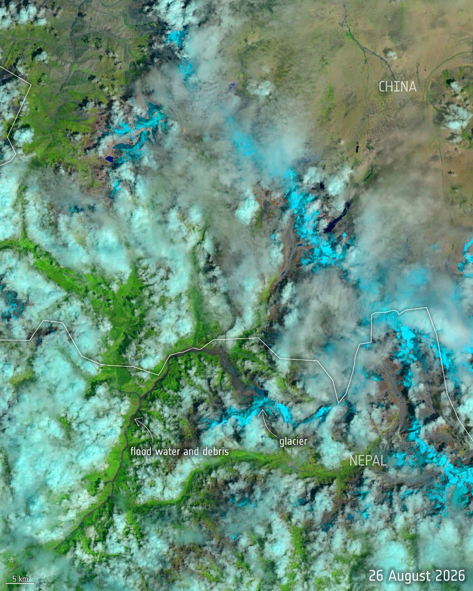
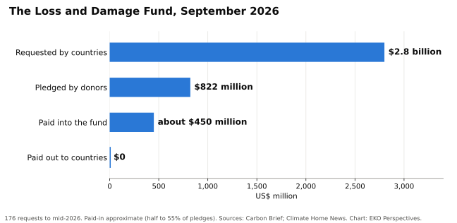

{fig-alt="Annotated satellite image of the Himalayan border region between Nepal and China. Labels mark the glacier and a long brown trail of flood water and debris running through green valleys, with clouds and snow across much of the frame." width="100%" fig-align="center"}

*Image: [European Space Agency](https://commons.wikimedia.org/wiki/File:Nepal_glacier_collapse_and_flood_(after)_(55504451912).jpg), Landsat-9 data, [CC BY 4.0](https://creativecommons.org/licenses/by/4.0/).*

On 26 August 2026 a glacier collapsed above the Bhote Koshi valley in northern Nepal. The flood that followed killed more than 1,400 people, left thousands missing and broke through several hydropower dams. Nepal's disaster authority puts the damage and loss at [$2.7 billion, with a further $4.8 billion](https://www.carbonbrief.org/analysis-nepals-20m-loss-and-damage-claim-only-covers-0-7-of-flood-costs) needed for recovery and reconstruction. In September the government asked the UN's Fund for Responding to Loss and Damage for $20 million. The Foreign Minister, Shisir Khanal, said it was not a request for charity but a demand for justice, grounded in ["legal and moral liability."](https://theconversation.com/nepal-isnt-the-only-disaster-struck-country-waiting-for-money-from-the-global-climate-loss-and-damage-fund-291264)

Twenty million dollars is the [most the fund allows](https://www.nature.com/articles/d41586-026-03000-7) for a single proposal. It is about 0.7 per cent of the estimated damage and loss, before any reconstruction. Nepal's own climate negotiator, Raju Pandit Chhetri, called it "a peanut" set against reconstruction. Nepal has done almost nothing to cause the warming that is melting its glaciers, and the most it can ask of the fund built for exactly this situation would cover less than one dollar in every hundred it has lost.

Even that has not been paid. The fund, agreed at COP27 in 2022, has received 176 requests seeking $2.8 billion. Donors have pledged $822 million, and only about half of it has actually been paid in. By September 2026 the fund had paid out nothing. At its mid-year meeting the board considered four requests and approved none, deferring its first approvals to December, when it expects to fund [15 to 20 projects](https://www.climatechangenews.com/2026/07/10/loss-and-damage-fund-delays-first-project-approvals-as-needs-dwarf-resources/). Eight of the 26 board members asked for an emergency meeting on Nepal. The co-chairs [replied on 10 September](https://english.onlinekhabar.com/loss-and-damage-fund-responds.html) that they were considering options within existing policies; no money was approved, and the board next meets in Manila in December. Without new contributions, the fund could run out of money by the end of 2027.

{fig-alt="Horizontal bar chart of the Loss and Damage Fund in September 2026. Countries had requested 2.8 billion dollars, donors had pledged 822 million, about 450 million had been paid into the fund, and nothing had been paid out to countries." width="100%" fig-align="center"}

*Original chart for EKO Perspectives. Data: [Carbon Brief](https://www.carbonbrief.org/analysis-nepals-20m-loss-and-damage-claim-only-covers-0-7-of-flood-costs); [Climate Home News](https://www.climatechangenews.com/2026/07/10/loss-and-damage-fund-delays-first-project-approvals-as-needs-dwarf-resources/).*

Loss and damage finance is meant to pay for the harm that adaptation could not prevent. In practice the line has blurred. More than three-quarters of the requests to the fund include slow-onset needs, such as sea walls and the capacity to cope with rising seas. That is protection which, in a system that worked, adaptation finance would already have built. That money is not there either.

The United Nations Environment Programme's [Adaptation Gap Report 2025](https://www.unep.org/resources/adaptation-gap-report-2025) estimates that developing countries will need about $310 billion a year for adaptation by 2035, or $365 billion if the figure is built from their own national plans. International public adaptation finance reached $26 billion in 2023, down from $28 billion the year before. The need is twelve to fourteen times the flow, and the Glasgow goal of doubling adaptation finance by 2025 will not be met. At COP30 in Belém, countries [called for efforts](https://www.carbonbrief.org/cop30-key-outcomes-agreed-at-the-un-climate-talks-in-belem) to triple adaptation finance by 2035, without naming a baseline or a figure; the least developed countries' proposal of $120 billion did not survive into the text. At the Bonn talks in June 2026, countries could not even agree to reference the tripling goal, and the question was [deferred to COP31](https://actalliance.org/act-news/after-bonn-what-sb64-delivered-and-what-it-left-behind/).

Rich countries are not spared the consequences of a hotter world. A rapid study of 854 European cities by Imperial College London and the London School of Hygiene and Tropical Medicine estimated [about 24,400 heat deaths](https://www.lshtm.ac.uk/newsevents/news/2025/climate-change-driven-summer-heat-caused-16500-additional-deaths-across-europe) in the summer of 2025, of which 16,500 were attributable to climate change. Europe has hospitals, early warning systems and budgets to protect people, and still lost thousands. Countries such as Nepal face the same physics with a fraction of the means.

Money alone will not close the gap. Adaptation can fail. A sea wall protects one stretch of coast and speeds erosion on the next. Air conditioning saves lives in a heat wave and adds to the emissions that cause heat waves. A 2026 study of heat policy in Accra by Maryam Nastar and Frederick Ato Armah warns that the [distance between what urban adaptation plans intend and what they deliver](https://lup.lub.lu.se/search/publication/e5762b28-af87-4eea-bb66-2d5cc8d3c4f9) can entrench the vulnerabilities they were meant to reduce. Badly designed adaptation is not a cheaper version of good adaptation. It can make people worse off. But the risk of spending badly is not an argument for not spending at all, and it is not the reason the money is missing.

The countries negotiating in Bonn, Belém and next in Türkiye know what needs to be done. They have agreed the principles. They have created the funds. They have written the plans. What they have not done is pay. Nepal's request now waits in the same queue as every other country's, for a board that meets in December with a fraction of what was asked.

Adaptation is now recognised as a central pillar of climate action, and the recognition is correct and overdue. But a pillar without a foundation is just a column standing in the air. The world has built the column. It has not yet built the ground beneath it.


