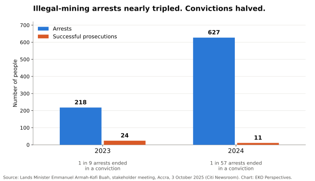

{fig-alt="Grouped bar chart. In 2023 there were 218 arrests for illegal mining and 24 successful prosecutions, about one conviction for every nine arrests. In 2024 there were 627 arrests and 11 successful prosecutions, about one for every 57 arrests." width="100%" fig-align="center"}

*Original chart for EKO Perspectives. Data: [Lands Minister Emmanuel Armah-Kofi Buah, 3 October 2025](https://www.citinewsroom.com/2025/10/galamsey-crackdown-collapsed-under-akufo-addo-only-4-of-arrests-prosecuted-buah/).*

The River Pra supplies drinking water to Sekondi-Takoradi, Cape Coast, Elmina and the towns around them. The treatment plant at Daboase was designed in 1969 for river water with a turbidity of about 54 units; the newer plant at Sekyere Hemang was built in 2008 to cope with up to 500. In March 2024, the Pra arriving at Sekyere Hemang reached [13,000](https://gna.org.gh/2024/03/galamsey-stakeholders-call-for-drastic-coordinated-action-to-save-water-situation/). Ghana Water said it had cut production by 30 percent, and at the same forum Professor David Kofi Essumang warned that the country could be importing water within fifteen years. At Kwanyako, on the same river, JoyNews reporters were shown the plant's own records rising from 25 in 2016 to [94,800 in September 2025](https://www.myjoyonline.com/the-galamsey-war-and-gwls-fictitious-and-inaccurate-rebuttal/). Ghana Water has since said that such plant tests are [not official monitoring of the river](https://www.myjoyonline.com/ghana-water-limited-clarifies-mandate-over-river-turbidity-data/), which falls to the Water Resources Commission and the EPA. It has not said the readings were wrong. This is not drought, and it is not climate change. It is the silt and chemistry of galamsey, illegal gold mining, carried downstream into the water that millions of Ghanaians drink. It is a choice made every day by people who will never drink from the Pra, and it is being made on behalf of children who have no say in it at all.

{fig-alt="A wide brown river, thick with sediment, flowing between banks of dense green forest and palms under a partly cloudy sky, with a small boat in the distance." width="100%" fig-align="center"}

*Photograph: [Efo Komla / Wikimedia Commons](https://commons.wikimedia.org/wiki/File:River_Pra_of_Ghana.jpg), [CC BY-SA 4.0](https://creativecommons.org/licenses/by-sa/4.0/).*

The trade at the heart of it is brutally simple. The gold leaves the country; the costs stay behind in the rivers, the forests and the farms. In October 2025 the Lands Minister said that 44 of Ghana's 288 forest reserves had been ["completely destroyed"](https://starrfm.com.gh/galamsey-arrests-prosecution-ghana) by illegal mining, and in August 2026 he put the area of reserve land completely degraded at [about 8,900 hectares](https://www.myjoyonline.com/galamsey-challenge-is-prosecution-not-arrest-lands-minister/). Cocoa, the crop that built modern Ghana, is being dug up with it. The figure most often quoted is more than 100,000 acres of cocoa destroyed. A farmers' association [used it in September 2024](https://citinewsroom.com/2024/09/over-100000-acres-of-cocoa-farms-destroyed-by-illegal-mining-farmers-association/), and a regional manager of the Ghana Cocoa Board [repeated it in July 2026](https://gna.org.gh/2026/07/cocoa-industry-will-collapse-if-urgent-interventions-are-not-made/). A loss estimate that has not moved in two years says a good deal about how little anyone is measuring. The smaller cases are better documented. In 2023 the head of the board's extension division reported that [36.5 hectares of cocoa it had rehabilitated](https://www.graphic.com.gh/news/general-news/cocoa-industry-under-threat-illegal-miners-destroy-rehabilitated-farms.html) near Boinso, in Aowin, had all been cut down for galamsey. Public money replants the trees; private gold uproots them.

The children are where the cost becomes impossible to ignore. In an open letter to the President early this year, the Paediatric Society of Ghana warned that illegal mining poses [severe and irreversible risks to children's health and brain development](https://gna.org.gh/2026/02/galamsey-threatens-childrens-health-society-warns/), that children have drowned in open pits left behind by miners, and that the toxins released into water and food cross the placenta and enter breast milk. The Society warned of mounting costs for dialysis, cancer treatment and disability support, asked the government to declare galamsey a child health emergency, and on Earth Day described it as a ["slow, silent assault on the Ghanaian child."](https://www.adomonline.com/paediatric-society-urges-mahama-to-declare-galamsey-public-health-emergency/)

The state's answer has been force, and force has produced numbers. What it has not produced is justice. In October 2025, the Lands Minister, Emmanuel Armah-Kofi Buah, told a national stakeholder meeting that of 845 people arrested for illegal mining in 2023 and 2024, only 35 were successfully prosecuted. The breakdown is worse than the total: 218 arrests and 24 prosecutions in 2023, then [627 arrests and just 11 prosecutions in 2024](https://www.citinewsroom.com/2025/10/galamsey-crackdown-collapsed-under-akufo-addo-only-4-of-arrests-prosecuted-buah/). Arrests nearly tripled while convictions halved. The minister has since said plainly that the challenge is now [prosecution, not arrest](https://www.myjoyonline.com/galamsey-challenge-is-prosecution-not-arrest-lands-minister/), and he has acknowledged allegations that some of the Blue Water Guards deployed against illegal mining have themselves accepted bribes. An arrest that ends in release is not enforcement. It is a fee.

This is why the conviction in July of Bernard Antwi Boasiako, the Ashanti Regional Chairman of the opposition New Patriotic Party, matters so much and proves so little. An Accra High Court sentenced him to [20 years with hard labour](https://gna.org.gh/2026/07/wontumi-jailed-20-years-for-facilitating-illegal-mining/) on six counts, including assigning mineral rights without the minister's approval, for facilitating unlicensed mining on the concession of his company, Akonta Mining, at Samreboi. The government had earlier alleged that the company sold access to forest reserves to illegal miners for up to [GH¢300,000 per concession](https://www.citinewsroom.com/2025/04/galamsey-govt-raids-akonta-mining-site-orders-revocation-of-lease/) and collected weekly royalties in gold. His party rejected the verdict, its General Secretary, Justin Kodua Frimpong, [called him a political prisoner](https://www.citinewsroom.com/2026/07/npp-rejects-wontumi-conviction-says-verdict-lacked-evidence/), and the party has said it will appeal. Whatever the higher courts decide, one conviction of one opposition figure cannot be the measure of a national campaign. The measure is whether the same law reaches the financiers, concession holders and protectors of galamsey whoever they vote for.

There is good reason to doubt that it will, because the problem is political before it is criminal. A 2025 study in *World Development* by Abdul-Gafaru Abdulai, Lars Buur and Paul Austin Stacey found that the rents from illegal gold mining, and politicians' growing dependence on votes in galamsey-dominated constituencies, are [key reasons why efforts to formalise small-scale mining have failed](https://doi.org/10.1016/j.worlddev.2025.107008). Its most uncomfortable finding is that military raids, rather than ending illegality, have helped ruling-party elites and supporters capture the rents. Both major parties have governed during the worst of the destruction, and both have accused the other of protecting it. The president of the university teachers' union at KNUST, Professor Eric Abavare, put the public mood plainly: politicians, he said, should not use galamsey ["for cheap political gain."](https://rainbowradioonline.com/2025/11/25/npp-ndc-playing-swinging-tactic-game-with-galamsey-knust-utag-prez/?amp=1)

This does not make the young man in the pit the villain. He is responding to the only economy that pays him. When a cocoa farmer is offered cash for land that earns little in a bad season, or a school leaver can earn in a week what farming pays in a month, the choice is not really a choice. Cocoa Board officials now [plead with farmers](https://gna.org.gh/2026/07/cocoa-industry-will-collapse-if-urgent-interventions-are-not-made/) not to sell their farms to miners. Enforcement aimed at the diggers while the financiers stay untouched is not a strategy. It is a revolving door that turns the poorest people in the chain into statistics and leaves the money where it was.

What would change it is not a state of emergency or another wave of soldiers. It is prosecutions that follow the money to the people who finance excavators, sell concessions and buy the gold, backed by prosecutors and courts resourced to finish cases rather than adjourn them. It is a licensing system simple and honest enough for small miners to work legally, in places chosen to protect rivers and cocoa land, rather than one that leaves most of them outside the law by default. It is reclamation that lasts after the cameras leave, and a gold trade that cannot buy metal it cannot trace. And it is a rural economy, cocoa above all, that pays enough for a young person to stay on the farm.

I keep returning to a thought that is less a policy than a wish. I wish that somewhere in Accra, in the ministries, the party offices and the committee rooms, someone with real power would stop treating galamsey as a problem to be managed between elections and start treating it as the thing that will decide what kind of country Ghana becomes. Not another task force, and not another press conference at a reclaimed site, but a decision made once and held for twenty years: that the water, the soil and the children come before the gold, and that no government reverses it when it loses power. On this one, the price of another abandoned promise would be paid by people not yet old enough to vote.

We cannot drink gold. Yet every turbid reading at a treatment plant on the Pra is a bill presented to the people downstream, who will never see a gram of the metal that muddied their water. The real failure is not the men with shovels at the riverbank. It is a system in which arrests rise and prosecutions fall, in which rivers are treated as a cost of doing business, and in which the question of who owns the land, who profits from the gold and who pays for the water is still answered in favour of the gold. Ghana has lived for centuries on its rivers and its cocoa. It cannot live on its gold alone, and it should not ask its children to try.

