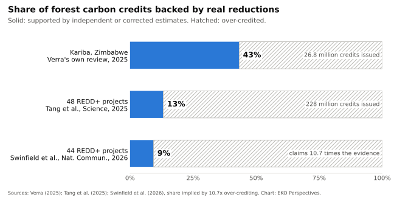

{fig-alt="View from the base of a large rainforest tree, looking up its deeply buttressed grey trunk into a dense canopy of green leaves with patches of bright sky." width="100%" fig-align="center"}

*Photograph: [César Favacho / Wikimedia Commons](https://commons.wikimedia.org/wiki/File:Floresta_Nacional_de_Caxiuan%C3%A3_C%C3%A9sar_Favacho_(10).jpg), [CC BY-SA 4.0](https://creativecommons.org/licenses/by-sa/4.0/).*

A forest carbon credit is a claim about something that did not happen. The project protects a forest, estimates how much of it would have been cleared without that protection, and sells the difference as tonnes of avoided emissions. The forest that was saved can be measured. The forest that would otherwise have been lost cannot. Everything the credit is worth rests on that second, unobservable number.

Two large studies have now tested it. In October 2025 an 18-author team, including Jonathan Chase of the German Centre for Integrative Biodiversity Research, published in [*Science*](https://www.idiv.de/?p=35812) an evaluation of 52 REDD+ projects in more than a dozen tropical countries. Using synthetic controls, which compare each project with similar unprotected areas nearby, they found that only 19 per cent of projects met their reported targets. Across 48 projects with public credit data, up to 228 million credits had been issued by the end of 2022, of which about 35 million, or 13.2 per cent, were likely to represent real reductions. In Colombia, most projects claimed deforestation risks more than ten times the study's estimates. "We estimate that only about one in eight tradable credits represents real emissions reductions," Chase said.

In April 2026 a Cambridge-led group synthesised six independent evaluations covering 44 projects in [*Nature Communications*](https://www.nature.com/articles/s41467-026-71552-3). The tone of the coverage was different, and so was the headline finding: four in five projects had protected forest. The over-crediting was not. Across the sample, projects claimed [10.7 times more avoided deforestation](https://www.cam.ac.uk/research/news/carbon-credits-have-enabled-vital-protection-of-tropical-forests-despite-being-oversold-tenfold) than independent estimates supported. Julia Jones of Bangor University, a co-author, put the distinction plainly: "'bad credits' do not necessarily mean 'bad projects'."

The two studies are less opposed than their press releases. Both find that many projects slowed deforestation, and both find that the credits sold for that work claimed several times what the evidence supports. The disagreement is about emphasis. On the credits themselves, the verdict is the same.

{fig-alt="Horizontal stacked bar chart of the share of forest carbon credits backed by real reductions. Kariba in Zimbabwe, from Verra's own 2025 review: 43 per cent of 26.8 million credits. Forty-eight REDD+ projects in Tang and colleagues (2025): 13 per cent of 228 million credits. Forty-four REDD+ projects in Swinfield and colleagues (2026): about 9 per cent, implied by claims 10.7 times the independent evidence. The remainder of each bar is hatched as over-credited." width="100%" fig-align="center"}

*Original chart for EKO Perspectives. Data: [Verra (2025)](https://verra.org/verra-acts-on-kariba-project-cancels-excess-credits-advances-independent-review/); [Tang et al. (2025)](https://www.idiv.de/?p=35812); [Swinfield et al. (2026)](https://www.nature.com/articles/s41467-026-71552-3).*

## Who sets the number

Over-crediting on this scale is not a run of bad luck. It follows from who chose the baseline and who checked it. Under the older REDD+ methodologies, the developer modelled its own counterfactual from local history and assumptions, and a higher baseline meant more credits to sell. The validation and verification bodies that audit those claims are [contracted by the project proponent](https://verra.org/documents/vvb-101). Transparency International US described the arrangement this year in one line: project developers ["hire and pay auditors"](https://reddmonitor.substack.com/p/transparency-international-us-conflicts) to verify compliance with the standard they are selling under. Every party with a hand on the baseline was paid more if it was higher.

The cases that broke the market's reputation show what that produces. Verra suspended the Kariba project in Zimbabwe in October 2023 after an article in the *New Yorker*. Its review, published in September 2025, found that [15.2 million of the 26.8 million credits](https://verra.org/verra-acts-on-kariba-project-cancels-excess-credits-advances-independent-review/) issued were excess, 57 per cent of the total. The developer had withdrawn the project from the registry, so the excess could not be clawed back from future issuance. Verra cancelled the project's 5,049,473 buffer credits and removed another 10 million that had been verified but never issued.

In Brazil, the Pacajai project covers about 135,000 hectares of the Amazon in Pará. It issued 10.06 million credits, and Verra [suspended it in September 2023](https://reddmonitor.substack.com/p/verra-suspended-the-pacajai-redd) over concerns that it overlapped state forest land without the required permits. The ratings firms BeZero and Sylvera had already judged it unlikely to reduce net emissions. Suspension did not stop the credits being used. The *Wall Street Journal* reported in March 2026 that more than 140 corporations retired Pacajai credits after the suspension, Philip Morris International, Mastercard and BlackRock among them. The credits had sold for less than $2 a tonne.

Pacajai is not an outlier in its own market. Corporate Accountability reviewed the 50 Brazilian projects with the most retirements between January 2024 and June 2025, which together account for 95 per cent of the country's retirements. It [rated 32 of them problematic](https://corporateaccountability.org/resources/over-70-of-all-carbon-credits-brazil-problematic/), and those 32 supplied 71 per cent of the credits retired.

The pattern is not confined to forests. A 2024 study in *Nature Sustainability* by Annelise Gill-Wiehl, Daniel Kammen and Barbara Haya found that a sample of clean cookstove projects had been [over-credited about ninefold](https://news.berkeley.edu/2024/01/23/as-carbon-offsets-cookstove-emission-credits-are-greatly-overestimated). In October 2024 federal prosecutors in New York charged Kenneth Newcombe, the former head of C-Quest Capital, with fraud over [alleged inflation of cookstove credits](https://justice.gov/usao-sdny/pr/us-attorney-announces-criminal-charges-multi-year-fraud-scheme-market-carbon-credits). A co-defendant has pleaded guilty; Newcombe's case has not yet gone to trial.

## The shrinking market

Buyers have responded. The value of voluntary credit transactions fell from a peak of nearly $2 billion in 2021 to [$535 million in 2024](https://www.reccessary.com/en/news/voluntary-carbon-market-hits-6-year-low), according to Ecosystem Marketplace. The buyers who remain are not reassuring. Carbon Market Watch reported in February that Shell has been the [largest corporate buyer](https://carbonmarketwatch.org/2026/02/26/oil-spill-how-fossil-fuel-interests-are-seeping-into-the-voluntary-carbon-market-rulebook/) of voluntary credits for three years running, and documented how fossil fuel companies have sought influence over the bodies that write the market's rules. The report's author, Inigo Wyburd, called their use of credits "a smoke and mirrors show."

Regulators have begun to move. Bloomberg reported in September that the US Commodity Futures Trading Commission had opened a [broad inquiry](https://carboncredits.com/?p=47798) into the market, reaching beyond individual developers to registries, verifiers and ratings firms. In Germany, authorities withdrew credits from [at least 30 China-based projects](https://news.bloomberglaw.com/esg/germany-revoked-suspicious-carbon-credits-bought-by-exxonmobil) found to be suspicious or overstated, one of them backed by an ExxonMobil entity. Those credits counted towards Germany's transport fuel quota rather than the voluntary market, but they failed the same test.

## The fix that already exists

The strongest defence of the market is that the baseline problem has already been addressed. Verra's consolidated REDD+ methodology, VM0048, launched in late 2023, takes baseline-setting away from developers. Deforestation is projected for a whole jurisdiction from ten years of historical data, Verra publishes risk maps that allocate that projected loss across the landscape, and a project must use [the baseline Verra assigns](https://verra.org/redd-why-we-need-it-and-how-we-make-it-work/). In November 2024 the Integrity Council for the Voluntary Carbon Market approved VM0048 and the ART TREES standard for its high-integrity label, and [acknowledged](https://www.spglobal.com/commodity-insights/en/news-research/latest-news/energy-transition/111524-three-redd-methodologies-receive-high-integrity-credit-badge) that no existing REDD+ credits met that bar.

This is real progress, and it answers the central weakness the two studies identified. It leaves two problems untouched. The first is the stock of credits issued under the old methodologies, which the market still sells cheaply and companies still retire, as Pacajai shows. The second is verification. Developers still choose and pay the firms that audit them, whatever methodology they use.

The Cambridge authors propose fewer credits at a higher price, enough to pay for projects that genuinely protect forests and the people who live in them. The direction is right, and it implies a further step: credits issued under baselines that are now acknowledged to be inflated should stop counting towards anyone's climate claims, and auditors should be paid by the registry or a public body, not the seller. The same problem, an unobservable number set by the party that profits from it, sits at the centre of the [US tax credit for corn ethanol](/blog/posts/2026-10-04-climate-credit-land/).

Paying to keep forests standing is still worth doing, and the evidence says many projects did keep them standing. What the market has not yet shown is that it will stop selling the credits it now admits were wrong.


