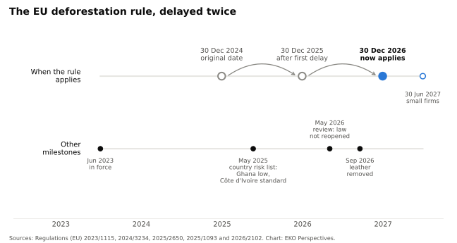

{fig-alt="A young man in a blue jacket leans across a raised bed of reddish-brown cocoa beans drying in the sun, with green trees, a house and power lines behind him under a pale sky." width="100%" fig-align="center"}

*Photograph: [King Bangaba / Wikimedia Commons](https://commons.wikimedia.org/wiki/File:A_cocoa_farm_in_Ghana.jpg), [CC BY-SA 4.0](https://creativecommons.org/licenses/by-sa/4.0/).*

At a technical meeting in Accra on 26 May, Ghana's Forestry Commission and the cocoa regulator COCOBOD set out how far the country had come in preparing for the European Union's Deforestation Regulation. The commission had produced a 2020 forest cover map, [built on the FAO forest definition](https://www.gbcghanaonline.com/general/ghana-positions-cocoa-sector-for-full-compliance-with-eu-deforestation-regulation/2026/) and validated with COCOBOD and Kwame Nkrumah University of Science and Technology. The Ghana Cocoa Traceability System combines [GPS mapping of farms with barcoded bags](https://dandc.eu/en/article/ghana-has-tested-digital-system-aims-make-cocoa-supply-chains-more-transparent-and-help), scanned at district and port level and fed into a central platform. A year earlier the European Commission had classified Ghana as a low-risk country.

Côte d'Ivoire, which grows more cocoa than any other country and is rated standard risk, started the 2026/27 season in a different position. From 1 September every cocoa purchase had to be made with an electronic producer card. Ten days later, Reuters reported that many cooperatives and buying agents were [still waiting for the equipment](https://www.myjoyonline.com/ivory-coast-cocoa-sellers-struggle-to-use-new-traceability-system/). "Our suppliers lack payment terminals, bags, and seals to carry out deals in rural areas," the director of a European export company in Abidjan said. The Conseil Café-Cacao disputed the shortage and said it had [bought 20,000 new terminals](https://beninwebtv.bj/en/ivory-coast-new-traceability-system-slows-cocoa-purchases/).

The contrast says something about who can comply with the regulation. Whether compliance protects forests is a separate question, and a harder one.

## What the rule asks

[Regulation (EU) 2023/1115](https://eur-lex.europa.eu/legal-content/EN/TXT/HTML/?uri=CELEX:32023R1115) covers cattle, cocoa, coffee, oil palm, rubber, soya and wood, and products made from them. A company placing them on the EU market must show that they were produced legally and on land not deforested after 31 December 2020, with geolocation for every plot, and must file a due diligence statement. Penalties must reach at least 4 per cent of a company's annual EU-wide turnover.

The rule was meant to apply from 30 December 2024. It has been postponed twice, and [now applies](https://eur-lex.europa.eu/legal-content/EN/TXT/HTML/?uri=CELEX:32025R2650) from 30 December 2026 for large and medium companies and from 30 June 2027 for micro and small ones. The second amendment also lightened the load: downstream companies now collect the reference numbers of their suppliers' statements instead of filing their own, and micro and small primary operators in low-risk countries make a one-time simplified declaration. In May the Commission completed a simplification review, confirmed that the regulation [would not be reopened](https://www.bakermckenzie.com/en/insight/publications/2026/05/eu-commission-publishes-simplification-review-of-eudr), and claimed compliance costs had fallen by about three-quarters.

{fig-alt="Timeline of the EU Deforestation Regulation from 2023 to 2027. The application date for large firms moved from 30 December 2024 to 30 December 2025 and then to 30 December 2026, with small firms following on 30 June 2027. Other milestones: entry into force in June 2023, the country risk list in May 2025 rating Ghana low risk and Côte d'Ivoire standard risk, a review in May 2026 that did not reopen the law, and the removal of leather from scope in September 2026." width="100%" fig-align="center"}

*Original chart for EKO Perspectives. Data: Regulations (EU) [2023/1115](https://eur-lex.europa.eu/legal-content/EN/TXT/HTML/?uri=CELEX:32023R1115), 2024/3234, [2025/2650](https://eur-lex.europa.eu/legal-content/EN/TXT/HTML/?uri=CELEX:32025R2650), [2025/1093](https://eur-lex.europa.eu/legal-content/EN/TXT/HTML/?uri=CELEX:32025R1093) and [2026/2102](https://eur-lex.europa.eu/eli/reg_del/2026/2102/oj/eng).*

The scope has narrowed in the process. A Commission staff working document published with the review found that leather could account for [up to 17 per cent](https://news.mongabay.com/2026/05/european-commission-linked-leather-to-deforestation-then-ignored-it/) of the deforestation footprint of imports covered by the regulation. A delegated act adopted in July nonetheless removed hides, skins and leather, and exempted waste and used goods, from 18 September. The Commission did not, however, add the "no-risk" country category that parts of the European Parliament had demanded.

## Who carries the cost

The regulation's unit is the plot. Ghana has about 800,000 cocoa farm holdings and Côte d'Ivoire [between 800,000 and 1.3 million](https://www.kakaoforum.de/en/news-service/country-profiles/cocoa-producing-countries/), most of them small and many held under customary tenure rather than registered title. Every one of those plots now has to be mapped, and every bag linked to it.

A review published in *Discover Sustainability* in August by Urugo and colleagues found that, across case studies, ["potential unintended impacts include exclusion from EU markets, increased administrative burdens, market consolidation, and deforestation leakage to less regulated markets."](https://doi.org/10.1007/s43621-026-04286-3) Its conclusion is the useful part. Outcomes, the authors argue, will depend less on farm size than on institutional infrastructure, digital readiness and how the supply chain is organised. That describes the gap between Accra and Abidjan better than any count of farmers.

Ghana's state-run marketing system, in which COCOBOD buys and sells the crop, makes national traceability easier to build than in Côte d'Ivoire's more fragmented chain. It also means the state can try to price compliance. In October 2025, Bloomberg reported that Ghana planned to seek a [premium of $200 a tonne](https://www.bloomberg.com/news/articles/2025-10-22/ghana-plans-to-seek-200-premium-for-eudr-compliant-cocoa) for compliant cocoa through the Cocoa Marketing Company. "Sustainably produced and traceable beans come at a cost, and must be paid for," its deputy managing director, Barnett Quaicoo, said. Whether European buyers will pay it, or pass the cost back to farmers through the price COCOBOD can afford to offer, is not yet known.

## What the rule cannot see

The deepest weakness is in the design. The regulation governs what enters one market. It does not govern land.

Manoj Sharma and Nelson Villoria modelled the effect on global soy trade in the [*European Review of Agricultural Economics*](https://doi.org/10.1093/erae/jbag008). Compliance costs shifted South American exports towards non-EU markets, mainly China, diverted EU imports towards North America and raised soy prices for European users. "Trade reallocation to an unregulated market could potentially dilute the impact of the EUDR," they wrote. A 2026 study of Indonesian exports by Juhro and colleagues found a negative effect on shipments to Europe, [with spillovers to non-European destinations](https://www.sciencedirect.com/science/article/pii/S2949753126000561).

The Commission's own expectations were modest from the start. Its 2021 impact assessment estimated that the regulation would save [at least 71,920 hectares](https://ec.europa.eu/commission/presscorner/api/files/document/print/en/qanda_21_5919/QANDA_21_5919_EN.pdf) a year of forest from EU-driven deforestation and degradation from 2030, and avoid at least 31.9 million tonnes of carbon emissions. Those are gains in the EU's footprint. They were never a forecast for the tropics as a whole.

Ghana shows the limit at home as well. A low-risk rating describes cocoa supply chains measured against a 2020 baseline. It says nothing about forest reserves being dug up for gold, the [illegal mining](/blog/posts/2026-10-04-we-cannot-drink-gold/) that is turning Ghana's rivers brown, because gold is not a covered commodity. A country can pass the regulation's test while losing forest to an activity the regulation does not touch.

## Why it still matters

The regulation is not pointless. It exists because voluntary commitments failed. Under the 2014 New York Declaration on Forests, companies and governments pledged to halve natural forest loss by 2020 and end it by 2030. Six years on, an assessment by the World Resources Institute found that annual tropical primary forest loss had [increased by 41 per cent](https://www.wri.org/blog/2020/11/nydf-assessment-protect-restore-forests-2030) since the declaration was signed. The regulation turns a deforestation-free claim from a marketing statement into a legal obligation with penalties, and it has already pushed producer countries such as Ghana to map forests and farms in a way that pledges never did.

What it will do well is make it hard to sell cocoa, coffee or palm oil from recently cleared land into Europe. This is worth having. Whether forests survive depends on things the regulation does not control: how producer governments enforce land and mining law, whether farmers earn enough from standing trees and existing farms to stop clearing new ones, and whether the markets that absorb the diverted trade ask the same questions. Europe has built a strong filter at its own border. The forests lie on the other side of it.


