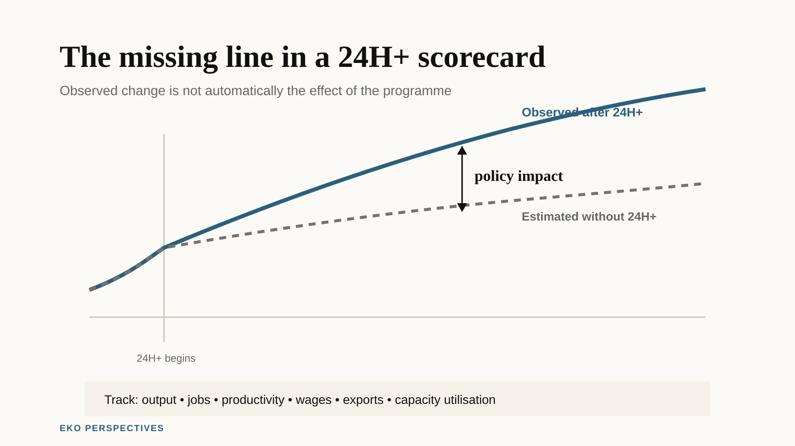

{fig-alt="Two parallel paths compare observed outcomes after Ghana's 24H+ programme with a counterfactual path without the programme. The difference between them is labelled policy impact, with output, jobs, productivity and exports listed as outcomes to track." width="100%" fig-align="center"}

*Original graphic for EKO Perspectives.*

In May, Ghana's National Petroleum Authority enrolled [268 filling stations, eight depots and two refineries](https://npa.gov.gh/npa-24-hr-economy-authority-launch-pilot-phase-of-24-hr-economy-in-petroleum-downstream-sector/) in the first phase of the 24-Hour Economy programme. By July, the 24H+ Secretariat was reporting that [33 manufacturing companies were operating under one-to-three-shift systems](https://gna.org.gh/2026/07/24-hour-economy-secures-5-5bn-investment-deals-160000-jobs-in-the-offing/).

Those are visible signs that something is happening. They are not yet evidence that Ghana has become more productive.

That distinction matters because the Government itself defines the 24-Hour Economy and Accelerated Export Development Programme as much more than businesses staying open late. The official programme says the destination is an economy in which productivity and capital utilisation are high enough to justify multiple shifts, with infrastructure, labour and machinery used more intensively. The [2026 Budget](https://mofep.gov.gh/sites/default/files/budget-statements/2026-Budget-Statement-and-Economic-Policy.pdf) calls it a "productivity revolution" and says it should create more than 1.7 million jobs by 2028.

The economic idea is plausible. A factory that owns an expensive machine but uses it for eight hours a day may be able to spread that fixed investment over a second or third shift. A cold store, port, hospital, logistics hub or processing plant may become more valuable when it is not idle for much of the day. More operating time can raise output without requiring the country to build an entirely new stock of capital first.

But output, capital utilisation and productivity are not the same thing.

A factory can produce more simply because it runs for sixteen hours instead of eight and employs another shift of workers. That may still be a good outcome. It creates jobs and uses the machine for longer. Yet labour productivity has not necessarily improved. Productivity rises when the economy produces more value from the resources it uses, not merely when those resources are used for more hours.

Ghana therefore needs to ask a harder question than whether firms are opening at night:

**What would output, employment and productivity have been without 24H+?**

## Ghana already has a productivity problem to solve

The Ghana Statistical Service's first national productivity report gives this question some historical weight. It defines labour productivity as output relative to labour input, measured by workers or hours worked, and multifactor productivity as the efficiency with which labour and capital are combined.

The report finds that Ghana has accumulated capital faster than it has converted that capital into productivity. Since 2010, [capital deepening grew about twice as fast as labour productivity](https://statsghana.gov.gh/gssmain/fileUpload/pressrelease/Productivity%20Statistics%20Report_Final_28th%20February,%202025.pdf). The capital-to-output ratio rose substantially, while the contribution of multifactor productivity to growth remained modest and erratic. The same report concludes that Ghana's structural transformation has been slow because labour and capital have not moved sufficiently into higher-productivity activities.

That is almost exactly the problem 24H+ says it wants to fix.

The programme's logic is not that Ghana lacks people willing to work. It is that too much labour, infrastructure and capital is trapped in low-output uses, fragmented value chains or idle capacity. The official framework says industries operate below potential, logistics add avoidable costs, firms struggle to finance expansion and too much value is captured outside Ghana.

The labour market makes the ambition understandable. Ghana Statistical Service reported that national unemployment averaged [12.8 per cent in the first three quarters of 2025, while unemployment among people aged 15 to 35 averaged 21.9 per cent](https://www.statsghana.gov.gh/news-and-events/press-releases/more-than-one-third-of-ghanas-population-is-youth). Nearly two million young people were not in employment, education or training in the third quarter.

A programme that genuinely makes existing capital more productive while drawing young people into decent work would therefore solve two problems at once.

The difficulty is showing that it did.

## A model can show what might happen

There is already one serious attempt to quantify the policy.

Yakubu Abdul-Salam's 2024 study in *Socio-Economic Planning Sciences* uses a dynamic computable general equilibrium model to compare a 24-hour-economy scenario with a business-as-usual counterfactual. The model reports large effects: real GDP under the policy scenario rises substantially above the baseline over time, and labour demand is more than three million jobs above business as usual within five years. The paper attributes the gains to higher investment, capital formation, productivity and household income. [The published article](https://doi.org/10.1016/j.seps.2024.102017) is useful because it does something many discussions of the policy do not: it makes the counterfactual explicit.

But a modelled counterfactual is still a scenario, not an evaluation of the programme now being implemented.

The model asks what Ghana's economy could look like if the policy changes the economy through the assumed channels. It cannot tell us whether a filling station that adds a night shift in 2026 did so because of 24H+, whether the shift would have appeared anyway, or whether the extra operating hours raise output enough to justify the additional labour, electricity, security and transport costs.

That is the next evidence problem.

## The programme has indicators. It also needs attribution

The good news is that 24H+ is not being launched without measurement language.

Its published programme document contains a national outcome framework covering GDP growth, import dependence, unemployment, youth unemployment, jobs by sector, vulnerable employment, manufacturing's share of GDP and other indicators. The Authority says it will [monitor performance targets and publish scorecards](https://24hplus.gov.gh/vision-and-objectives/). It has also said that firms seeking incentives will face performance assessments tied to [jobs, investment and productivity](https://gna.org.gh/2026/08/businesses-seeking-24-hour-economy-incentives-to-undergo-performance-assessment/).

Those are useful commitments.

But monitoring an outcome is not the same as identifying a policy effect.

Suppose manufacturing output rises next year. Ghana's economy is already growing: real GDP expanded [6.0 per cent in the second quarter of 2026](https://www.statsghana.gov.gh/highlights/gdp-performance). Inflation has fallen sharply, the cedi has stabilised relative to the crisis years and investment conditions may improve for reasons that have little to do with 24H+. If output and employment rise at participating firms, some of that growth may have happened anyway.

The same problem applies to the programme's investment announcements. In July the Secretariat reported US$5.5 billion in signed project agreements and more than 160,000 projected jobs. Those numbers describe a pipeline. They are not the same as capital actually installed, factories actually operating or workers actually on payroll.

For a programme this large, the distinction between **announced**, **committed**, **implemented** and **additional** should be visible in every scorecard.

## The rollout itself creates an evaluation opportunity

Ghana does not need a perfect laboratory experiment to learn whether 24H+ works.

The programme is already being rolled out in phases, sectors and places. The petroleum pilot began with selected facilities in Greater Accra, Ashanti, Western and Northern regions. Firms enter readiness programmes at different times. Incentives are supposed to depend on performance. That creates variation that can be used.

At minimum, each participating firm or facility should have a baseline before support begins: operating hours, capacity utilisation, output, employment, wages, electricity use, outages, exports and other sector-specific measures. The same outcomes should then be tracked after participation.

The stronger design would compare those changes with similar firms that have not yet entered the programme. If a participating manufacturer moves from one shift to two and output rises by 40 per cent, that sounds impressive. If comparable manufacturers outside the programme rise by 35 per cent over the same period because demand and macroeconomic conditions improved, the additional effect looks very different.

Phased implementation makes this kind of comparison possible, although not automatically credible. Firms volunteering for 24H+ may already be larger, better financed or more ambitious than firms that do not participate. Any serious evaluation would have to account for that selection rather than treating participants and non-participants as interchangeable.

The point is not that one econometric method will settle the programme. It is that the programme should be designed now so that evaluation remains possible later.

## Electricity is part of the treatment

There is another reason why opening hours alone are a weak measure.

A 24-hour factory requires reliable power for more than the original shift. The IMF's 2026 review of Ghana's energy sector says the country's industrial ambitions, including 24H+, require a step change in the [reliability, affordability and financial sustainability of electricity](https://www.elibrary.imf.org/view/journals/018/2026/086/article-A001-en.xml). World Bank Enterprise Survey data from 2023 show that [73.76 per cent of Ghanaian firms experienced electrical outages](https://data.worldbank.org/indicator/IC.ELC.OUTG.ZS?locations=GH).

That means some of the programme's most important interventions may not look like "24-hour economy" interventions at all. Grid reliability, logistics, finance, worker transport, night security and access to markets determine whether a second shift is profitable.

If those constraints improve, the programme may raise productivity even at firms that never literally operate for 24 hours.

This is another reason the slogan should not become the metric.

## What should count as success

The Government's 1.7 million job target will attract the most attention because jobs are visible and politically important. It should not be the only test.

A credible 24H+ scorecard should distinguish at least four things.

First, **activity**: how many firms joined, how many shifts were added, how much finance was mobilised and how many facilities were built.

Second, **outcomes**: output, employment, exports, wages, capacity utilisation and productivity.

Third, **quality**: whether the new jobs are stable and decently paid, whether night work carries appropriate protections, and whether productivity gains reach workers as well as firms.

Fourth, **additionality**: how much of those outcomes happened because of the programme rather than alongside it.

The last category is the hardest. It is also the one that turns a government progress report into an economic evaluation.

The 24-hour economy is an unusually ambitious attempt to change how Ghana uses capital, labour and infrastructure. It deserves to be judged at that level. Counting businesses with lights on after midnight would undersell the programme. Counting every announced job as a created job would oversell it.

The real test is whether Ghana produces more value, creates better work and uses its productive assets more efficiently than it would have without 24H+.

That counterfactual will never be directly visible. But if the Government builds the data around the rollout now, it can be estimated rather than guessed.
