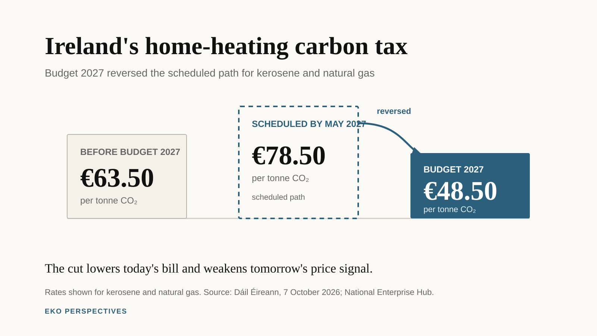

{fig-alt="Three rate markers compare €63.50 per tonne before Budget 2027, the scheduled €78.50 rate by May 2027, and the new €48.50 rate for kerosene and natural gas." width="100%" fig-align="center"}

*Graphic: EKO Perspectives. Sources: [Dáil Éireann, 7 October 2026](https://prelive.oireachtas.ie/en/debates/debate/dail/2026-10-07/20/) and the [National Enterprise Hub Budget 2027 summary](https://www.neh.gov.ie/the-source/budget-2027-key-changes).*

Ireland's carbon tax on kerosene and natural gas is being cut from €63.50 to €48.50 per tonne of CO2. The two scheduled increases that would have taken the rate to €78.50 by May 2027 will not happen. Instead, the lower rate will be maintained for the lifetime of the current Government.

That is the central carbon-tax decision in Budget 2027. Finance Minister Simon Harris presented it as a response to an energy-price shock that households did not cause and, in many cases, cannot quickly escape. Many homes still depend on oil or gas for heat. The Government has also extended fuel-excise reductions, increased Fuel Allowance by €5 a week and widened some income supports. The *Irish Times* estimated that the tax reversal will cut [about €40 from a 900-litre fill of home-heating oil](https://www.irishtimes.com/your-money/2026/10/06/big-policy-change-sees-carbon-tax-reversed-to-ease-home-heating-fuel-costs/).

The relief is real. So is the policy reversal.

Ireland's carbon tax was designed not simply as a charge today, but as a predictable sequence of increases through 2030. That trajectory mattered because households and firms could see fossil fuels becoming steadily more expensive and make investment decisions accordingly. The Tax Strategy Group described it as a [clear long-term signal to industry and society](https://www.irishtimes.com/your-money/2026/10/07/carbon-tax-u-turn-calls-governments-climate-commitments-into-question/) to move away from fossil-fuel dependence.

Budget 2027 has broken that sequence for home-heating oil and natural gas.

## What Budget 2027 changed

The immediate arithmetic is straightforward. The carbon-tax rate on kerosene and natural gas falls to €48.50 per tonne, back to its 2023 level, rather than rising to €78.50 by May 2027. Harris told the Dáil that the lower rate would remain in place for the lifetime of the Government. The [Budget debate records the Government's case](https://prelive.oireachtas.ie/en/debates/debate/dail/2026-10-07/20/): households facing volatile international energy prices need help, and many have no easy alternative to oil or gas heating.

The fiscal cost is less straightforward. Department of Finance estimates reported after the Budget put the revenue loss at about [€25 million in 2026 and €177 million in each full year thereafter](https://www.irishtimes.com/your-money/2026/10/07/carbon-tax-u-turn-calls-governments-climate-commitments-into-question/). That is not enormous beside total government revenue, but carbon-tax receipts have a specific role in Irish climate policy.

Since 2020, more than €4.2 billion in carbon-tax revenue has been allocated to measures including residential retrofits, targeted welfare supports, just-transition spending and greener farming. In June, before the Budget reversal, the Government itself told the Dáil that pausing the trajectory would reduce the funding available for those measures. The [official Dáil record](https://data.oireachtas.ie/ie/oireachtas/debateRecord/dail/2026-06-17/debate/mul%40/main.pdf) made the link explicit.

That does not mean every euro lost from the tax will automatically disappear from climate spending. Government can replace revenue from elsewhere. Budget 2027 still contains substantial climate and energy spending. The more precise point is that the dedicated revenue stream has weakened at the same time as the price signal has weakened.

## Who benefits from the cut

Energy-price shocks do not fall evenly across households. Lower-income households spend a larger share of their resources on essentials such as heating and electricity, so a sudden increase in fuel prices can be particularly painful.

That is a strong argument for intervention. It is not automatically an argument for cutting the price for everyone.

The ESRI's post-Budget assessment is unusually direct. The reduction in carbon tax on home-heating oil and gas is [untargeted, expensive and weakens the incentive to decarbonise](https://www.esri.ie/news/budget-2027-tax-and-welfare-measures-keep-pace-with-forecast-inflation-for-2027). The institute argues that targeted support for low-income households could protect the people most exposed to the price shock while preserving the incentive for households that can afford to switch.

This is the central distributional choice.

A universal tax cut helps every household that buys the fuel. A targeted transfer concentrates support on households for whom the price shock does the most damage. The first is simple, visible and politically easy to explain. The second can be cheaper and more progressive, but it depends on the welfare system identifying and reaching the households that need it.

Ireland has used both approaches during the energy crisis. Budget 2027 chose to make the carbon-tax relief broad and the lower rate long-lasting.

## The price signal matters

The Government's strongest defence is that the carbon tax did not cause the energy crisis. That is correct. International fuel prices rose because of events far outside Ireland. The tax only added to a much larger market-driven increase.

Cutting it during a shock can therefore be defended as crisis policy.

The harder question is why a temporary shock required a long-term change in the tax path.

Carbon pricing works partly through the price people pay today, but also through what they expect to pay tomorrow. A homeowner comparing another oil boiler with a heat pump does not look only at this winter's bill. A landlord considering insulation, or a business deciding whether to replace fossil-fuel equipment, also cares about the expected path of energy costs.

The old carbon-tax schedule said that the fossil-fuel component of those costs would rise predictably. Budget 2027 now says that, for kerosene and natural gas, it will not rise again during the lifetime of this Government.

That makes the decision different from a short deferral.

It also comes when Ireland remains far from its climate targets. The EPA's [May 2026 emissions projections](https://www.epa.ie/news-releases/news-releases-2026/epa-projections-show-ireland-remains-off-track-for-2030-climate-.php) estimate that, even with additional planned measures, national greenhouse-gas emissions could fall by about 25 per cent by 2030 against a target of 51 per cent. Agriculture emissions are projected to fall by up to 19 per cent, transport emissions by up to 28 per cent, and residential fuel-combustion emissions by up to 18 per cent.

Those gaps do not prove that one carbon-tax decision will determine whether Ireland meets its targets. It will not. Building standards, electricity, transport, retrofits, farm measures, infrastructure and technology all matter more than one tax rate in isolation.

But removing a policy signal while the country is already off track still has a cost.

## What did the Government buy?

Budget 2027 bought immediate relief for households using heating oil and natural gas. For households under real pressure from international fuel prices, that matters.

It also bought political certainty. People know that the scheduled increases on those fuels will not return during the lifetime of the Government.

What it gave up is part of the architecture that made the carbon tax more than another excise duty: a predictable rising path and a growing stream of ring-fenced revenue.

The trade-off is therefore not simply climate policy against the cost of living. A better comparison is between two ways of protecting households during a shock.

One cuts the price for every user and weakens the incentive to switch away from the fuel. The other uses targeted payments to protect the households that need help while leaving the long-run price signal intact.

The ESRI now explicitly prefers the second approach. The Government chose the first.

That choice is defensible in an emergency. What is harder to defend is treating a temporary energy shock as a reason to abandon the trajectory rather than pause it.

Ireland's carbon tax was supposed to become more predictable as 2030 approached. Budget 2027 has made one part of it less so. The immediate question is how much relief households receive this winter. The longer question is what replaces the signal, and the revenue, that Ireland has now chosen to give up.
