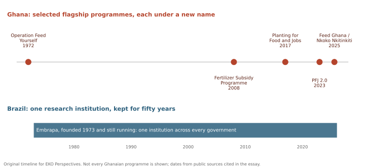

{fig-alt="Timeline. The upper row shows selected Ghanaian agricultural programmes as separate points: Operation Feed Yourself in 1972, the Fertilizer Subsidy Programme in 2008, Planting for Food and Jobs in 2017, PFJ 2.0 in 2023 and Feed Ghana with Nkoko Nkitinkiti in 2025. The lower row shows a single continuous bar for Brazil's Embrapa from 1973 to the present." width="100%" fig-align="center"}

*Original timeline for EKO Perspectives.*

Every Ghanaian of a certain age knows the ceremony. A minister or a president stands in front of a banner, a crowd gathers, bags of fertiliser or crates of birds are handed to the first beneficiaries, and the photographs go out on the evening news. The policy is usually sensible. It is often written with care, sometimes with the help of the World Bank and other partners who have studied our farms for decades. And then, a few seasons later, the farmers are saying what farmers said about the programme before it: the inputs came late, the market was not there, someone else got what was meant for them. I watch this now from Ireland, where I study agricultural policy for a living, and I find it harder each time to watch without a kind of grief. The problem is rarely the idea. It is what happens between the idea and the farm.

The story is older than most of us. In February 1972, a month after taking power, Colonel Acheampong's government launched [Operation Feed Yourself](https://www.infoclio.ch/de/node/125697), a programme meant to make Ghana self-sufficient in food and to shed what it called the image of a beggar nation. Urban households were drawn into backyard farming, rice production in the north expanded, and in 1974 Ghana was officially declared self-sufficient in rice. Some writers called it Ghana's green revolution. By 1977 it was widely judged a failure, with acreage falling, food prices stubbornly high and the [budget deficit more than four times larger](https://globalvoices.org/2024/03/11/ghanas-economy-and-food-security-policies-lessons-from-operation-feed-yourself/) than when it began. The ambition was real, the early results were real, and the programme still did not outlive the government that launched it.

A year later, on the other side of the Atlantic, another military government worried about food imports made a different kind of decision. In April 1973 Brazil created [Embrapa](https://product.statnano.com/company/the-brazilian-agricultural-research-corporation), a public agricultural research corporation, at a time when the country was still importing staple foods and even receiving food aid. Embrapa's scientists learned how to make the acid soils of the cerrado, the Brazilian savanna, productive, and Brazil went on to become [the world's biggest agricultural exporter](https://beyondimitation.substack.com/p/embrapa). Many things contributed, from credit to land to markets, but when *The Economist* tried to name the main reason, it answered in three words: ["Embrapa, Embrapa, Embrapa."](https://www.bresserpereira.org.br/terceiros/2010/10.08.Economist-Miracle_of_the_cerrado.pdf) When Ghanaians ask why we are not where Brazil or China are in agriculture, this is the comparison I keep returning to. Both countries began in the early 1970s with a food problem and a determined government. Brazil built an institution and protected it through every change of government for fifty years. Ghana built a campaign, and then, decades later, another one.

Since then the campaigns have kept coming, each with a new name. According to the World Bank's own summary, Ghana has supported farmers mainly through input subsidies: the [Fertilizer Subsidy Programme from 2008 to 2017, Planting for Food and Jobs from 2017 to 2022](https://projects.banquemondiale.org/fr/projects-operations/project-detail/P181488), and pandemic-era support, followed by a redesigned PFJ 2.0 in 2023. Planting for Food and Jobs openly [drew inspiration from Operation Feed Yourself](https://globalvoices.org/2024/03/11/ghanas-economy-and-food-security-policies-lessons-from-operation-feed-yourself/). On paper it was a serious programme, combining subsidised seed and fertiliser with extension support, and it reached more than a million farmers a year at its height. Its trouble was almost never the design. It was delivery.

The farmers' complaints were consistent from the start. An assessment of the programme from the perspective of beneficiary farmers, presented to the Peasant Farmers Association of Ghana, found that fertiliser often [arrived after the planting season was over](https://ghanaiantimes.com.gh/peasant-farmers-association-of-ghana-accesses-pfjs-programme/), that registration was cumbersome, and that more than half of farmers could not obtain the improved seed they wanted. In agriculture, that is not a small administrative inconvenience. A road built three months late is still a road. Fertiliser delivered three months late is a bag of chemicals waiting for next year, and seed that arrives after the rains is food that will not be grown. Farming runs on a biological clock, and a state that cannot keep time with it cannot help farmers, however generous its budget.

{fig-alt="Women farmers preparing a field for sowing near Lawra in northern Ghana." width="100%" fig-align="center"}

*Members of the Rural Women's Farmers Association of Ghana preparing a field near Lawra. Photograph: [Rob Partridge / Global Justice Now](https://commons.wikimedia.org/wiki/File:Rural_Women%27s_Farmers_Association_of_Ghana_prepping_a_field.jpg), used under [CC BY 2.0](https://creativecommons.org/licenses/by/2.0/).*

Then the fertiliser began to leave the country. Subsidised bags meant for Ghanaian farmers turned up in markets in Burkina Faso, Togo and beyond. The Director of Crop Services at the Ministry of Food and Agriculture described smugglers loading fertiliser onto donkeys that crossed the border unaccompanied, adding, with a weariness every Ghanaian will recognise, ["I can't question the donkeys."](https://thebftonline.com/?p=87464) One regional minister estimated that the country lost [about $12 million to fertiliser smuggling in a single year](https://ghanaiantimes.com.gh/ghana-burkina-faso-collaborate-to-check-fertiliser-smuggling/amp/). The Peasant Farmers Association went further, alleging that fertiliser dealers, security officers, opinion leaders and young people employed under a national service scheme were all part of the smuggling network. The general secretary of the agricultural workers' union said the coupon system had been abused so that people who were not farmers ended up selling fertiliser to farmers, and that the government had counted the young men who offloaded the trucks as [jobs created](https://citinewsroom.com/?p=896950).

Not all of the failure was theft. Some of it was simply a state that did not pay its bills. By 2021 the suppliers of fertiliser for the programme had [halted distribution because the government owed them money](https://citinewsroom.com/?p=769038), and in northern Ghana farmers watched their maize turn yellow for want of the inputs they had been promised. The Minister of Food and Agriculture told Parliament that the finance ministry had not released the [GH¢700 million needed to pay fertiliser dealers](https://ghanaiantimes.com.gh/govt-releases-gh%E2%82%B5260m-to-settle-indebtedness-to-fertiliser-companies/amp/) and other subsidies. Among the opposition politicians pressing in Parliament for those debts to be paid was Eric Opoku. Today he is the Minister of Food and Agriculture, responsible for the next great programme.

That programme is Feed Ghana, and its most visible part is Nkoko Nkitinkiti. On 12 November 2025, in Kumasi, President Mahama launched a plan to distribute [three million birds to about 60,000 households in all 276 constituencies](https://www.graphic.com.gh/news/general-news/mahama-launches-nkoko-nkitinkiti-initiative-to-supply-3-million-birds-to-60-000-households.html), fifty birds per household with feed and technical guidance. The goal is to raise Ghana's poultry self-sufficiency from 12 per cent to more than 75 per cent by 2028, after a year in which the country spent more than $350 million importing poultry. It is a sensible ambition. It is also, more than fifty years on, a backyard production campaign of exactly the kind Operation Feed Yourself began with. The day before the launch, the National Poultry Farmers Association said the programme was a good policy that [could still cause financial loss to the state](https://rainbowradioonline.com/2025/11/11/nkoko-nkitinkiti-initiative-is-a-good-policy-but-may-end-up-causing-financial-loss-to-the-state-association/), and that the association had not yet been consulted. The people who already raise chickens for a living were learning about the national chicken programme from the news.

I want Nkoko Nkitinkiti to succeed. But the question that matters is not how many birds are handed out this year. It is what happens after. A bird needs affordable feed, vaccines, a veterinary officer who can respond to an outbreak, and, at the end of six or eight weeks, a buyer who will pay a price that covers the cost of raising it. The ministry has promised a processing centre and links to feed producers, and those promises are the real programme. Distributing chickens is an activity; building a poultry industry is a system. Ghana has been very good at the first and very poor at the second, and the evidence is in the import figures. In 2025 the country spent [more than GH¢36 billion importing food](https://graphiconline.com/news/general-news/ghana-spent-over-ghc36bn-importing-food-in-2025-gss-report-reveals.html), and frozen chicken was the second-largest item on the list, just behind processed cereals and ahead of rice, which appeared twice.

{fig-alt="A Ghanaian woman poultry farmer standing beside chickens and an improved chicken coop in western Ghana." width="100%" fig-align="center"}

*Small-scale poultry farming in western Ghana, 2011. Photograph: Susan Quinn / USAID Africa Bureau via [Wikimedia Commons](https://commons.wikimedia.org/wiki/File:Chicken_farmer_in_Ghana_(5926941911).jpg), public domain.*

Money has rarely been the only constraint. Development partners have lent and granted Ghana substantial sums for agriculture, often for well-designed projects. The World Bank's West Africa Food System Resilience Program is one example, with objectives that are hard to fault: better climate and pest information, more resilient farming, and stronger capacity to respond to food crises. Yet when the Bank's supervision mission visited Accra in 2024, it [revised its rating of progress down to moderately satisfactory](https://documents1.worldbank.org/curated/en/099080224001514693/text/P178132-42e1f398-9066-4cc9-afe2-488fb196c165.txt), noting that an agreement with the meteorological agency was delayed and that little progress had been made on the climate, pest and food-security information systems. The same institution, describing the subsidy years, observed that PFJ had placed the government under a [heavy fiscal burden](https://projects.banquemondiale.org/fr/projects-operations/project-detail/P181488). Loans can pay for irrigation, laboratories and digital platforms. They cannot decide whether fertiliser reaches a farmer in the Upper West before the rains, whether a district officer has fuel for his motorbike, or whether a programme survives the next election.

It would be easy to end this with a single word, corruption, and many Ghanaians would nod. Corruption is part of the story, and the smuggling of subsidised fertiliser across our northern borders, allegedly with the help of people paid to prevent it, is a scandal that was reported season after season and still allowed to continue. But I have come to think that the word is too comfortable, because it lets everyone else off. A programme can fail without anyone stealing anything. It can fail because the finance ministry did not release funds, because procurement took most of a season, because the beneficiary list was drawn up by party loyalists rather than extension officers, because the ministry consulted the press before it consulted the farmers, or because the new government preferred to launch its own programme rather than repair the old one. It can fail because success is measured by the number of bags and birds distributed instead of by what farms look like three years later. These failures are duller than a scandal, and they are more common.

They also cross party lines, which is why I find them so dispiriting. Operation Feed Yourself belonged to a military government, Planting for Food and Jobs to the New Patriotic Party, and Feed Ghana to the National Democratic Congress. The names change and the colours on the banners change, but the complaints from farmers sound almost word for word the same. When each government must rediscover agricultural transformation under its own slogan, nothing is learned, because nobody is responsible for remembering. The lesson of Brazil is not that Brazilians are more virtuous than Ghanaians. It is that Brazil created something that did not belong to any one government, staffed it with scientists rather than party organisers, and let it work for long enough to matter.

What would it take for Ghana to do the same? It would take institutions that outlast elections: an agricultural research and extension system funded on a multi-year basis and protected from being reshuffled with every new minister. It would take a farmer registry that is kept up to date and used for every programme, rather than rebuilt for each launch. It would take paying input suppliers on time, publishing beneficiary lists so that communities can see who received support, and tying the release of inputs to the farming calendar rather than the political one. Above all, it would take independent evaluation that asks the questions nobody likes to ask. How many of the households that received birds in 2025 are still producing in 2028? Did local chicken actually replace imported chicken? Which districts delivered fertiliser on time, and why? A government that answered those questions honestly, and kept what worked when it lost power, would be doing something no recent Ghanaian government has done.

I am not without hope, and it would be unfair to pretend that nothing has improved. PFJ 2.0 was an attempt to learn from the failures of direct subsidies, digital platforms for registering farmers and distributing inputs are being built, and the ministry has at least begun to talk about processing and feed rather than birds alone. But I have seen too many good programmes celebrated at their launch and quietly abandoned at their end to confuse a beginning with a result. Ghana does not lack ambition, and it does not lack plans. It has been writing good agricultural policy for more than fifty years. What it has never quite managed is to stay with a good idea long enough, and carefully enough, for it to reach the farm. The real test of Nkoko Nkitinkiti will come not on the day the birds are handed out, but in 2028, when we find out whether Ghana is producing three-quarters of its own chicken or is, once again, feeding itself on paper.


