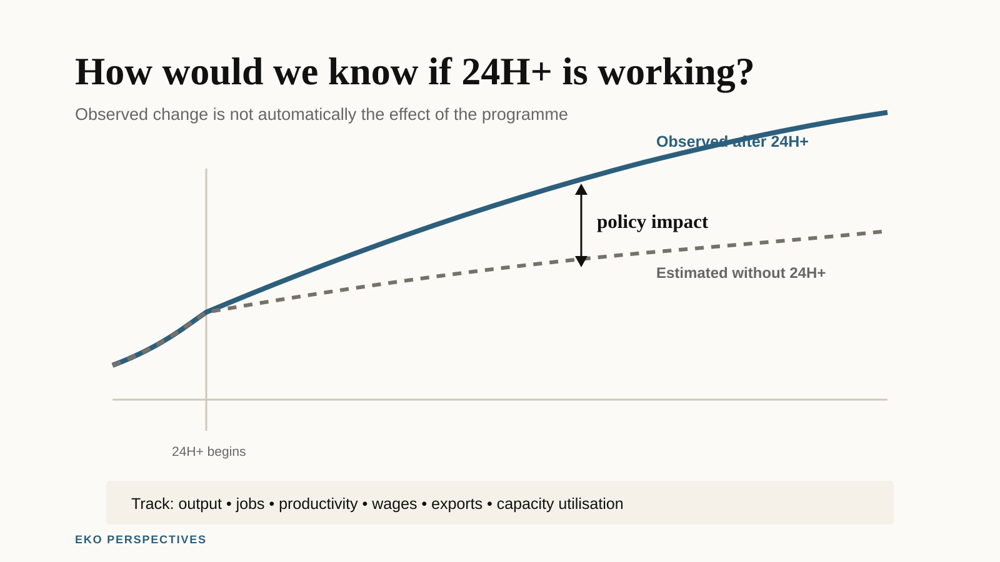

{fig-alt="Two paths compare observed outcomes after Ghana's 24H+ programme with an estimated counterfactual path without the programme. The difference between them is labelled policy impact." width="100%" fig-align="center"}

*Original graphic for EKO Perspectives.*

Ghana's 24-hour economy programme has a target of [1.7 million jobs by 2028](https://24hplus.gov.gh/24-hour-economy-on-track-to-create-1-7-million-jobs-by-2028-goosie-tanoh/). It has already enrolled [268 filling stations, eight depots and two refineries](https://npa.gov.gh/npa-24-hr-economy-authority-launch-pilot-phase-of-24-hr-economy-in-petroleum-downstream-sector/) in a petroleum pilot. The Secretariat has reported [33 manufacturers operating one-to-three-shift systems](https://gna.org.gh/2026/07/24-hour-economy-secures-5-5bn-investment-deals-160000-jobs-in-the-offing/). The Government has also begun designing firm incentives around performance assessments covering [jobs, investment and productivity](https://gna.org.gh/2026/08/businesses-seeking-24-hour-economy-incentives-to-undergo-performance-assessment/).

All of that is activity. None of it answers the question that matters: is Ghana producing more than it would have produced without the programme?

That question is not a criticism. It is the standard test for any industrial policy, and it is consistent with the programme's own promise to monitor performance and [publish scorecards](https://24hplus.gov.gh/vision-and-objectives/). The problem is that jobs created, firms enrolled, investment signed and shifts added cannot on their own distinguish a programme that raised output from one that merely coincided with activity that was going to happen anyway.

## What the programme is trying to do

The official framing is careful. The 24H+ Authority describes the programme as a production-led transformation in which [productivity and capital utilisation become high enough to justify multiple shifts](https://24hplus.gov.gh/). The [2026 Budget](https://mofep.gov.gh/sites/default/files/budget-statements/2026-Budget-Statement-and-Economic-Policy.pdf) calls it a "productivity revolution" aimed at making Ghana produce, earn and employ more.

A factory that runs two shifts instead of one uses the same building and machines for more hours. If demand exists and inputs arrive reliably, output can rise without a proportionate increase in fixed capital.

That is a real economic mechanism, and it is why the programme deserves to be taken seriously. In principle, higher capital utilisation can spread fixed costs over more units of output. In practice, the effect depends on what is actually constraining the firm: whether it can find workers for night shifts, whether electricity is reliable, whether inputs and finished goods can move safely, whether finance is available, and whether there is demand for the extra output at a price that covers the extra cost.

If those constraints bind, adding a shift may add hours without delivering the productivity gain the policy is trying to create.

## What the productivity data suggest

Ghana's own statistics give reason for caution. The Ghana Statistical Service reports that [capital deepening has grown roughly twice as fast as labour productivity since 2010](https://statsghana.gov.gh/gssmain/fileUpload/pressrelease/Productivity%20Statistics%20Report_Final_28th%20February,%202025.pdf). More capital per worker has not translated proportionately into more output per worker.

That is the pattern 24H+ is meant to reverse. It also shows why longer utilisation alone is not enough. Adding hours to underused capital does not automatically fix the reason the capital was underused.

This is where the counterfactual becomes essential.

Suppose a manufacturer in Tema adds a night shift. Jobs at that firm rise. Output rises. The programme records both. But if the firm was already planning to add the shift because of an export order, the programme did not cause the change. It coincided with it.

The policy effect is the difference between what happened with 24H+ and what would have happened without it. The second outcome is never directly observed. It has to be estimated.

## Scenario evidence is not impact evidence

One published economic analysis of a Ghanaian 24-hour economy is Yakubu Abdul-Salam's 2024 study in *Socio-Economic Planning Sciences*. It uses a dynamic computable general equilibrium model to compare a 24-hour-economy scenario with a business-as-usual scenario and reports large potential effects on GDP and employment. [The paper](https://doi.org/10.1016/j.seps.2024.102017) estimates that real GDP after ten years could be 31.71 per cent higher than under business as usual and that more than three million jobs could be generated within five years.

Those are ex ante scenario results. They are not an evaluation of the programme now being implemented.

A CGE model asks what the economy would look like under a specified set of shocks and behavioural relationships. Its results are conditional on the model structure, parameters, closure rules and the way the policy scenario is represented. That makes the study useful for asking whether a large effect is economically possible under its assumptions. It cannot tell us whether the firms adding shifts in 2026 did so because of 24H+, or how much of the observed change would have happened anyway.

That distinction matters when modelled possibilities and programme targets begin to sit beside one another in public debate. A scenario can inform expectations. It cannot substitute for impact evidence.

## The electricity constraint is real and measurable

One practical constraint is electricity. The IMF has said that Ghana's industrial ambitions, including 24H+, require a step change in the [reliability, affordability and financial sustainability of power](https://www.elibrary.imf.org/view/journals/018/2026/086/article-A001-en.xml). World Bank Enterprise Survey data show that [73.76 per cent of Ghanaian firms experienced electrical outages](https://data.worldbank.org/indicator/IC.ELC.OUTG.ZS?locations=GH) in the most recent survey round.

A share of firms is not a measure of outage duration or cost, and those details matter. But the figure shows how common the constraint is.

A night shift does not run on an unreliable grid. If firms must self-generate, the cost of the extra hours rises and the gain from using the plant longer shrinks. If they cannot self-generate, production stops when the power does.

The programme itself recognises that raising capacity utilisation requires removing constraints around energy, logistics, finance and the wider business environment. That is important because some of the most consequential 24H+ interventions may not look like "24-hour" interventions at all.

## How the phased rollout creates an opportunity

The phased rollout creates a potential evaluation opportunity.

The petroleum pilot began in selected facilities across Greater Accra, Ashanti, Western and Northern regions. Other firms and sectors are entering readiness or incentive arrangements at different times. That variation can help construct comparison groups, provided the participating and non-participating firms are comparable enough and the reasons for entering the programme are handled carefully.

At minimum, participating firms need a baseline before support begins: operating hours, capacity utilisation, output, employment, wages, electricity use, outages, exports and other sector-specific measures. The same outcomes then need to be observed after participation.

A stronger design would compare those changes with similar firms that have not yet entered the programme. If a participating manufacturer moves from one shift to two and output rises by 40 per cent, that sounds impressive. If comparable manufacturers outside the programme rise by 35 per cent over the same period because demand and macroeconomic conditions improved, the additional effect looks very different.

If pre-programme trends are sufficiently similar, a difference-in-differences design is one possible way to estimate that effect. But the rollout does not create a valid control group automatically. Firms that volunteer or qualify for 24H+ may already be larger, better financed, more export-oriented or more ambitious than firms that do not participate. Spillovers may also affect nearby or competing firms.

Those problems can be addressed only if the underlying data are preserved. The firm-level baselines and comparison data needed for a credible impact evaluation are not yet publicly reported at that level. The performance assessments planned for incentive recipients are a useful starting point, but impact evaluation requires information on plausible non-participants too.

## What the programme can and cannot measure

Four layers of evidence should be kept separate.

The first is **activity**: how many firms enrolled, how many shifts were added, how much investment was signed and how many facilities were built. Much of the public reporting so far sits here.

The second is **outcomes**: whether output, employment, exports, wages, capacity utilisation and productivity actually rose.

The third is **quality**: whether additional shifts create stable, adequately paid and safe jobs, or whether some of the adjustment costs are shifted onto workers.

The fourth is **additionality**: how much of those outcomes happened because of the programme rather than alongside it, and whether gains at participating firms came partly at the expense of firms elsewhere in the economy.

That last category is the hardest. It is also what turns a progress report into an economic evaluation.

## What would need to happen

The most useful thing the 24H+ Authority could do now is make the evaluation question explicit and preserve the data needed to answer it.

That means publishing clear participation and eligibility criteria, recording firm-level baselines before incentives or readiness support begin, collecting the same outcomes consistently over time, and identifying non-participating firms that provide credible comparisons. It also means committing to publish enough of the evaluation design and results for outsiders to understand what has and has not been attributed to the programme.

Ghana has built a programme aimed at raising productivity by using existing capacity more intensively. Whether that is what it does remains an empirical question.

The country has an unusual opportunity to answer it because implementation is still young and staggered. If the evidence architecture is built alongside the production architecture, 24H+ will eventually be able to demonstrate more than how much activity took place. It will be able to estimate how much difference the programme made.
