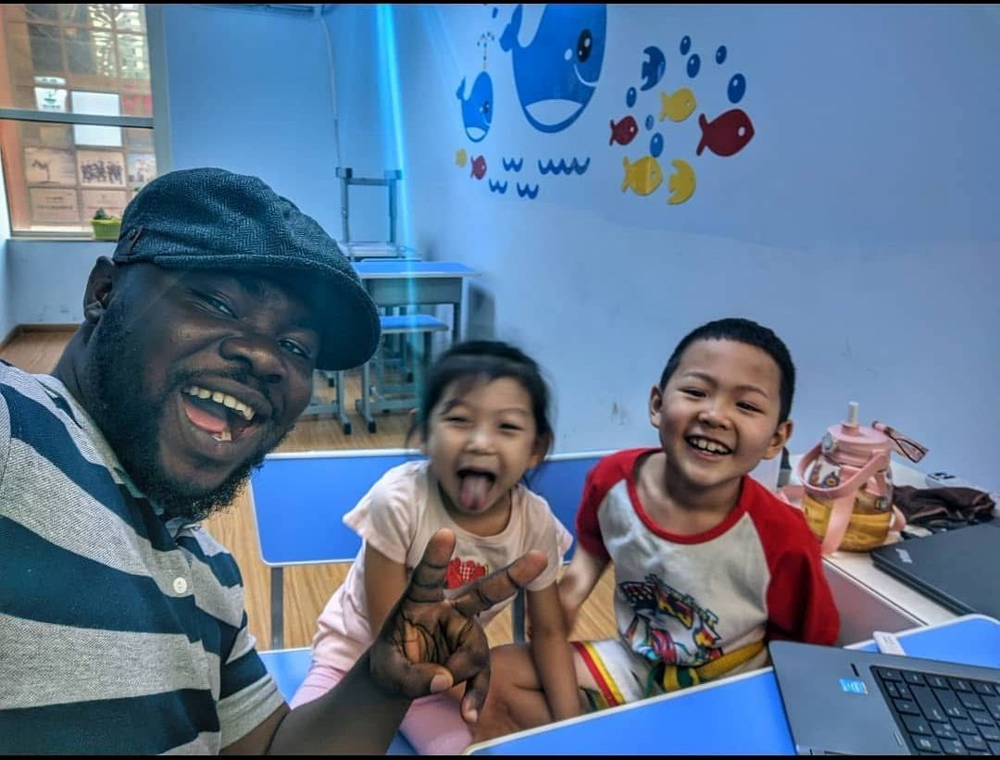
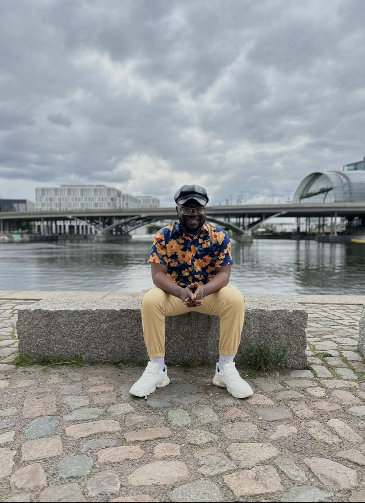
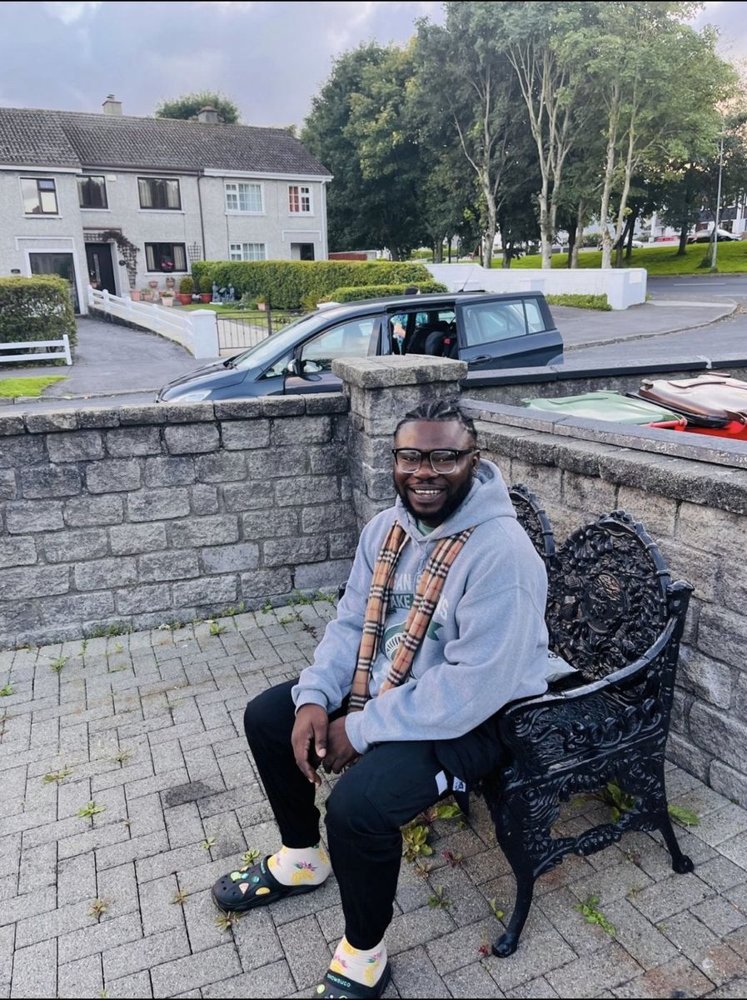
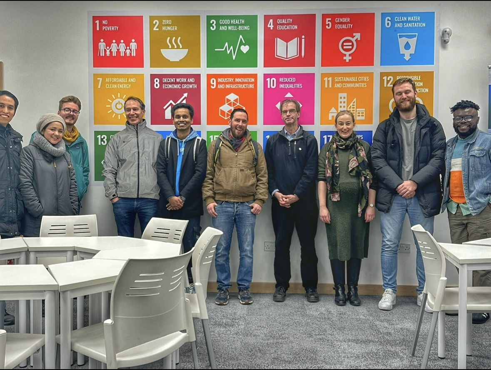
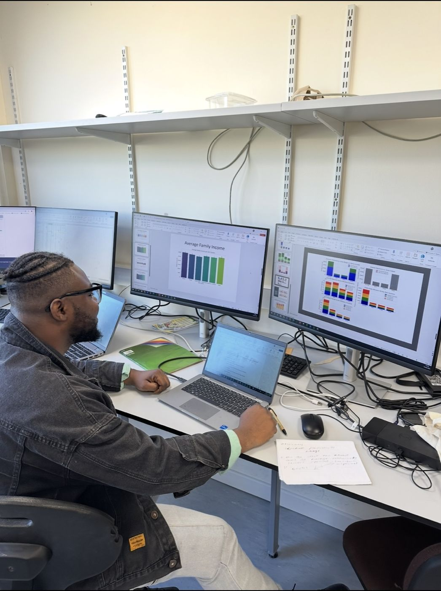
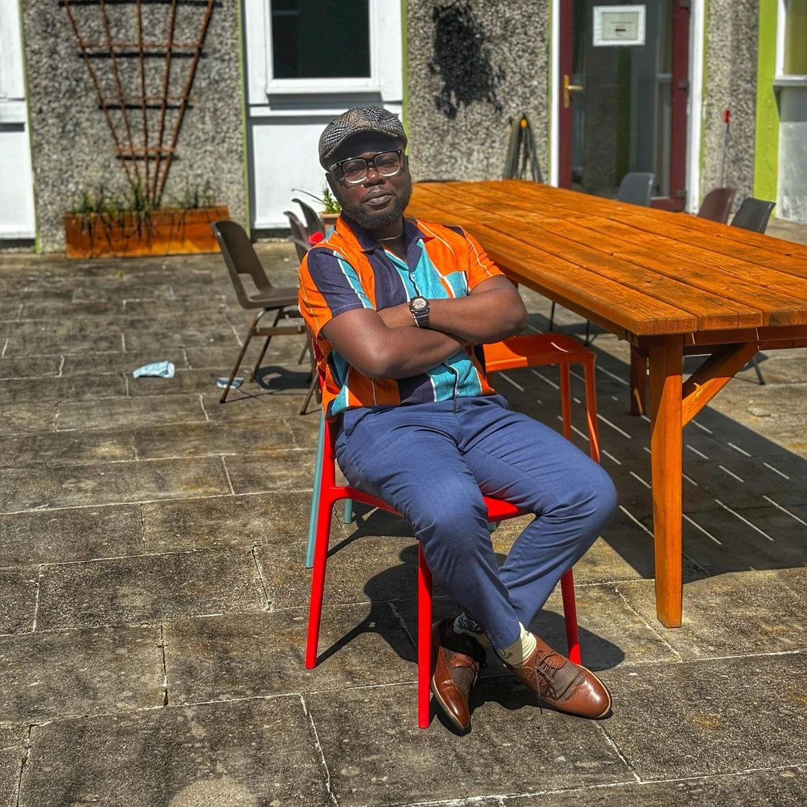
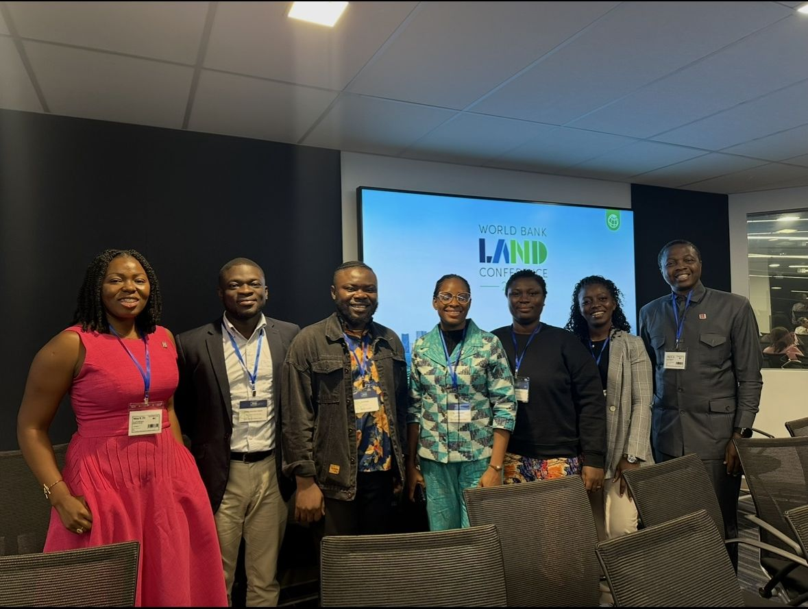
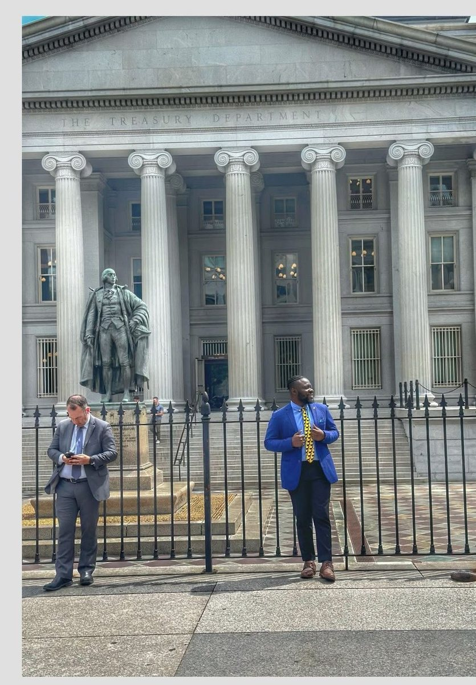
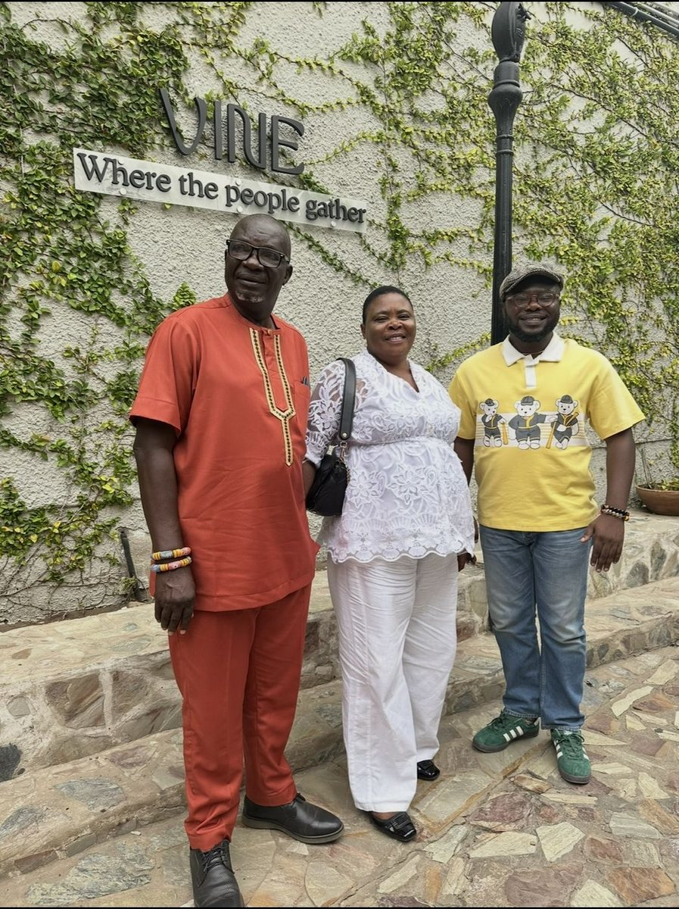
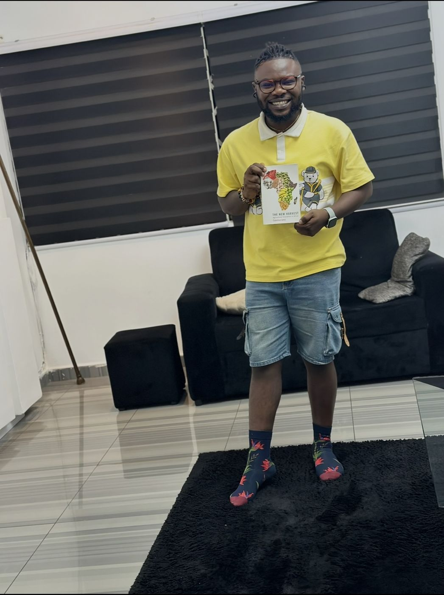

# How I got here

A living account of the places, people and opportunities that shaped the work I do.

From Ghana to China and Ireland: the people, opportunities, detours and questions that shaped Elvis Kwame Ofori’s work and writing.

Elvis Kwame Ofori standing outdoors in a patterned cardigan.

I studied accounting in Ghana, taught English in China, and now build agricultural and land-use models in Ireland. None of those sentences would have predicted the next one while I was living it. Looking back can make a life seem more carefully planned than it was. Mine was not. There were opportunities I prepared for and decisions I made, but also plans that changed, a visa that arrived too late, people who opened doors, and places that became important long after I first arrived in them. The [About page](../about.llms.md) has the short version. This is the longer story.

## Ghana: where it began

I studied Accounting at the University of Professional Studies, Accra. It may seem some distance from the work I do now, but I do not think of it as an abandoned beginning. Accounting taught me to pay attention to numbers and organisations, and to the difference between what something appears to be and what the underlying records actually show. It took me years to see how useful that instinct would become.

After university I did my National Service with Ghana’s National Petroleum Authority. I had been living in Accra, and the posting sent me to Takoradi, one of the first times life moved me somewhere I had not planned to go. It was also my first real taste of responsibility. I worked nights and double shifts and was trusted with supervisory duties. None of it was glamorous, but it was an education of its own. University had taught me concepts; work began to show me what happens when procedures, rules and decisions meet the people expected to carry them out, and how differently an organisation looks depending on where inside it you stand.

I would not have called that an interest in policy implementation at the time. A few years later, however, the same concern returned as research. One of my early papers, published in [*Resources Policy*](https://doi.org/10.1016/j.resourpol.2023.103368), examined how to measure safety performance in Ghana’s oil and gas industry. The subject was different from what I work on now, but the underlying question was already familiar: what happens between a formal system and the people who have to make it work?

## China: a much bigger change than a degree

In 2019 I received a full scholarship for an MSc in Management Science and Engineering and moved to Taiyuan, in northern China. I knew China would be different. I was less prepared for how different the north would feel to someone arriving from Ghana, and the cold introduced itself quickly.

The larger change was intellectual. China was where I became deliberate about policy research. Instead of seeing only a result, I started asking what structure had produced it. Who were the actors? What assumptions sat underneath the analysis, and what counted as evidence? What happened when a policy left a document and entered an economy, an organisation or a community? My interests moved across sustainability, development, environmental policy and energy economics. Energy held my attention because so many of its decisions operate at scale: governments, industries and large companies can change the direction of a whole system, and thinking at that scale taught me to look for the links between institutions, incentives and outcomes.

With people who became part of my life in China.

*China became much more than a scholarship or a degree. The people around me became part of the education too.*

Part of my life there never appeared on a transcript. I taught English as a second language, including to young children, and I loved the moment when confusion turned into confidence and something difficult suddenly made sense. Years later I realised that teaching had sharpened a skill research needs too: understanding something yourself is one thing, and explaining it clearly to someone else is another. The same instinct showed up when colleagues needed help with data. I liked sitting down with someone and working through not only which command to run, but what the numbers were saying and whether the interpretation held up. I still think of data analysis almost as a conversation. You learn how to talk to data, and you also have to learn when to stop talking long enough to let the data answer back.

Teaching English in China became one of the unexpected parts of my life there.

I later began doctoral study in China as well. That path would change, but China had already changed me.

## What moving teaches you

I left Ghana in 2019. I could not have known then that I would not go home again until 2024. Living abroad brought opportunities that changed my life, and it also taught me that mobility is not experienced equally. For some people international travel is mostly a ticket, a passport and a timetable. For others it means visa applications, appointments, waiting and the real possibility that an opportunity will move faster than the paperwork.

I learned this clearly with Germany. I was due to join colleagues at a capacity-building training there. They did not face the same visa requirement; I did. By the time my visa arrived, the training was over. I eventually travelled to Germany, but as a personal trip rather than for the programme that had made the journey necessary. It was hardly a tragedy, but it stayed with me because it showed something that talk of international mobility tends to hide: an opportunity can be equally available on paper and still be much easier for one person to reach than another.

Germany, eventually. The original training had passed by the time my visa arrived, but I still made the journey later.

## Ireland: beginning again

Eventually I left the doctoral path I had begun in China and moved to the University of Galway for a different PhD. Before the research groups, conferences and models became part of the story, Ireland was simply somewhere new, and a new country means learning small things all over again: routes, weather, shops, ways of speaking, and the rules nobody explains because everyone else already knows them.

My first day in Ireland. Before the research groups and models, it was simply another new beginning.

Then the research moved sideways in a way I had not expected. Much of my earlier work was in energy economics, where the important actors were governments, industries and large institutions. Agriculture and land use brought the problem much closer to individual decisions. A government can set a climate target, a model can describe a pathway, and a sector can be told that its emissions must fall. But eventually somebody owns or works the land. Somebody has animals to feed, bills to pay, machinery already bought, a family involved in the farm, or a perfectly good reason for continuing to do something that looks inefficient from far away. That pulled my attention towards farmers, land-use decisions, behavioural responses and the way costs are distributed across people and places. Later, while continuing the PhD, I joined the wider FORESIGHT and FUSION research environment at Galway as a Research Assistant.

With colleagues from the FORESIGHT and FUSION research environment at the University of Galway.

At the Agriculture & Land Use in Ireland conference.

*Research eventually gave me a community as well as a subject.*

The subject had changed a great deal since accounting and my energy work, but the underlying questions had changed less than I first thought. Who makes the decision, and with what information? Which constraints disappear when you look from too far away? Who benefits, and who pays? A national model may say that livestock numbers should fall, that land should change use or that a technology should be adopted. A farmer still has to decide what to do on Monday morning. The distance between the aggregate pathway and that decision has become the part of the work I care about most.

At work in Ireland. Much of the research happens in the quieter work of testing assumptions, rebuilding figures and checking numbers.

[Read more about my research →](../research/)

Work helps a place become home, but work alone does not make a life. Church, shared meals, friendships and ordinary routines are what turned Ireland from somewhere I had moved for a PhD into somewhere that holds pieces of my life. There have been classmates who became friends, colleagues who patiently explained things I probably should have known, supervisors who trusted me, and people who helped when I was new. A CV is good at recording institutions and much worse at recording people. It records the year you arrived; it does not record who helped make the place feel less strange.

After church in Galway, waiting for lunch with members of the church community.

A sunny day in Galway.

*Somewhere along the way, a place you moved to for work begins collecting friendships and memories of its own.*

## Beyond the desk

Research has also given me reasons to travel. One trip took me to Washington, D.C., for the World Bank LAND Conference. The programme was the formal reason for going, but a conference is rarely only its programme. There are conversations over coffee, people you did not expect to meet, and a city you had previously known mostly through books and news. In Washington I met other Ghanaians at the conference, a small reminder that home can turn up in unexpected places.

With other Ghanaian participants at the World Bank LAND Conference in Washington, D.C.

Washington, D.C., beyond the conference room.

## Going home

For all the places that became part of my life after 2019, Ghana never stopped being home. I returned for the first time in 2024, five years after leaving, and went back again in 2025. Five years is long enough for absence to become normal. You learn to celebrate some things through a screen, hear family news over the phone and accept that ordinary moments are happening without you. Going home changed the scale of those years.

Back with my parents in Ghana. Returning home reminded me what distance had been asking me to miss.

What mattered was not sightseeing but family: sitting together, talking without watching the time, eating together, being physically present again. Living abroad has given me opportunities I am deeply grateful for, but opportunity and family are not interchangeable. A career can cross borders surprisingly well. Relationships still depend on presence.

## Reading beyond the work

One habit runs through all of these chapters: I love to read. Some books connect directly to my research, and many do not. I like following an argument into a subject I know little about and finding another question waiting there. That is partly why this website is broader than my PhD. Research teaches you to narrow a question until it can be answered properly, and that discipline matters. Curiosity does not always respect project boundaries.

Books have been another part of the journey. Reading is one way the boundaries of my work keep expanding.

Some posts here will be about agriculture or economics because that is where my research sits. Others will be about science, technology, Ghana, Africa, Ireland, a book, a place or a person. I do not expect them all to fit in one intellectual box. My own route has not.

## Still unfinished

Writing about a journey from the middle of it has an obvious danger. Accidents start to look like plans, decisions gain importance because you already know what came next, and memory quietly rearranges the cast. I do not want this page to become a polished origin story in which accounting inevitably led to China and China inevitably led to Ireland. Some things worked and some plans changed. One visa arrived after the opportunity it was meant for. I walked away from one PhD and began another, places I expected to be temporary became important, and after five years away I went home.

The page is called *How I got here*, but “here” is still moving. I will come back to it when another chapter changes the shape of the story, when memory supplies something I missed, or when I realise I have not thanked somebody properly. For now, this is where I am.
