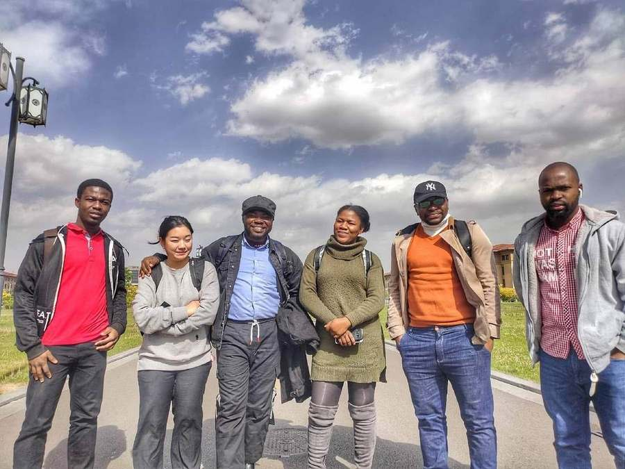
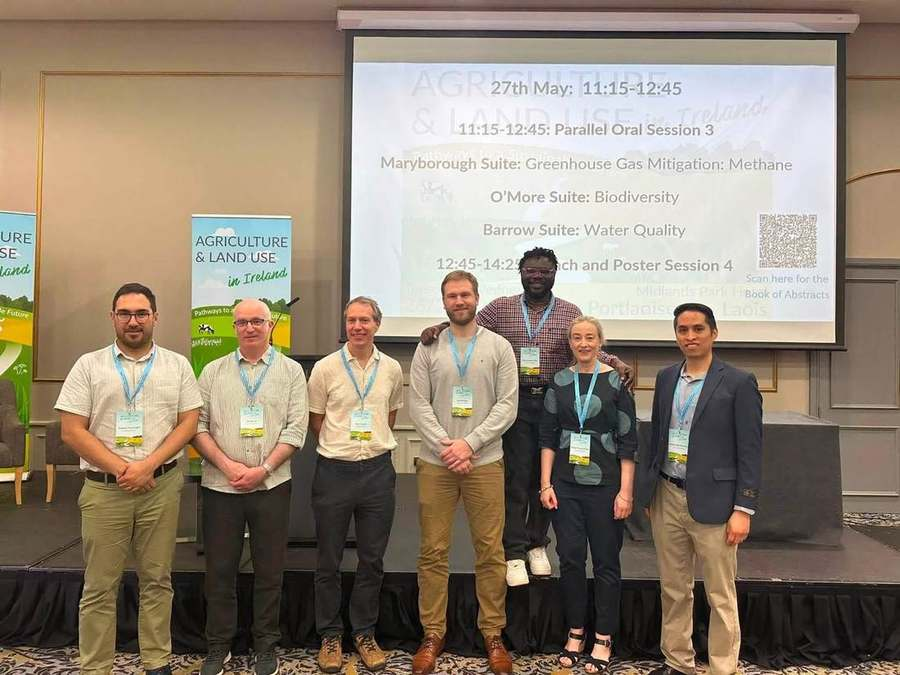
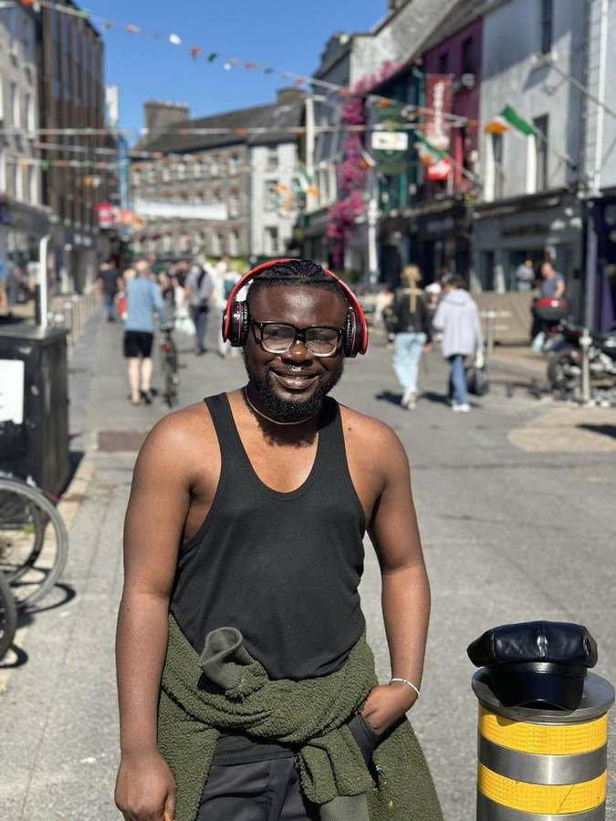
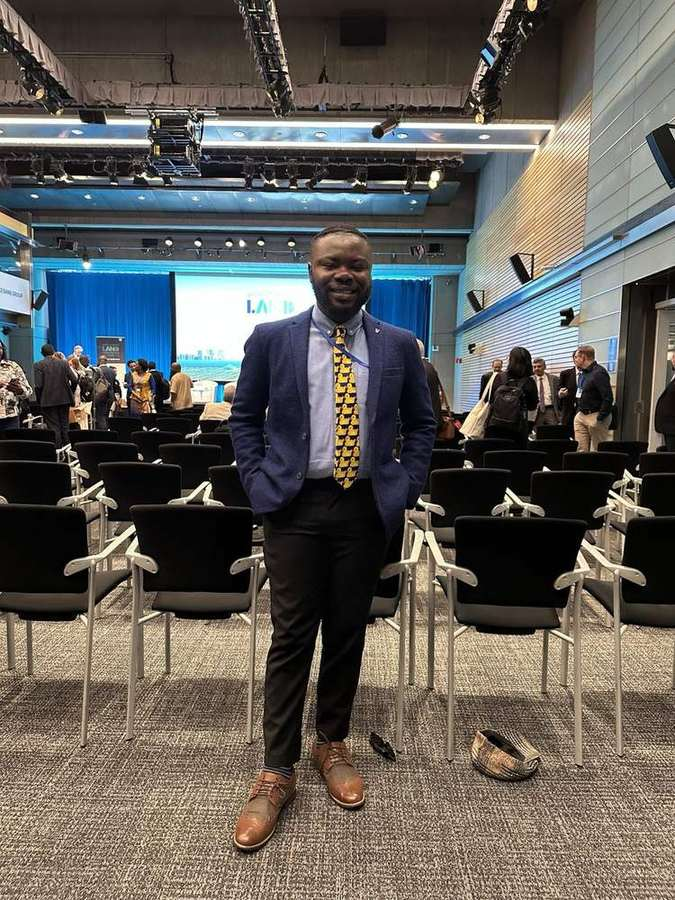

{width=72% fig-align="center"}

Welcome to my little corner of the internet.

There is an [About page](../about.qmd) elsewhere on this site if what you need is the short version: who I am, what I research and where I work. This is something different.

Think of this as an invitation to take a ride with me.

I want to tell some of the story behind the work: Ghana, China, Ireland, the opportunities I was fortunate enough to receive, the people I met, the things I learned and occasionally had to unlearn, and the questions that gradually became important to me.

My journey has never felt particularly planned. I studied accounting in Ghana. I spent my National Service working with the National Petroleum Authority and was sent from Accra to Takoradi. A scholarship later took me to northern China. Research moved me towards policy, sustainability and energy. Another turn brought me to Ireland, agriculture and land use, and increasingly to the choices made by farmers and the people who ultimately live with decisions made much farther away.

Looking back makes the path appear neater than it actually was.

I have never understood the opportunities I received as proof that I was always the smartest or most exceptional person in the room. I have been fortunate, but I have also tried to be prepared when opportunities came and to make hay while the sun shone. That is one of the habits for which I am most grateful.

And none of this happened alone.

Teachers, family, friends, classmates, colleagues, supervisors, institutions and people I met only briefly have opened doors, offered advice, trusted me with responsibilities or simply made unfamiliar places feel less unfamiliar.

This page is partly my attempt to remember that.

It is also unfinished. I expect to return to it as the journey continues, adding chapters, correcting what needs correcting and giving proper credit to the people and places that have helped shape my path.

## Ghana: where it began

I studied **Accounting at the University of Professional Studies, Accra**.

Accounting may look some distance from the work I do now, but I do not think of it as an abandoned beginning. It taught me to pay attention to numbers, organisations and the difference between what something appears to be and what the underlying records actually show. I would only understand much later how useful that instinct could become.

After university, I completed my National Service with Ghana's **National Petroleum Authority**.

I had been in Accra, but the work took me to Takoradi. It was one of the first moments when life moved me somewhere I had not necessarily planned to go.

Takoradi also gave me some early experiences of responsibility. I worked nights. There were double shifts. I was trusted with supervisory responsibilities. It was not glamorous, but it was useful education.

University had taught me concepts. Work began teaching me what happens after procedures, rules and decisions meet real people who have to carry them out.

I would not have described that as an interest in policy implementation at the time. I was simply learning how a workplace functions, how people respond to responsibility, and how different the same organisation can look depending on where inside it you happen to stand.

Those questions stayed somewhere in the background.

## China: learning to think in frameworks

In 2019, another opportunity appeared.

I received a **full scholarship for an MSc in Management Science and Engineering** and moved to **Taiyuan in northern China**.

I knew China would be different. I was less prepared for exactly how different northern China could feel to someone arriving from Ghana.

The cold made its introduction quickly.

But the more important change was intellectual.

China was where I began learning to approach problems through frameworks. I became more deliberate about policy research and analysis. Instead of seeing only a result, I started asking what structure produced it. Who were the relevant actors? What assumptions sat underneath the analysis? What evidence was being used? What happened when a policy moved from a document into an economy or a community?

My research interests moved across sustainability, development, environmental policy and energy economics.

Energy was particularly interesting because many of the decisions were large ones. Governments, industries, energy companies and other major actors could change what happened across an entire system. Thinking at that scale taught me to see connections between institutions, incentives and outcomes.

I later had the opportunity to begin doctoral study in China as well.

{fig-alt="Elvis Kwame Ofori standing outdoors with a group of friends and fellow students during his time in China" width=94% fig-align="center"}

*China became much more than a scholarship or a degree. The people around me became part of the education too.*

There was another part of my life in China that did not appear neatly on an academic transcript.

I taught **English as a second language to Chinese students**. I especially enjoyed working with younger learners. There is something I still love about watching a person become more confident because something that looked difficult begins to make sense.

The same instinct started appearing in my work with colleagues.

If somebody was struggling with data analysis, I enjoyed sitting down with them and working through it. Not simply which button to press or which command to run, but what the numbers were actually saying and whether the interpretation made sense.

Over time I have come to think of data analysis almost as a conversation.

You learn how to talk to data. You also have to learn when to stop talking long enough to let the data answer back.

That interest in teaching, explaining and helping people make sense of evidence has followed me into almost everything I have done since.

The scholarship mattered enormously. So did the opportunities that followed it.

I am grateful for them, although I have never been very comfortable interpreting opportunity as proof that someone is simply more intelligent or deserving than everybody else.

There were certainly people more brilliant than me.

What I learned to value was being prepared when an opportunity appeared.

Make hay while the sun shines.

It is an old saying, but it has served me well. Prepare before you know exactly what the preparation will be useful for. When a door opens, take the opportunity seriously. Learn what you can while you are there.

A surprising amount of my journey has worked that way.

## Ireland: bringing the question closer to the ground

Eventually, I left the doctoral path I had begun in China and moved to Ireland for a different PhD.

Ireland was beautiful.

It also moved my research sideways in a way I had not completely anticipated.

I arrived at the **University of Galway** as a PhD student. Much of my earlier work had been connected to energy economics and policy, where the important actors could be governments, industries and large institutions.

Agriculture and land use brought me much closer to individual choices.

A national government can set a climate target. A model can describe a pathway. A sector can be told that emissions need to fall.

But eventually somebody owns the land.

Somebody has animals to feed, bills to pay, machinery already purchased, a family involved in the farm, or a reason for continuing to do something that may look inefficient when viewed only from above.

That shift interested me.

I began thinking much more about farmers, land-use decisions, behavioural responses and the distribution of costs across different people and places.

Later, while continuing the PhD, I was employed as a **Research Assistant** within the wider **FORESIGHT and FUSION** research environment at the University of Galway.

That work pulled me further into agricultural, climate and land-use modelling.

{fig-alt="Elvis Kwame Ofori standing with other participants at the Agriculture and Land Use in Ireland conference" width=94% fig-align="center"}

*Research eventually gave me a community as well as a subject.*

The subject had changed substantially from accounting and from some of my earlier energy work, but I began to notice that the underlying questions had not changed as much as I first thought.

Who makes the decision?

What information do they have?

What constraints are invisible from a distance?

Who benefits?

Who pays?

And what happens between a policy being designed and somebody actually having to respond to it?

My doctoral work now sits inside those questions.

I am interested in national pathways, but also in the farms and places inside them. A national model may indicate that livestock numbers should fall, land should change use or a technology should be adopted.

A farmer still has to decide what to do on Monday morning.

That distance between the aggregate pathway and the individual decision has become one of the most interesting parts of the work for me.

[Read more about my research →](../research.qmd)

## The people along the way

Since leaving Ghana in 2019, I have sometimes felt like a wanderer.

Countries change. Rooms change. The people around the table change.

You learn new routes to work, new foods, new weather, new ways people speak to one another and all the small rules nobody thinks to explain because everybody else already knows them.

Then, slowly, somewhere unfamiliar begins to feel ordinary.

When I look back, the institutions are easy to list. Universities. Research groups. Government bodies. Conferences.

The people are harder to reduce to a list.

There have been classmates who became friends, colleagues who patiently explained things I should probably already have known, supervisors who trusted me, people who shared meals, people who helped when I was new somewhere, and people whose paths crossed mine only briefly but left something behind.

I have met beautiful people along the way.

That may be the part of moving countries that a CV hides most effectively.

A CV records the year you arrived. It does not record who helped make the place feel less strange.

{fig-alt="Elvis Kwame Ofori standing on a sunny street in Galway wearing headphones" width=68% fig-align="center"}

*Somewhere along the way, a place you moved to for work begins collecting friendships and memories of its own.*

## Beyond the desk

Research has also given me reasons to travel.

One of those trips took me to Washington, D.C., for the **World Bank LAND Conference**.

The conference was the reason for being there, but conferences are rarely the whole experience.

There are the formal sessions, the presentations and the people you planned to meet. Then there are the conversations afterwards, the walk through a city, a museum you had not expected to spend so long inside, or something you see that sends your thinking somewhere unrelated to the programme.

I have come to value both.

{fig-alt="Elvis Kwame Ofori standing in a conference room at the World Bank LAND Conference in Washington DC" width=68% fig-align="center"}

*The formal programme was one part of the trip. The conversations and wandering afterwards became part of it too.*

Perhaps that is also why this website is broader than my PhD.

Research teaches you to narrow a question until it can be answered properly. That discipline matters. But life keeps presenting questions that do not yet fit neatly inside a model, a journal article or a research project.

I wanted somewhere to put those too.

That is part of what **EKO Perspectives** has become for me.

Sometimes I will write about agriculture or economics because that is where my research currently sits. Sometimes it will be technology, science, Ghana, Africa, Ireland, a book, a place, a person or something I encountered while looking for something completely different.

I do not expect all of it to fit into one intellectual box.

My own journey has not.

## Still unfinished

There is an obvious danger in writing about your own journey while you are still in the middle of it.

You can make accidents look like plans.

You can give too much importance to decisions whose consequences only became clear years later. You can forget the people who mattered at the time because memory has quietly rearranged the cast.

So I do not want this page to become a polished origin story in which every step inevitably led to the next one.

It did not.

Some things worked. Some plans changed. Some opportunities appeared unexpectedly. I walked away from one PhD and began another. My research moved from one field towards another. Places I expected to be temporary became important parts of my life.

And I am still figuring out where some of it leads.

That is why this page will remain open.

I will return when memory supplies something I missed, when another chapter changes the shape of the story, or when I realise I have failed to thank somebody properly.

For now, this is where I am.
