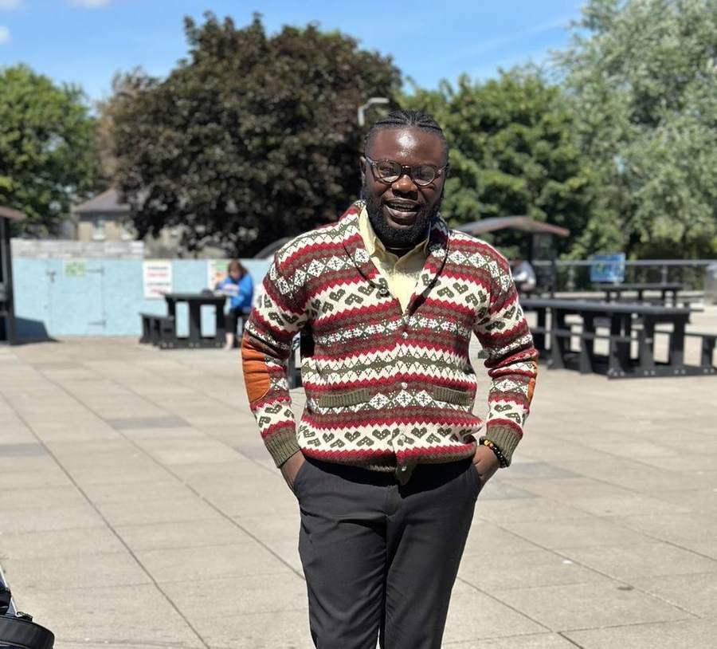
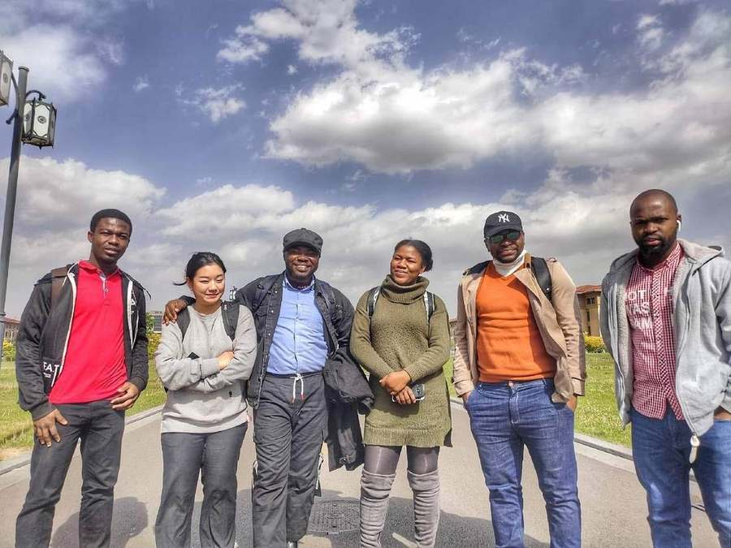
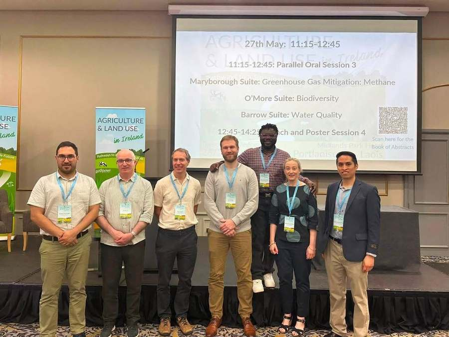
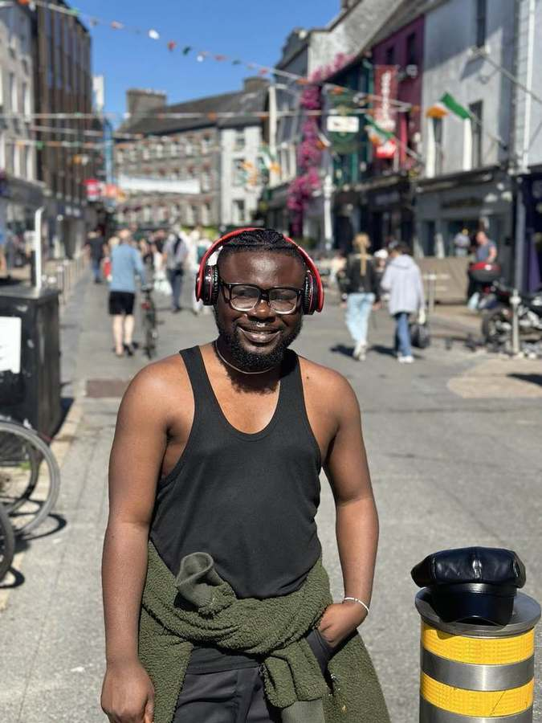
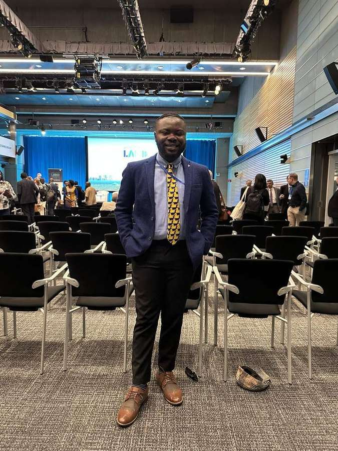

{width=72% fig-align="center"}

I studied accounting in Ghana, taught English in China, and now build agricultural and land-use models in Ireland. None of those sentences would have predicted the next one while I was living it.

Looking backwards has a way of making a life appear more carefully planned than it was. Mine was not. There were opportunities I prepared for, decisions I made, plans that changed, visas that arrived too late, people who opened doors, and places that became important long after I first arrived in them.

The [About page](../about.qmd) has the short version of who I am and what I work on. This is the longer story.

## Ghana: where it began

I studied **Accounting at the University of Professional Studies, Accra**.

Accounting may seem some distance from the work I do now, but I do not think of it as an abandoned beginning. It taught me to pay attention to numbers, organisations and the difference between what something appears to be and what the underlying records actually show. I understood much later how useful that instinct would become.

After university, I completed my National Service with Ghana's **National Petroleum Authority**. I had been living in Accra, and the posting sent me to Takoradi.

Takoradi was one of the first times life moved me somewhere I had not planned to go. It also gave me an early taste of responsibility. I worked nights and double shifts and was trusted with supervisory duties. It was not glamorous, but it was an education of its own.

University had taught me concepts. Work began teaching me what happens after procedures, rules and decisions meet the people expected to carry them out.

I would not have called that an interest in policy implementation at the time. I was simply learning how an organisation looks different depending on where inside it you stand.

The question stayed with me.

## China: a much bigger change than a degree

In 2019, another opportunity appeared.

I received a **full scholarship for an MSc in Management Science and Engineering** and moved to **Taiyuan in northern China**.

I knew China would be different. I was less prepared for exactly how different northern China would feel to someone arriving from Ghana. The cold introduced itself quickly.

The larger change, though, was intellectual.

China was where I became much more deliberate about policy research and analysis. Instead of seeing only a result, I started asking what structure had produced it. Who were the actors? What assumptions were buried underneath an analysis? What counted as evidence? And what happened when a policy left a document and entered an economy, an organisation or a community?

My interests moved across sustainability, development, environmental policy and energy economics. Energy fascinated me because so many of its decisions operated at scale. Governments, industries and major companies could alter the direction of an entire system. Thinking at that scale taught me to look for the links between institutions, incentives and outcomes.

But China was never only research.

{fig-alt="Elvis Kwame Ofori standing outdoors with friends and fellow students during his time in China" width=94% fig-align="center"}

*China became much more than a scholarship or a degree. The people around me became part of the education too.*

Part of my life there never appeared on an academic transcript. I taught **English as a second language**, including to young children. I enjoyed the moment when confusion turned into confidence, when something that had looked difficult suddenly began to make sense.

Years later, I realised that teaching had sharpened something I would need in research too: understanding something yourself is one skill; explaining it clearly to another person is another.

The same instinct appeared when colleagues needed help with data. I enjoyed sitting down with someone and working through not only which command to run, but what the numbers were actually saying and whether the interpretation made sense.

I still think of data analysis almost as a conversation.

**You learn how to talk to data. You also have to learn when to stop talking long enough to let the data answer back.**

I eventually began doctoral study in China too. That path would later change, but China had already changed me.

## What moving teaches you

I left Ghana in **2019**. At the time, I could not have known that I would not return home until **2024**.

Living abroad brought opportunities that changed my life. It also taught me that mobility is not experienced equally.

For some people, international travel is mostly a ticket, a passport and a timetable. For others, there are visa applications, appointments, waiting, uncertainty and the possibility that an opportunity may move faster than the permission needed to reach it.

I learned that in a particularly clear way with Germany.

I was supposed to join colleagues for a **capacity-building training in Germany**. My colleagues did not face the same visa requirement. I did. By the time my visa arrived, the training had already passed.

I eventually travelled to Germany anyway, but as a personal trip rather than for the capacity-building programme that had originally made the journey necessary.

It was not some great tragedy. But it stayed with me because it revealed something easily hidden when people talk about international mobility as though everybody begins from the same place.

An opportunity can be equally available on paper and still be much easier for one person to reach than another.

That is part of the immigrant experience too. Opportunity abroad can expand your life enormously, while the process of getting there, staying there and moving between places can remind you how much depends on documents, borders and circumstances that other people may rarely need to think about.

And none of that removes the other cost of movement: distance from home.

## Ireland: beginning again

Eventually I left the doctoral path I had begun in China and moved to Ireland for a different PhD at the **University of Galway**.

Before the research groups, conferences and models became part of the story, Ireland was simply somewhere new. A new country means learning small things all over again: routes, weather, shops, ways of speaking, and the rules everybody else seems to know without remembering when they learned them.

Then the intellectual change began.

Much of my earlier work had been connected to energy economics and policy, where the important actors could be governments, industries and large institutions.

Agriculture and land use brought the problem much closer to individual decisions.

A government can set a climate target. A model can describe a pathway. A sector can be told that emissions need to fall.

But eventually somebody owns or works the land.

Somebody has animals to feed, bills to pay, machinery already purchased, a family involved in the farm, or a perfectly understandable reason for continuing to do something that may appear inefficient when seen only from above.

That shift pulled my attention towards farmers, land-use decisions, behavioural responses and the distribution of costs across people and places.

Later, while continuing the PhD, I joined the wider **FORESIGHT and FUSION** research environment at Galway as a Research Assistant. The work became broader, but so did the community around it.

{fig-alt="Elvis Kwame Ofori standing with other participants at the Agriculture and Land Use in Ireland conference" width=94% fig-align="center"}

*Research eventually gave me a community as well as a subject.*

The subject had changed substantially since accounting and my earlier energy work. The underlying questions had not changed nearly as much.

Who makes the decision? What information do they have? Which constraints disappear when we look from too far away? Who benefits? Who pays? What happens between a policy being designed and somebody actually having to respond to it?

My doctoral work now sits somewhere inside those questions.

A national model may indicate that livestock numbers should fall, land should change use or a technology should be adopted.

**A farmer still has to decide what to do on Monday morning.**

That distance between the aggregate pathway and the individual decision has become one of the parts of the work I care about most.

[Read more about my research →](../research/)

## Making somewhere unfamiliar feel ordinary

There is another Ireland story that does not happen inside the university.

Since leaving Ghana, I have sometimes felt like a wanderer. Countries change. Rooms change. The people around the table change.

You learn a place slowly. Then, almost without noticing, somewhere that once required effort begins to feel ordinary.

Work helps. But work alone does not make a life.

Church, shared meals, friendships and ordinary routines became part of how Ireland changed from somewhere I had moved for a PhD into somewhere containing pieces of a life.

There have been classmates who became friends, colleagues who patiently explained things I probably should have known, supervisors who trusted me, people who shared meals, and people who helped when I was new somewhere.

{fig-alt="Elvis Kwame Ofori standing on a sunny street in Galway wearing headphones" width=68% fig-align="center"}

*Somewhere along the way, a place you moved to for work begins collecting friendships and memories of its own.*

A CV is very good at recording institutions. It is much worse at recording people.

**A CV records the year you arrived. It does not record who helped make the place feel less strange.**

That may be one of the things moving countries has taught me most clearly.

## Beyond the desk

Research has also given me reasons to travel.

One of those journeys took me to Washington, D.C., for the **World Bank LAND Conference**.

The conference was the formal reason for being there, but conferences are rarely only their programmes.

There are presentations and planned meetings. Then there are conversations over coffee, people you did not know you would meet, and the experience of walking through a city you had previously known mostly through books, television or news.

{fig-alt="Elvis Kwame Ofori standing in a conference room at the World Bank LAND Conference in Washington DC" width=68% fig-align="center"}

*The formal programme was one part of the trip. The people and places around it became part of the experience too.*

One of the pleasures of travelling for research has been finding familiar connections in unfamiliar places. In Washington I met other Ghanaians at the conference, a small reminder that home can sometimes appear unexpectedly in places far from it.

I have come to value both sides of research travel: the reason written on the programme and everything that happens around it.

## Going home

For all the places that became part of my life after 2019, Ghana never stopped being home.

I left in 2019 and returned for the first time in **2024**, five years later. I went back again in **2025**.

Five years is long enough for absence to become normal. You learn to celebrate some things through a screen, hear family news through phone calls and accept that ordinary moments are happening without you.

Going home changed the scale of those five years. What mattered most was not sightseeing. It was family. Sitting together, talking without watching the time, eating together and being physically present again.

There is something strange about returning to somewhere deeply familiar after being away long enough for both you and the place to have changed.

Living abroad has given me opportunities for which I am deeply grateful. But opportunity and family are not interchangeable.

A career can cross borders surprisingly well. Relationships still depend on presence.

Coming home reminded me how much distance can teach you to value things that once felt ordinary.

## Reading beyond the work

There is one more habit that connects many of these chapters.

I love to read.

Some books connect directly to my research. Many do not. I like following an argument into a subject I know little about and discovering another question waiting there. A paper can send me to a book, a book to a historical argument, and that argument eventually to something I want to understand for myself.

That is partly why this website is broader than my PhD.

Research teaches you to narrow a question until it can be answered properly. That discipline matters. But curiosity does not always respect project boundaries.

Sometimes I will write here about agriculture or economics because that is where my research currently sits. Sometimes it will be science, technology, Ghana, Africa, Ireland, a book, a place, a person or something I encountered while looking for something else.

I do not expect all of it to fit inside one intellectual box.

My own journey has not.

## Still unfinished

Writing about your own journey while you are still in the middle of it carries a danger.

Accidents begin to look like plans. Decisions acquire importance because you already know what happened afterwards. Memory rearranges the cast. The stops that led somewhere become easier to remember than those that did not.

I do not want this page to become a polished origin story in which accounting inevitably led to China, China inevitably led to Ireland, and every turn somehow knew where it was going.

It did not.

Some things worked. Some plans changed. Some opportunities appeared unexpectedly. One visa arrived after the opportunity it was meant for. I walked away from one PhD and began another. Places I expected to be temporary became important parts of my life. People I did not know when I left Ghana became friends, colleagues and community.

And after five years away, I went home.

The page is called **How I got here**, but "here" is still moving.

I expect to return to it when another chapter changes the shape of the story, when memory supplies something I missed, or when I realise I have not thanked somebody properly.

For now, this is where I am.
