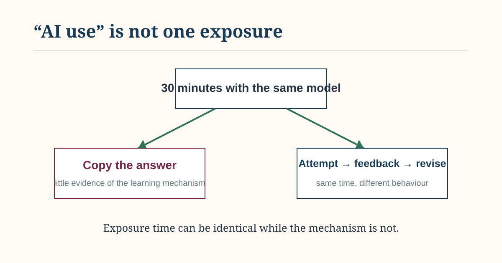

# Home

Personal writing on policy, science, economics, technology, places and research.

Ghana · China · Ireland

# Elvis Kwame Ofori

Researcher, writer and policy observer

I write about how policy, evidence and technology shape agriculture, land use and development. This site brings together public-policy analysis, research notes and personal observations shaped by Ghana, China and Ireland.

[Read EKO Perspectives →](blog/)

## Start here

Two pieces that show what EKO Perspectives is about.

[Economics & Evidence **When the future is outside the data** Why climate and land-use targets can push economics beyond what historical data can tell us, and what scenario models add.](blog/posts/2026-09-22-econometrics-to-scenario-thinking/)

[Land & Agriculture · Policy **When environmental policy needs a landscape, not just a farm** Why some environmental problems need coordination beyond individual holdings.](blog/posts/2026-09-22-acres-landscape-actions/)

## Latest from EKO Perspectives

[EKO Perspectives →](blog/)

### [Useful GitHub: MAgPIE and the discipline of open land-system modelling](blog/posts/2026-09-22-useful-github-magpie/index.llms.md)

What the MAgPIE repository can teach researchers about modelling agriculture, forestry and land-use futures reproducibly.

Sep 22, 2026

### [AI is becoming ordinary. The evidence about its effects is still catching up](blog/posts/2026-09-22-ai-needs-evidence-not-anecdotes/index.llms.md)

As generative AI moves into classrooms and everyday life, the important scientific question is shifting from capability to effects.

Sep 22, 2026

### [Where my PhD sits: FUSION and FORESIGHT](blog/posts/2026-09-22-fusion-foresight/index.llms.md)

The modelling environment around my PhD, who supports it, and why that context matters when I write about policy.

Sep 22, 2026

## About my research

[Research →](research/)

My research examines how national agricultural, climate and land-use goals translate into different costs, opportunities and constraints across farms and places. I work with spatial, economic and behavioural models at the University of Galway.
