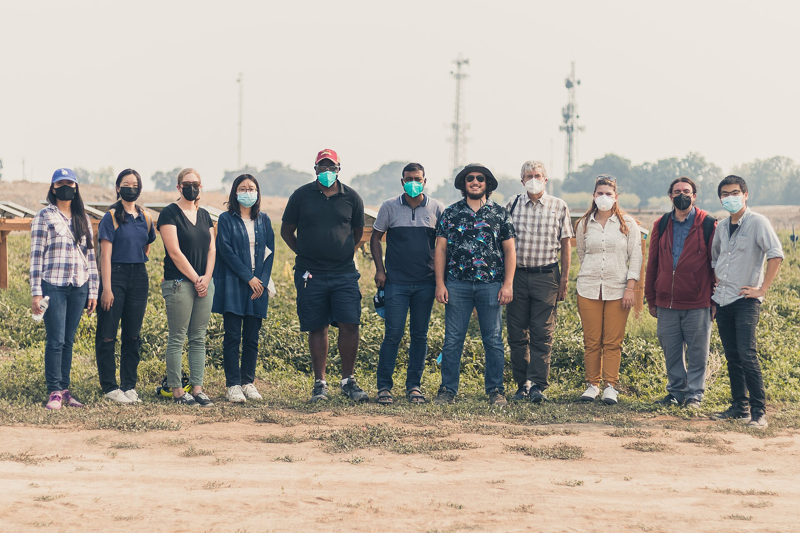
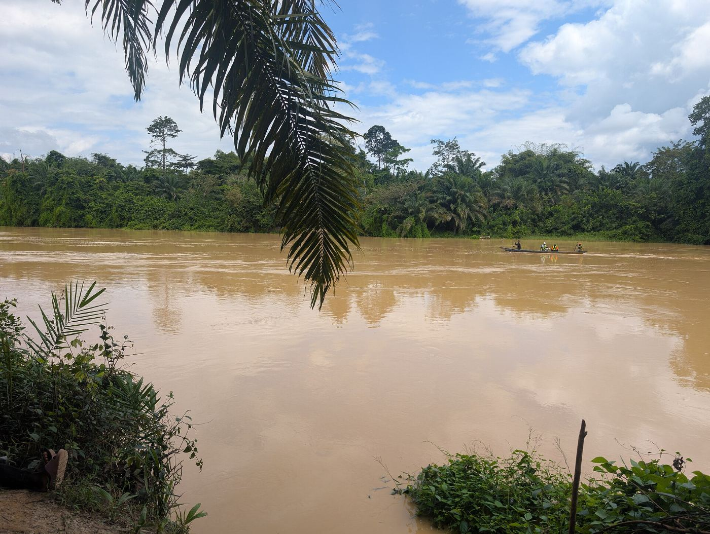
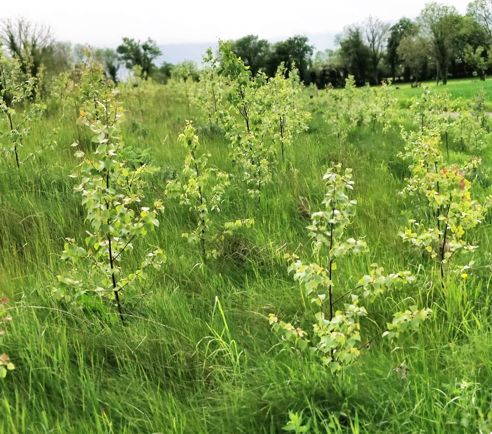
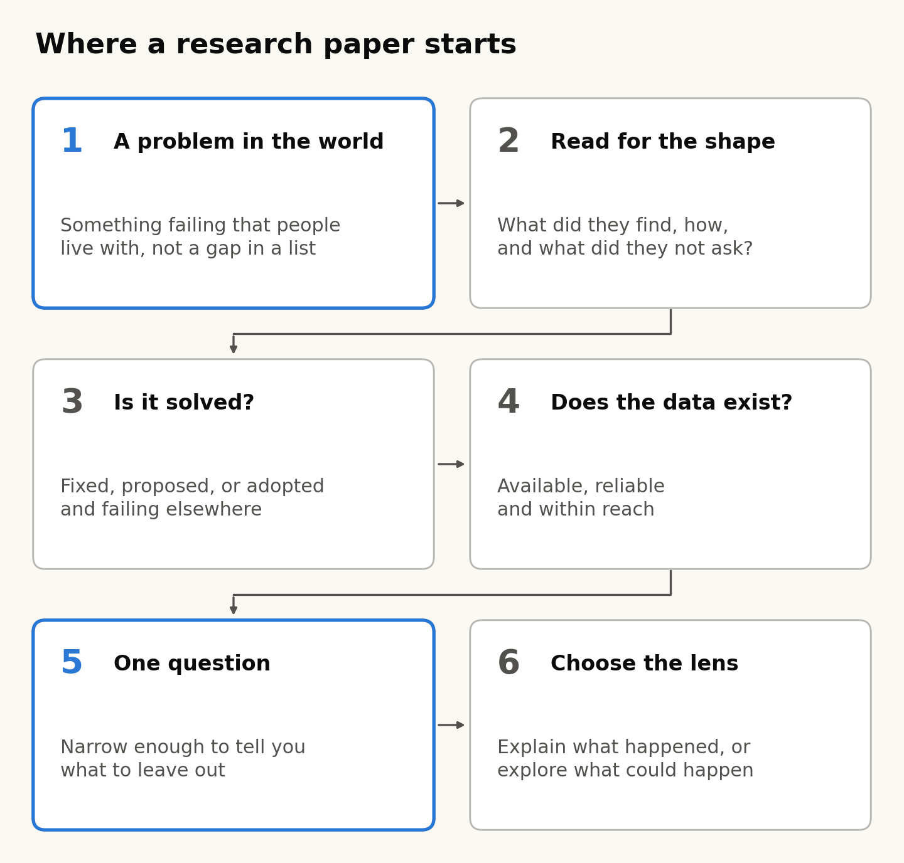
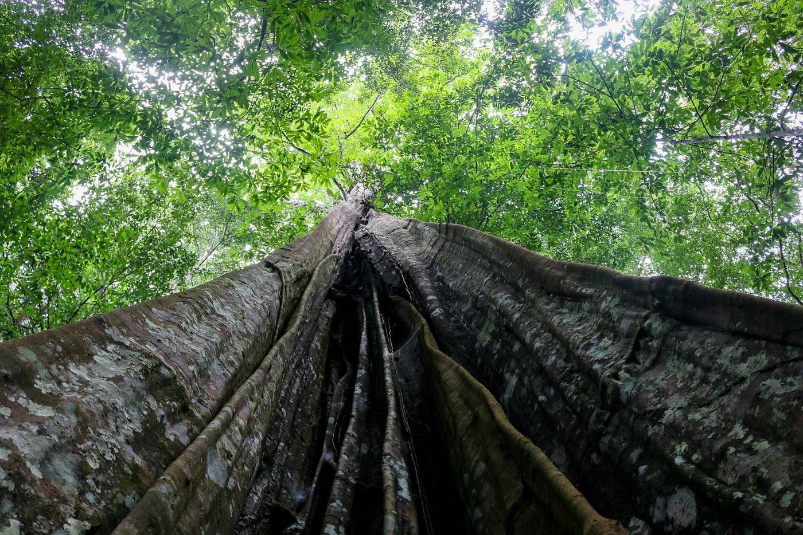
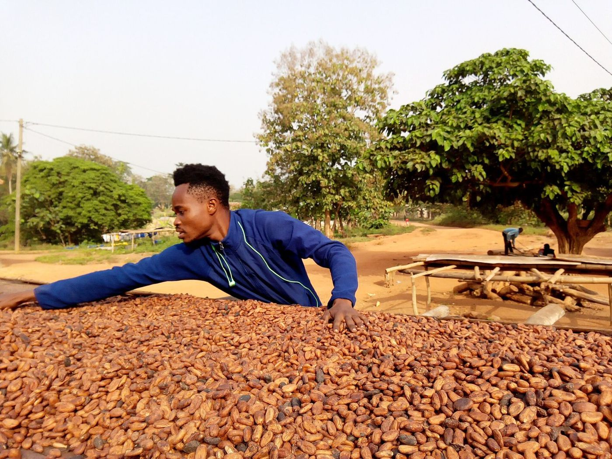

# EKO Perspectives

Research, evidence and ideas on policy, agriculture, land use, economics, science, technology and development.

# [EKO Perspectives](./)

Research, evidence and ideas by Elvis Kwame Ofori

[Policy](./blog/#category=Policy) [Land & Agriculture](./blog/#category=Land%20%26%20Agriculture) [Economics & Evidence](./blog/#category=Economics%20%26%20Evidence) [Science & Technology](./blog/#category=Science%20%26%20Technology) [Places & Development](./blog/#category=Places%20%26%20Development) [Personal & Ideas](./blog/#category=Personal%20%26%20Ideas)

Featured

 UC Davis College of Engineering · Wikimedia Commons · CC BY 2.0

Land & Agriculture

## One hectare, many promises

Climate, biodiversity, energy, housing and food are all asking more of the same land. The farmer who lives from it is rarely at the table.

 Efo Komla · Wikimedia Commons · CC BY-SA 4.0

Places & Development

### We cannot drink gold

Ghana arrests hundreds of illegal miners a year and convicts a handful. The deeper problem is who profits from the gold and who pays for the water.

 Tree Council · Wikimedia Commons · CC BY-SA 4.0

Policy

### Thirty years of Irish tree-planting promises, checked against the record

Ireland has planted a fraction of the forest it promised since 1996. Licensing explains one bad stretch. Farmers walking away from planting explains more of the gap.

## Latest from EKO Perspectives

[All writing →](blog/)

### [How to start a research paper, and why you should](blog/posts/2026-10-05-start-research-paper/index.llms.md)

A paper worth writing starts with a failure in the world, not a method or a gap in a literature review. Five questions get you from that failure to something you can answer.

Oct 5, 2026

Elvis Kwame Ofori

### [The carbon credit that wasn’t there](blog/posts/2026-10-05-carbon-credit-counterfactual/index.llms.md)

Two major studies agree that forest carbon credits claimed several times what the projects achieved, even where forests were protected. The registries have since rewritten how baselines are set. The old credits are still being retired.

Oct 5, 2026

Elvis Kwame Ofori

### [Europe’s forest rule will trace the cocoa. Will it save the forest?](blog/posts/2026-10-05-eudr-cocoa-ghana/index.llms.md)

From 30 December the EU will require every cocoa, coffee, palm oil, soy, rubber, timber and cattle shipment to be traced to a plot cleared of no forest since 2020. Ghana has built the systems to comply and Côte d’Ivoire is struggling. The harder question is what the rule cannot see.

Oct 5, 2026

Elvis Kwame Ofori

## About my research

[Research →](research/)

My research examines how national agricultural, climate and land-use goals translate into different costs, opportunities and constraints across farms and places. I work with spatial, economic and behavioural models at the University of Galway.
