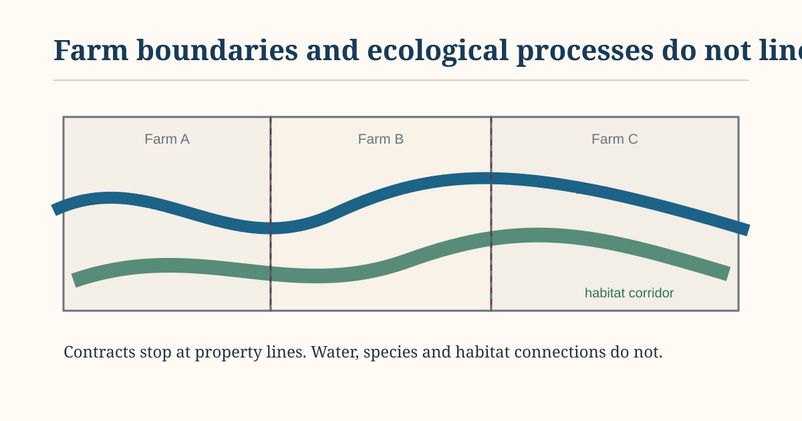
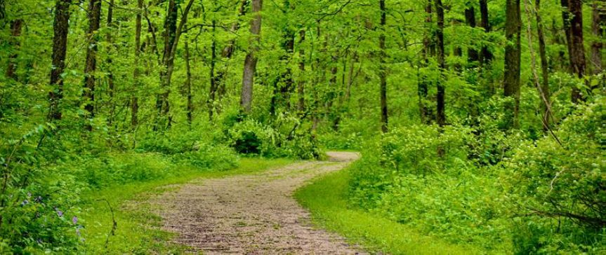

# EKO Perspectives

Research, evidence and ideas on policy, agriculture, land use, economics, science, technology and development.

# [EKO Perspectives](./)

Research, evidence and ideas by Elvis Kwame Ofori

[Policy](./blog/#category=Policy) [Land & Agriculture](./blog/#category=Land%20%26%20Agriculture) [Economics & Evidence](./blog/#category=Economics%20%26%20Evidence) [Science & Technology](./blog/#category=Science%20%26%20Technology) [Personal & Ideas](./blog/#category=Personal%20%26%20Ideas)

Featured

 Daniel Hanrahan / Wikimedia Commons · CC BY 3.0

Economics & Evidence

## When the future is outside the data

Climate and land-use targets can push economics beyond what historical data can tell us. Scenario models offer a way to explore futures that have not yet been observed.

Land & Agriculture

### When environmental policy needs a landscape, not just a farm

Some environmental problems do not stop at the farm gate. Ireland’s ACRES landscape actions show why coordination can matter across holdings.

Science & Technology

### AI is becoming ordinary. The evidence about its effects is still catching up

Generative AI is becoming ordinary in classrooms and everyday life. The scientific question is shifting from what the tools can do to what happens when people actually use them.

## Latest from EKO Perspectives

[All writing →](blog/)

### [A map can clarify the world and still leave something out](blog/posts/2026-09-24-seeing-like-a-state-models/index.llms.md)

Reading James C. Scott’s Seeing Like a State as a warning about simplification, and as a useful question for anyone who builds models for policy.

Sep 24, 2026

Elvis Kwame Ofori

### [Wildfire policy begins before the fire](blog/posts/2026-09-24-wildfire-policy-before-fire/index.llms.md)

Europe is treating wildfire less as an emergency event and more as a land-management problem. Ireland has reasons to pay attention.

Sep 24, 2026

Elvis Kwame Ofori

### [Where my PhD sits: FUSION and FORESIGHT](blog/posts/2026-09-22-fusion-foresight/index.llms.md)

The modelling environment around my PhD, who supports it, and why that context matters when I write about policy.

Sep 22, 2026

Elvis Kwame Ofori

## About my research

[Research →](research/)

My research examines how national agricultural, climate and land-use goals translate into different costs, opportunities and constraints across farms and places. I work with spatial, economic and behavioural models at the University of Galway.
