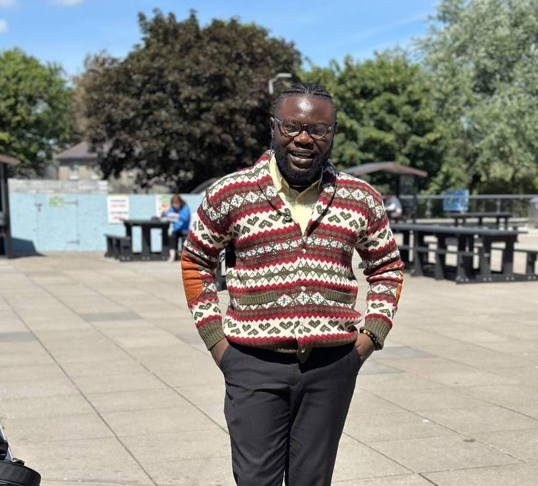

University of Galway · Ryan Institute

<h1 class="profile-name">Elvis Kwame Ofori</h1>

Agricultural, land-use and policy modeller

I develop economic, spatial, behavioural and computational models to understand how agricultural, land-use, climate and bioenergy policy moves from national objectives to real farms, production systems and places.

<a href="https://github.com/ElvisKwameOfori123">GitHub</a>
<a href="https://orcid.org/0000-0001-5404-9078">ORCID</a>
<a href="https://scholar.google.com/citations?user=cf5X1eAAAAAJ&hl=en">Google Scholar</a>
<a href="https://www.linkedin.com/in/elvis-ofori-12139b71/">LinkedIn</a>

<section class="home-section">

<h2>Research</h2>
<a href="research/">Explore research →</a>

A national pathway can be technically feasible and still be difficult to implement locally. My work connects aggregate objectives with heterogeneous farms, land resources, production systems and places, asking where adjustment occurs, what it costs, and how policy design changes implementation.

</section>

<section class="home-section">

<h2>Featured work</h2>
<a href="projects/">All projects →</a>

Spatial foresight · Ireland

<h3><a href="projects/goblin-spatial/">GOBLIN-Spatial</a></h3>

Resolving nationally coherent agricultural and land-use transitions across local geography to examine exposure, feasibility and implementation constraints.

Farm-level modelling · Ireland

<h3><a href="projects/ift-biosim/">IFT-BioSim</a></h3>

Bioeconomic microsimulation of heterogeneous opportunity costs, participation, transition support and policy incidence.

Bioenergy · United States

<h3><a href="projects/bioland-us/">BioLand-US</a></h3>

Linking prospective biomass allocation with compatible agricultural land and voluntary contractual access.

</section>

<section class="home-section">

<h2>Latest writing</h2>
<a href="blog/">Visit the Blog →</a>

Blog

<h3><a href="blog/">A general place to write</a></h3>

Research sometimes, but also economics, technology, books, Ghana, Ireland, code, data, current affairs and observations.

Notes

<h3><a href="blog/posts/2026-09-22-welcome/">Starting this site</a></h3>

A short note on why I want research, code, projects and broader writing to live together rather than in separate corners of the internet.

</section>

<section class="home-section">

<h2>Explore</h2>

Agricultural economics
Land use
Climate policy
Bioenergy
Spatial modelling
Econometrics
Microsimulation
Synthetic populations
Python
R
Stata
Writing

</section>

