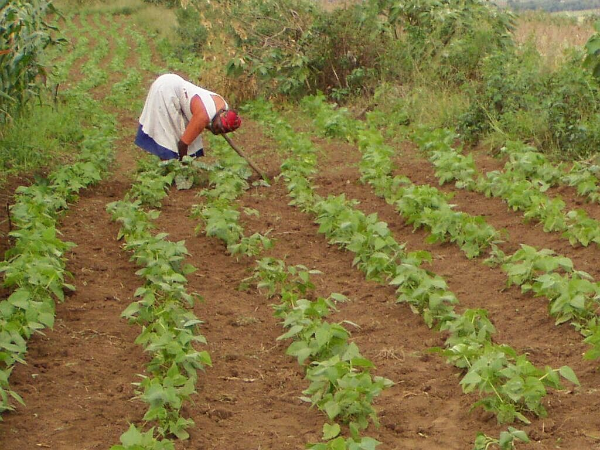

<header class="publication-masthead">
<h1 class="publication-name"><a href="/">EKO Perspectives</a></h1>

Research, evidence and ideas by Elvis Kwame Ofori

<nav id="topics" class="publication-topics" aria-label="Topics">
<a href="/blog/#category=Policy">Policy</a>
<a href="/blog/#category=Land%20%26%20Agriculture">Land &amp; Agriculture</a>
<a href="/blog/#category=Economics%20%26%20Evidence">Economics &amp; Evidence</a>
<a href="/blog/#category=Science%20%26%20Technology">Science &amp; Technology</a>
<a href="/blog/#category=Places%20%26%20Development">Places &amp; Development</a>
<a href="/blog/#category=Personal%20%26%20Ideas">Personal &amp; Ideas</a>
</nav>
</header>

<section class="home-feature-section">

Featured

<!-- Homepage curation rule: every post shown in this hand-curated Featured block
     must carry `featured: true` in front matter, and every post with
     `featured: true` should be represented here so Latest can exclude it. -->

<a class="feature-card feature-card--lead" href="blog/posts/2026-10-02-one-hectare-many-promises/">

Alan Manson · Wikimedia Commons · CC0 1.0

Land &amp; Agriculture
<h2>One hectare, many promises</h2>

Climate, biodiversity, energy, housing and food are all asking more of the same land. The farmer who lives from it is rarely at the table.

</a>

<a class="feature-card feature-card--side" href="blog/posts/2026-10-04-we-cannot-drink-gold/">

Efo Komla · Wikimedia Commons · CC BY-SA 4.0

Places &amp; Development
<h3>We cannot drink gold</h3>

Ghana arrests hundreds of illegal miners a year and convicts a handful. The deeper problem is who profits from the gold and who pays for the water.

</a>

<a class="feature-card feature-card--side" href="blog/posts/2026-10-01-ireland-tree-planting-promise/">

Tree Council · Wikimedia Commons · CC BY-SA 4.0

Policy
<h3>Thirty years of Irish tree-planting promises, checked against the record</h3>

Ireland has planted a fraction of the forest it promised since 1996. Licensing explains one bad stretch. Farmers walking away from planting explains more of the gap.

</a>

</section>

<section class="home-section">

<h2>Latest from EKO Perspectives</h2>
<a href="blog/">All writing →</a>

::: {#home-writing}
:::
</section>

<section class="home-section">

<h2>About my research</h2>
<a href="research/">Research →</a>

My research examines how national agricultural, climate and land-use goals translate into different costs, opportunities and constraints across farms and places. I work with spatial, economic and behavioural models at the University of Galway.

</section>

