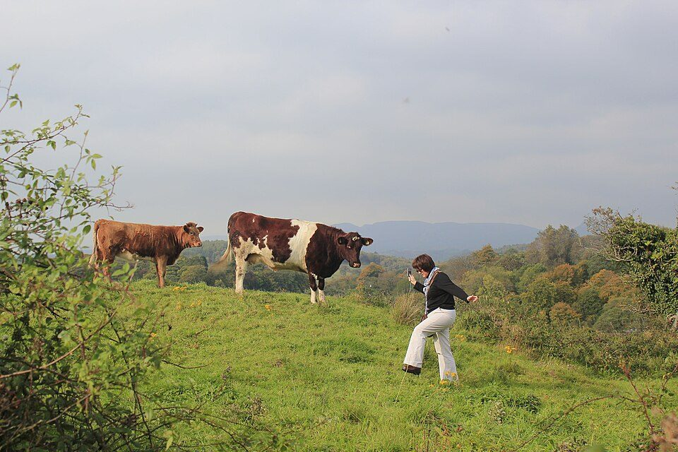
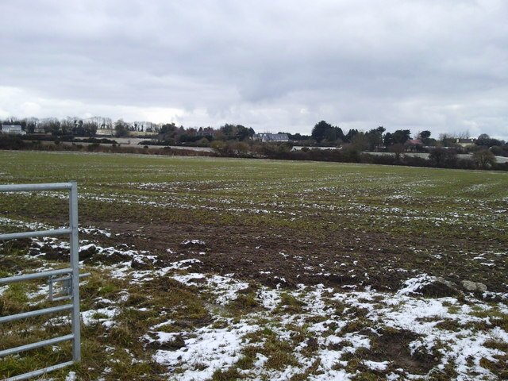
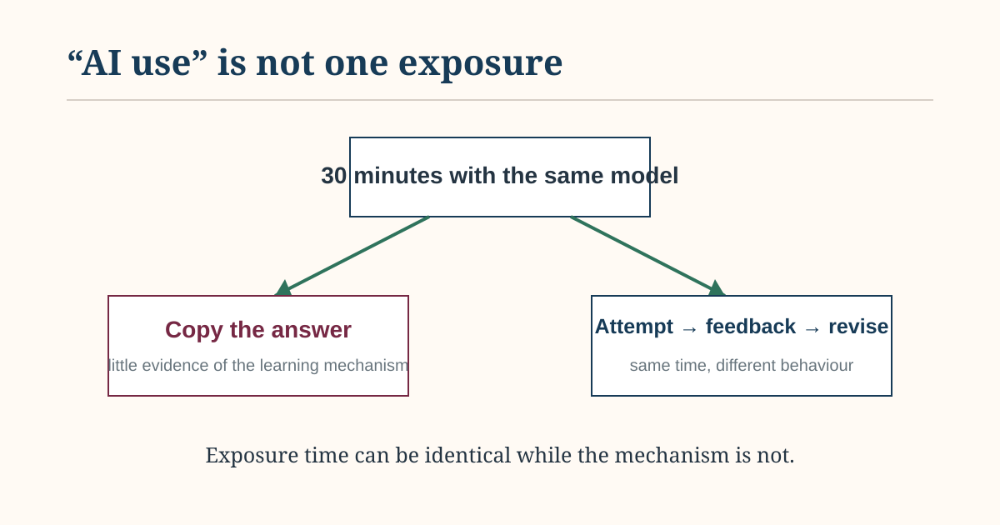

<header class="publication-masthead">
<h1 class="publication-name"><a href="/">EKO Perspectives</a></h1>

Research, evidence and ideas by Elvis Kwame Ofori

<nav id="topics" class="publication-topics" aria-label="Topics">
<a href="/blog/#category=Policy">Policy</a>
<a href="/blog/#category=Land%20%26%20Agriculture">Land &amp; Agriculture</a>
<a href="/blog/#category=Economics%20%26%20Evidence">Economics &amp; Evidence</a>
<a href="/blog/#category=Science%20%26%20Technology">Science &amp; Technology</a>
<a href="/blog/#category=Personal%20%26%20Ideas">Personal &amp; Ideas</a>
</nav>
</header>

<section class="home-feature-section">

Featured

<!-- Homepage curation rule: every post shown in this hand-curated Featured block
     must carry `featured: true` in front matter, and every post with
     `featured: true` should be represented here so Latest can exclude it. -->

<a class="feature-card feature-card--lead" href="blog/posts/2026-09-22-econometrics-to-scenario-thinking/">

Daniel Hanrahan / Wikimedia Commons · CC BY 3.0

Economics &amp; Evidence
<h2>When the future is outside the data</h2>

Climate and land-use targets can push economics beyond what historical data can tell us. Scenario models offer a way to explore futures that have not yet been observed.

</a>

<a class="feature-card feature-card--side" href="blog/posts/2026-09-22-acres-landscape-actions/">

C O'Flanagan / Wikimedia Commons · CC BY-SA 2.0

Land &amp; Agriculture
<h3>When environmental policy needs a landscape, not just a farm</h3>

Some environmental problems do not stop at the farm gate. Ireland's ACRES landscape actions show why coordination can matter across holdings.

</a>

<a class="feature-card feature-card--side" href="blog/posts/2026-09-22-ai-needs-evidence-not-anecdotes/">

Science &amp; Technology
<h3>AI is becoming ordinary. The evidence about its effects is still catching up</h3>

Generative AI is becoming ordinary in classrooms and everyday life. The scientific question is shifting from what the tools can do to what happens when people actually use them.

</a>

</section>

<section class="home-section">

<h2>Latest from EKO Perspectives</h2>
<a href="blog/">All writing →</a>

::: {#home-writing}
:::
</section>

<section class="home-section">

<h2>About my research</h2>
<a href="research/">Research →</a>

My research examines how national agricultural, climate and land-use goals translate into different costs, opportunities and constraints across farms and places. I work with spatial, economic and behavioural models at the University of Galway.

</section>

